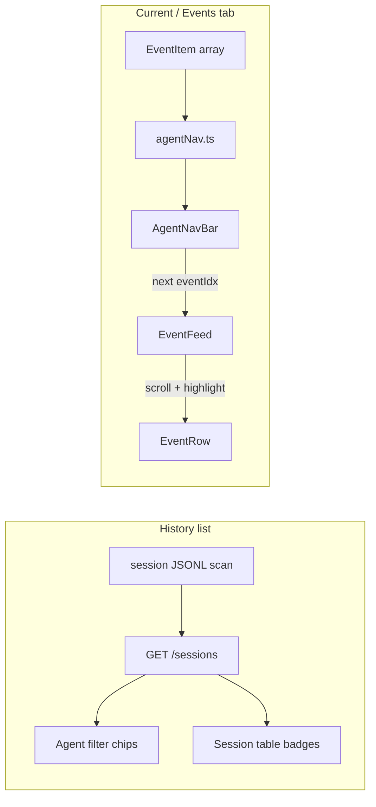

# Agent navigation and History filters

## Goals

1. **In-session (Current `/` and session detail Events):** Show a chip per agent type present in the loaded events (`parent`, `explorer`, `compactor`, `grilling`, `coder`, `reviewer`). Clicking a chip scrolls to the **next** matching event (wrap to first after the last).
2. **History list (`/history`):** Filter sessions that used a given agent type, and show compact agent badges per row so you can see which agents ran in each session.

You confirmed **one chip per agent type** (all explorer lanes share one Explorer button).

## Architecture

## 1. Frontend: agent navigation (no API required)

### New module: [`dashboard/web/src/lib/agentNav.ts`](dashboard/web/src/lib/agentNav.ts)

- **Known types** (order for display): `parent`, `explorer`, `grilling`, `coder`, `reviewer`, `compactor`.
- **`matchAgentType(event, type)`** rules:
  - `parent`: reuse [`isParentAgent`](dashboard/web/src/lib/groupEvents.ts) from `groupEvents.ts`.
  - Sub-agent types (`explorer`, etc.): `event.agent_type === type` or `payload.agent_type === type` (covers spawn/return and lane events).
  - `compactor`: `agent_type === "compactor"` **or** `kind === "context_compaction"` (compactor work is not a Turn+agents lane today).
- **`collectAgentNavTargets(events)`** → `{ type, label, eventIndices: number[] }[]` (indices sorted ascending by `event_idx`; omit types with zero matches).
- **`nextEventIndex(indices, cursor)`** → next index strictly after `cursor`, or wrap to `indices[0]`.

### New component: [`dashboard/web/src/components/AgentNavBar.tsx`](dashboard/web/src/components/AgentNavBar.tsx)

- Renders chips only for targets returned by `collectAgentNavTargets`.
- Local state: `activeType`, `cursorEventIdx` per type (or single cursor + active type).
- On chip click: compute next `eventIdx`, call `onJump(eventIdx)`, highlight active chip.
- Optional `title` with match count and “click for next”.

### Wire into [`EventFeed.tsx`](dashboard/web/src/components/EventFeed.tsx)

- New optional props: `highlightEventIdx`, `onHighlightEventIdx` (controlled from parent), `showAgentNav` (default `true`).
- Place `AgentNavBar` in the toolbar row beside view-mode buttons ([`EventStreamToolbar.tsx`](dashboard/web/src/components/EventStreamToolbar.tsx) or directly in `EventFeed`).
- On jump:
  - Set `highlightEventIdx` (parent-controlled).
  - `document.getElementById(\`event-${idx}\`)?.scrollIntoView({ behavior: "smooth", block: "center" })` (same pattern as [`SessionDetailPage.tsx`](dashboard/web/src/pages/SessionDetailPage.tsx) lines 120–126).

### Expand collapsed turns on jump

[`TurnSection.tsx`](dashboard/web/src/components/TurnSection.tsx): `useEffect` — if `highlightEventIdx` is inside `group.events`, call `setExpanded(true)` so nested turn views reveal the target row.

### Pages

| Page | Change |
|------|--------|
| [`CurrentSessionPage.tsx`](dashboard/web/src/pages/CurrentSessionPage.tsx) | `useState` for `highlightEventIdx`; pass to `EventFeed` with `displayEvents`. |
| [`SessionDetailPage.tsx`](dashboard/web/src/pages/SessionDetailPage.tsx) | Same on **Events** tab; on agent jump, if `tab !== "events"`, `setTab("events")` first; sync URL `?eventIdx=` via existing `searchParams` for shareable links. |

**Note:** `EventRow` already auto-expands when `highlightEventIdx` matches ([`EventRow.tsx`](dashboard/web/src/components/EventRow.tsx) lines 48–53).

## 2. Backend: agent types per session (History)

Mirror the existing [`session_tags.py`](dashboard/api/services/session_tags.py) / [`session_compaction_tags.py`](dashboard/api/services/session_compaction_tags.py) pattern.

### New: [`dashboard/api/services/session_agent_types.py`](dashboard/api/services/session_agent_types.py)

- Scan JSONL when present (same as sub-agent flags); else derive from SQLite `events` / `subagents` rows (`agent_type` column).
- Collect distinct types using the same rules as frontend `matchAgentType` (at minimum: any non-empty `agent_type` on events; treat `context_compaction` as presence of `compactor`).
- **`bulk_agent_types(db, session_ids) -> dict[str, list[str]]`** sorted canonical order.

### Schema + list enrichment

- Add `agent_types_present: list[str] = []` to [`SessionSummary`](dashboard/api/schemas.py) and [`api.ts`](dashboard/web/src/api.ts).
- In [`list_sessions`](dashboard/api/services/sessions.py) (~245–268), merge `bulk_agent_types` like sub-agent/compaction flags.

### Tests

- Extend [`tests/test_dashboard_api.py`](tests/test_dashboard_api.py): fixture JSONL with `explorer` sub-agent + `context_compaction` → session list includes `explorer` and `compactor` in `agent_types_present`; filter behavior via query or document frontend-only filter (filter stays client-side on loaded list, consistent with current sub-agent chips).

## 3. History UI

### [`sessionFilters.ts`](dashboard/web/src/lib/sessionFilters.ts)

- New filter ids: `agent:parent`, `agent:explorer`, `agent:compactor`, etc. (or a map `agentType -> filter id`).
- `filterSessions`: OR-match if `s.agent_types_present?.includes(type)`.
- Export `SESSION_AGENT_FILTER_OPTIONS` with labels matching runtime types.

### [`HistoryPage.tsx`](dashboard/web/src/pages/HistoryPage.tsx)

- Third filter row: **Agents** (chips for the six known types).
- New **`AgentBadges`** component on each table row: small pills for each entry in `agent_types_present` (hide when empty).
- Optional column **Agents** between Sub-agents and Compaction.

Persist filters in `localStorage` (extend existing `vg-dashboard-history-filters` array validation).

## 4. Spec update

Update [`specs/70_dashboard.md`](specs/70_dashboard.md):

- Document `agent_types_present` on `GET /sessions`.
- **Agent navigation** on Current + Events tab (`eventIdx` deep link, cyclic next-event).
- **History agent filters** and row badges.

## Out of scope

- No changes under `src/vg_agent/` (dashboard-only).
- No Vitest (not in [`dashboard/web/package.json`](dashboard/web/package.json)); API tests only.
- Session detail Timeline tab stays unchanged (agent nav lives on the event stream).

## UX sketch

**Event stream toolbar**

`[Flat] [By turn] [Turn + agents]  |  [parent] [explorer] [compactor]  |  Parallel columns`

Active chip: accent background. Click `explorer` repeatedly: event #12 → #40 → #55 → wrap to #12.

**History**

`Agents: [parent] [explorer] [compactor] …` — toggling **explorer** shows only sessions where `agent_types_present` contains `explorer`.
