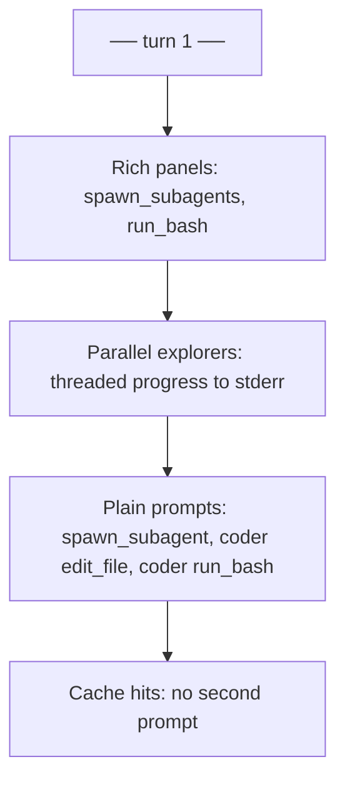

# Approval UI inconsistency (same-session, full log)

## Direct answer: is it a bug?

**Yes.** Your full transcript is one Rich `--chat` turn (`── turn 1 ──` only) with a welcome panel and status bar, yet approval chrome **degrades mid-run**:

| When | Tool | UI | Menu |
|------|------|-----|------|
| Parent step 1 | `spawn_subagents` | Rich panel `Approve spawn_subagents` | `1/y yes  2 yes (scoped) …` |
| Parent step 2–3 | `run_bash` | Rich panel | `1/y yes …` |
| Parent step 4 | `spawn_subagents` | **No prompt** (scope cache `*`) | — |
| Parent step 5 | `spawn_subagent` (long Coder brief) | **Plain inline** | `1) yes  2) yes (this folder) …` |
| Coder step 2 | `edit_file` (first) | **Plain inline** | `1) yes …` |
| Coder steps 3–5 | `edit_file` | **No prompt** (scope `calc_haiku_4`) | only `decision=…` lines |
| Coder step 7 | `run_bash` (first compile) | **Plain inline** | `1) yes …` |
| Coder step 7 | second compile | cache `cmd:python3` | — |

So it is **not** “Docker vs local” or “old vs new image” for this paste — it is **in-process inconsistency** after ~6 parent steps and a parallel Explorer batch.

The **indented diff after `[tool] coder-5 edit_file ok`** is correct (spec: live progress diff). The **plain `[approval] edit_file …` prompt before `> 2`** is the bug.

---

## How to tell prompt vs progress

- **Interactive prompt (buggy when plain):** `[approval] <tool>  <summary>` — two spaces, **no** `decision=`
- **Post-choice progress (OK):** `[approval] <tool> decision=approved_scoped scope=…`

Cached approvals correctly show only the second form.

---

## Root cause (from code + log)

### 1. Two renderers

| Menu | Source |
|------|--------|
| `1/y yes  2 yes (scoped)` | [`prompt_approval`](src/vg_agent/chat_ui.py) when `use_rich_ui()` is true |
| `1) yes  2) yes (this folder)` | [`__main__._stdin_prompt`](src/vg_agent/__main__.py) else branch **or** [`prompt_approval`](src/vg_agent/chat_ui.py) fallthrough (1315–1320) |

Your later prompts use **`this folder`** → **non-Rich path**. No `╭ Approve … ╮` box was rendered for those (not just scrolled away).

`use_rich_ui()` requires **both** stdin and stderr TTY ([`chat_ui.py`](src/vg_agent/chat_ui.py) 41–46). Leading hypothesis for mid-session flip: **stderr TTY state** after heavy stderr traffic (status bar redraws, raw ANSI progress lines, parallel Explorer `event_sink` writes from worker threads) — or **nested `PromptSession` + raw stderr** confusing the terminal without changing Python’s isatty (needs a repro + latch fix regardless).

### 2. `prompt_approval` fallthrough (real defect even if not this paste’s only cause)

```1304:1321:src/vg_agent/chat_ui.py
        console.print(Panel(panel_body, title=title, border_style=border_style))
        if PromptSession is not None:
            session = PromptSession()
            line = session.prompt("> ")
            return _parse_approval_choice(line, request)
    # falls through → plain [approval] + readline
```

If `PromptSession` were ever `None` after a panel print, you would get **duplicate** chrome. Fix: always `return` after panel + `input()` / `readline`.

### 3. Multiline tool summaries (UX / layout)

Parent step 5 `[llm] … done` line embeds newlines from the spawn question because [`_tool_summary`](src/vg_agent/__main__.py) / [`_args_summary`](src/vg_agent/agent.py) do not sanitize `\n`:

```
tools=spawn_subagent Edit only …

Engine API …
- `Cal
[approval] spawn_subagent  Edit only …
```

The plain approval line repeats the same multi-line summary, so it **looks like** the `[llm]` line and approval merged. Fix: replace `\n` with ` ↵ ` (or similar) in progress + panel headline; optional 2-line cap in panel body with “… (N more lines in trace)”.

### 4. Duplicate plain menu in `__main__`

[`_stdin_prompt`](src/vg_agent/__main__.py) duplicates non-Rich logic instead of always calling `prompt_approval` — drift risk (“scoped” vs “this folder”).



---

## What is not a bug

- `[approval] … decision=approved_scoped` after you answer
- Inline `  --- a/…` diff after successful `[tool] … edit_file ok`
- Second `spawn_subagents` / repeated `edit_file` / second `run_bash` without a box (scope cache)

---

## Fix plan (spec-first)

### 1. Latch Rich approval for `--chat` (primary fix for mid-session flip)

In [`scripts/generate_project.py`](scripts/generate_project.py) template for [`chat_ui.py`](src/vg_agent/chat_ui.py):

- On chat session start (when `use_rich_ui()` is true at dashboard print), set `_rich_chat_latched = True`.
- `use_rich_ui()` returns true for approvals when latched, even if a later `stderr.isatty()` blips false.
- Reset latch on `/reset`, `/new`, `/exit`.

Document in [`specs/16_chat_ui.md`](specs/16_chat_ui.md).

### 2. Fix `prompt_approval` control flow

- After `Panel`, read choice via `PromptSession` **or** `input("> ")` / `input_stream.readline()` — **always return**; never fall through to plain `[approval]`.
- Prefer **`input()` after panel** instead of spawning a new `PromptSession` per approval (avoids fighting the chat REPL `PromptSession` + raw progress ANSI).

### 3. Sanitize multiline summaries

- [`_args_summary`](src/vg_agent/agent.py) / [`_tool_summary`](src/vg_agent/__main__.py): `summary.replace("\n", " ↵ ").replace("\r", "")` before progress and approval display.
- Rich panel: first line bold + dim remainder truncated (~500 chars) for `spawn_subagent` questions.

### 4. Approval / progress synchronization

- Global `threading.Lock` in progress sink: sub-agents emit events from [`ThreadPoolExecutor`](src/vg_agent/agent.py); **all** `stderr` progress writes take the lock.
- `policy.check` acquires same lock before `prompt_approval`, releases after — no `[llm]` lines interleaved mid-prompt.
- Spec note: interactive approval must run on **main thread** (marshal if ever needed).

### 5. Consolidate `_stdin_prompt`

- `return prompt_approval(...)` always (non-TTY still handled inside `prompt_approval`).

### 6. Tests ([`tests/test_vg_agent.py`](tests/test_vg_agent.py))

- Multiline `spawn_subagent` question → progress `[llm] done` is single line; approval stderr has no leading `[approval] tool  summary` when latched rich.
- `PromptSession=None` + latched rich → panel + no plain fallback.
- Simulated `stderr.isatty False` mid-session with latch → still Rich menu `yes (scoped)`.

### 7. Verify

```powershell
python scripts/generate_project.py --clean
uv run pytest tests/test_vg_agent.py -k "approval" -q
docker compose build vg-agent   # if demo in Docker
# Replay your calc_haiku_4 prompt; every *first* gated tool per scope should show a cyan box
```

---

## Quick self-check

| Good | Bad |
|------|-----|
| `╭─ Approve spawn_subagent ─╮` | `[approval] spawn_subagent  Edit only…` |
| `1/y yes  2 yes (scoped)` | `1) yes  2) yes (this folder)` |

Your log: steps 1–3 good; step 5 spawn + coder edits bad.
