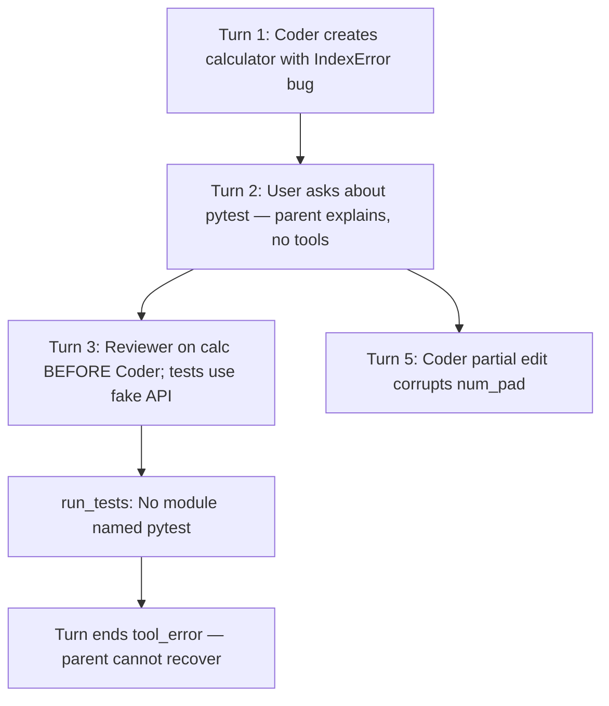

# Calculator session 3 — follow-up changes

## What already works (prior plan)

| Fix | Evidence in transcript |
|-----|------------------------|
| Reviewer reads disk | reviewer-2/4 call `read_file` before returning |
| `run_tests` wired | parent step 14 calls `run_tests`, not `run_bash pytest` |
| Reviewer on flash | `reviewer-2 google/gemini-2.5-flash` (your `.env` tier change) |
| Coder mutates | coder-1/3/5 all write/edit; no read-only false success |

## New failure chain



---

## Gap 1 (P0): pytest not installed in Docker runtime

**Symptom:** `run_tests error: No module named pytest` (`/app/.venv/bin/python`).

**Cause:** [`Dockerfile`](Dockerfile) line 19 runs `uv sync --frozen --no-dev`, but pytest lives in optional `[dev]` in [`pyproject.toml`](pyproject.toml) — not in main `dependencies`.

**Fix (pick one, recommend A):**

- **A.** Add `pytest>=8` to main `[project] dependencies` (smallest change; ~1MB, needed for `run_tests` to be a first-class feature).
- **B.** Change Dockerfile to `uv sync --frozen --extra dev` (pulls httpx too).

Also update [`specs/50_packaging.md`](specs/50_packaging.md) / [`README.md`](README.md) to state pytest is a runtime dependency for `run_tests`.

Add test or CI assert: import pytest from the same venv the agent uses (smoke in [`tests/test_vg_agent.py`](tests/test_vg_agent.py) already calls `run_tests` locally where dev deps exist).

---

## Gap 2 (P0): `run_tests` failure hard-aborts the turn

**Symptom:** After pytest missing, turn ends `✗ tool_error (turn failed)`; parent never re-spawns Coder or tells user to install pytest.

**Cause:** [`run_live_task`](scripts/generate_project.py) (~3750–3758) returns immediately on **any** parent `tool_result.status != "ok"`:

```3750:3758:scripts/generate_project.py
            if result["status"] != "ok":
                recorder.emit(
                    "run_end",
                    final_status="tool_error",
                    ...
                )
                return recorder
```

This contradicts [`PROMPTS.md`](PROMPTS.md): *"If `run_tests` fails, re-spawn Coder with the failure output."*

**Fix:**

- Introduce **soft tool errors** for `run_tests` (and optionally `spawn_subagent` when sub-agent returns recoverable errors): return error payload to the model and **continue** the parent loop.
- Reserve hard `tool_error` + `run_end` for approval abort, budget cap deny, and truly fatal blocks.
- Document in [`specs/10_main_agent.md`](specs/10_main_agent.md).

**Test:** FakeClient parent calls `run_tests` → error result → parent gets another LLM turn (does not emit `run_end` with `tool_error`).

---

## Gap 3 (P1): Explorer vs Reviewer mis-routing

**Symptom:** User asks to "review `calculator.py`" → parent spawns **Reviewer** (no Coder in that turn). Reviewer PASS did not catch the IndexError.

**Cause:** Prompt says Reviewer is mandatory after Coder, but does not forbid Reviewer for **pre-fix inspection**. Per [`specs/12`](specs/12_subagent_pipeline.md), Explorer = read-only inspection; Reviewer = post-Coder verification.

**Fix — prompts + optional runtime guard:**

- **Parent prompt:** "To review existing code without a recent Coder edit, spawn **Explorer**, not Reviewer. Reviewer is only for verifying a Coder change in the current task (requires a prior Coder `subagent_return` in this run)."
- **Optional runtime:** when spawning `reviewer` and `_resolve_review_coder_id()` returns `None`, auto-downgrade to Explorer or return spawn error `"Reviewer requires a prior Coder run; use Explorer for read-only review."`

**Reviewer prompt:** FAIL if `__main__` exists but obvious bugs present (e.g. loop index vs collection length mismatch, `num_pad[i]` where `i` can exceed `len-1`).

---

## Gap 4 (P1): Tests still use fictional API

**Symptom:** `test_calculator.py` calls `calculator.button_click()`, `calculator.expression` — none exist in [`calculator.py`](workspace/tkinter_calc/calculator.py).

**Cause:** Coder-3 wrote tests without `read_file` on the implementation first. Current guard only requires **a write**, not **read-before-test**.

**Fix:**

- **Coder runtime guard extension:** if spawn question mentions `test_*.py` / pytest / tests, require at least one successful `read_file`/`read_file_range` on the module under test **before** `write_file` on the test file.
- **Reviewer prompt:** FAIL if test imports or method names are absent from the implementation file (Reviewer already has partial wording; enforce read of **both** files when question names a folder).

---

## Gap 5 (P2): Parent passive when user asks "did you pytest?"

**Symptom:** Turn 2 — parent explains options in prose, zero tool calls.

**Fix — parent prompt bullet:**

- When user asks whether code was reviewed or tested, **do not** only explain capabilities — immediately start the verify pipeline (Explorer or read → Coder for tests → Reviewer → `run_tests`) in the same turn.

---

## Gap 6 (P2): UX polish (from original plan, still relevant)

- **`clarify_tool_error`:** map `No module named pytest` → *"pytest not installed in agent venv; add pytest to runtime deps or run `uv sync --extra dev` on host."*
- **Coder `mkdir` before `write_file`:** reinforce in Coder prompt (already says not to; model ignored it).
- **Budget/step caps:** session used 26/31 steps with many approval panels — optional follow-up, not blocking.

---

## Model tier strategy (config-only — no code required)

Session 3 failures are mostly **orchestration** (wrong agent, passive parent, bad spawn order) and **Coder quality** (IndexError, fictional test API, bad `edit_file` anchor) — not Explorer/Compactor work.

### Cost context (from [`MODEL_CONFIG.md`](MODEL_CONFIG.md))

| Model | Input $/Mtok | Output $/Mtok | vs Flash |
|-------|-------------|---------------|----------|
| gemini-2.5-flash | 0.10 | 0.40 | 1x |
| claude-haiku-4.5 | 1.00 | 5.00 | ~10–12x |
| claude-sonnet-4.6 | 3.00 | 15.00 | ~30–37x |

Your caps: `VG_MAX_USD_PER_RUN=0.50`, session 3 used **~$0.02** on all-flash with 26 parent steps. Putting Sonnet on **parent + coder** for the same flow could consume **most or all of the $0.50 cap** in one multi-spawn turn.

OpenRouter ID: `openrouter/anthropic/claude-sonnet-4.6` (already priced in generated `config.py`).

### Recommended profiles

**Profile A — Sonnet parent + Haiku reviewer (active test config in `.env`)**

Best ROI for session 3 issues: pipeline order, Explorer vs Reviewer, proactive verify on "did you test?".

```env
VG_PARENT_MODEL=openrouter/anthropic/claude-sonnet-4.6
VG_CODER_MODEL=google/gemini-2.5-flash          # or qwen3-coder / deepseek-v4-flash
VG_REVIEWER_MODEL=openrouter/anthropic/claude-haiku-4.5
VG_EXPLORER_MODEL=google/gemini-2.5-flash-lite
VG_GRILLING_MODEL=google/gemini-2.5-flash-lite
VG_COMPACTOR_MODEL=google/gemini-2.5-flash-lite
```

**Profile B — Sonnet parent + specialist Coder (best quality for calc/demo tasks)**

Use when edits and test API accuracy matter more than cost.

```env
VG_PARENT_MODEL=openrouter/anthropic/claude-sonnet-4.6
VG_CODER_MODEL=openrouter/qwen/qwen3-coder-30b-a3b-instruct
# or: openrouter/deepseek/deepseek-v4-flash (+ OPENROUTER_PROVIDER_ONLY_DEEPSEEK if needed)
VG_REVIEWER_MODEL=openrouter/anthropic/claude-haiku-4.5
# lite for read-only roles unchanged
```

Raise `VG_MAX_USD_PER_RUN=1.00` (or `1.50`) for multi-spawn fix+test flows.

**Profile C — Haiku middle tier (budget-conscious upgrade from flash)**

Fixes most orchestration slips at ~10x flash cost, not ~30x. Good if Sonnet blows the cap.

```env
VG_PARENT_MODEL=openrouter/anthropic/claude-haiku-4.5
VG_REVIEWER_MODEL=openrouter/anthropic/claude-haiku-4.5
VG_CODER_MODEL=openrouter/qwen/qwen3-coder-30b-a3b-instruct
```

**Profile D — Sonnet everywhere (not recommended)**

Burns `$0.50`/run quickly; Compactor/Explorer do not need it. Reserve for one-off `--parent-model` experiments only.

### Where Sonnet helps vs does not

| Failure in session 3 | Sonnet parent | Sonnet coder | Runtime fix still needed |
|----------------------|---------------|--------------|--------------------------|
| Passive "did you pytest?" reply | **Yes** | — | Prompt (Gap 5) |
| Reviewer instead of Explorer | **Yes** | — | Prompt/guard (Gap 3) |
| Fictional test API | Partial | **Yes** | read-before-test guard (Gap 4) |
| `No module named pytest` | — | — | pytest in Docker (Gap 1) |
| Turn abort on run_tests fail | — | — | soft error (Gap 2) |
| IndexError / bad edit anchor | Partial | **Yes** | Reviewer FAIL heuristics |

**Conclusion:** Sonnet as the **parent** is a good idea. Pair it with a **coding-specialist Coder** (qwen3-coder or deepseek-v4-flash), keep **lite** for Explorer/Grilling/Compactor, and use **Haiku** (not lite) for Reviewer. Bump run cap if using Sonnet on parent. Shell/runtime fixes (Gaps 1–5) still matter — models alone will not fix missing pytest or hard-abort turns.

Update [`MODEL_CONFIG.md`](MODEL_CONFIG.md) recommended tiers to include Sonnet parent profile when implementing docs pass.

---

## Recommended implementation order

1. Add pytest to runtime deps + Dockerfile note (unblocks `run_tests` in Docker)
2. Soft-error path for `run_tests` in `run_live_task`
3. Prompt: Explorer vs Reviewer + proactive verify on "did you test?"
4. Coder read-before-test guard
5. Tests for soft-error loop + read-before-test guard

Regenerate after generator changes: `python scripts/generate_project.py --clean` then `uv run pytest`.

---

## Out of scope

- Fixing broken [`workspace/tkinter_calc/*`](workspace/tkinter_calc/) artifacts (user workspace; re-run agent after shell fixes)
- Replacing gemini-flash Coder with qwen/deepseek (config-only — see Model tier strategy above)
