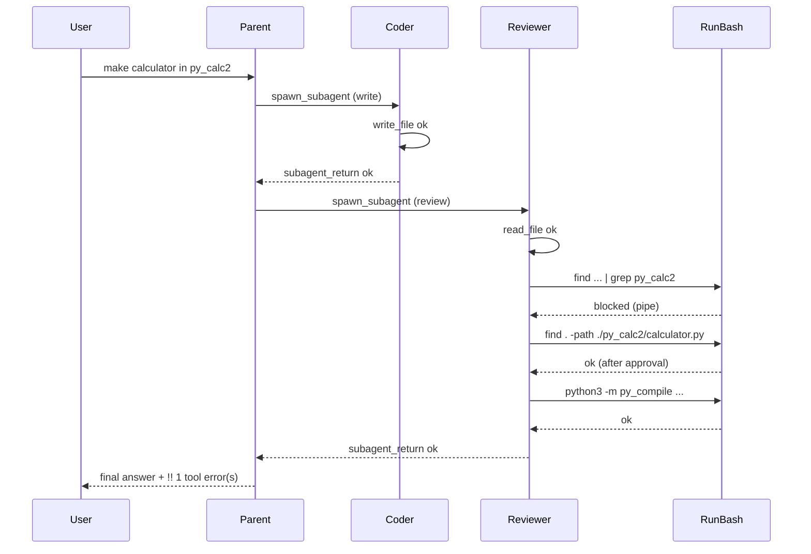

# Calculator session: tool error review

## Verdict

**Yes — this is expected behavior.** Nothing indicates a runtime bug. The safety gate did its job; the Reviewer sub-agent recovered; the parent run completed with `run_end` status `ok`. The yellow `!! 1 tool error(s)` line is intentional UX, not a false alarm.

---

## What happened (timeline)



| Step | Event | Expected? |
|------|--------|-----------|
| Coder `write_file` | Created `py_calc2/calculator.py` | Yes — correct pipeline for mutations |
| Reviewer `read_file` | Read the file | Yes — Reviewer must read disk before verdict ([`PROMPTS.md`](PROMPTS.md) Reviewer section) |
| Reviewer `find ... \| grep ...` | **Blocked** | **Yes** — deny-by-default shell safety |
| Reviewer `find . -path ...` | Ok after approval | Yes — single-command `find` is allowlisted ([`specs/20_tools.md`](specs/20_tools.md)) |
| Reviewer `py_compile` | Ok | Yes — narrow Python exception for syntax-only check |
| Parent `spawn_subagent` ×2 | Both `ok` | Yes |
| Run end | `[run] ok` + `!! 1 tool error(s)` | Yes — see below |

---

## 1. Why `run_bash` blocked the pipe

The Reviewer issued:

```text
find . -maxdepth 2 -type f -name "*.py" | grep py_calc2
```

[`specs/20_tools.md`](specs/20_tools.md) (lines 77–79, 97–99) explicitly rejects pipes, redirection, and command chaining so a safe-looking first token cannot hide a second command. The runtime message:

```text
run_bash blocked: shell control or redirection marker '|' is not allowed
```

matches `validate_shell_command` in [`scripts/generate_project.py`](scripts/generate_project.py) (generated into [`src/vg_agent/tools.py`](src/vg_agent/tools.py)).

The **Reviewer system prompt** also forbids pipes ([`PROMPTS.md`](PROMPTS.md) lines 161–166; embedded in generated `REVIEWER_SYSTEM_PROMPT`). So this is a **model mistake**, not a spec/runtime mismatch — the gate behaved correctly.

**Redundant command:** Reviewer had already succeeded with `read_file py_calc2/calculator.py` on step 1. The `find | grep` probe was unnecessary; `read_file` + `py_compile` would have been enough per prompt guidance (“Prefer `read_file` over `run_bash`”).

**Safe alternative** (what the model did next): `find . -path "./py_calc2/calculator.py"` — single command, no pipe — aligns with spec examples for safe `find` usage.

### Decision: keep rules or loosen?

**Recommendation: keep the rules; accept that the agent must use another way.**

| Option | Verdict | Why |
|--------|---------|-----|
| **Loosen `run_bash` (allow `\|`)** | **Do not** | Pipes are the main way to chain a allowlisted first command with a destructive second. That is exactly what [`specs/20_tools.md`](specs/20_tools.md) and the VG demo story guard against. `find \| grep` adds no capability here — `read_file` already proved the file exists. |
| **Accept current behavior** | **Yes** | Block → tool error in trace → sub-agent retries with a single command → run `ok`. One extra Reviewer step and one approval prompt; ~$0.01 noise, not a failure mode. |
| **Prompt-only nudge** | **Done** | Added to [`PROMPTS.md`](PROMPTS.md) Reviewer section; regenerated via `generate_project.py --clean`. |
| **UX: `partial` / softer `!!`** | **Optional, separate** | Does not fix the pipe question; only makes recovered errors less alarming in chat. |

**Bottom line:** This session is the intended contract — conservative shell gate, model learns from refusal, task still completes. Changing rules to allow pipelines would trade a core safety invariant for convenience the Reviewer did not need.

---

## 2. Why the run still ended `ok`

Per [`specs/12_subagent_pipeline.md`](specs/12_subagent_pipeline.md) failure table:

- Sub-agents **may retry within `MAX_SUBAGENT_STEPS` after a tool error**
- `tool_error` status on `subagent_return` applies only if the sub-agent **exhausts steps without completing**

Here Reviewer continued (steps 3–6), completed review, and returned `status: ok` to the parent. Parent `spawn_subagent` tool results were `ok`. Final `run_end` was `ok` with ~$0.08 spend — a successful turn with one recoverable blemish.

---

## 3. Why `!! 1 tool error(s)` appears with `✓ ok`

This is **documented chat UI behavior**, not a contradiction in run outcome:

- [`specs/16_chat_ui.md`](specs/16_chat_ui.md) §Secondary status: show `!! {reason}` when **`tool_errors > 0`**, even if `final_status` is `ok` or `ready`.
- [`src/vg_agent/chat_ui.py`](src/vg_agent/chat_ui.py) `_tool_error_count` counts **every** `tool_result` with `status != "ok"` in the turn — **including sub-agent** events, not only parent.
- Primary status icon uses `_status_token`, which treats **parent** tool errors and **failed** `subagent_return` as failure; a recovered sub-agent that still returned `ok` keeps **`✓ ok`**.

So: **run succeeded; observability still surfaces the one blocked command** so you can scroll up and see `run_bash error ... '|' is not allowed`.

This matches prior RCA notes in [`.cursor/plans/fix_mkdir_failure_chain_f1a83f6d.plan.md`](.cursor/plans/fix_mkdir_failure_chain_f1a83f6d.plan.md).

---

## 4. Pipeline choices (also expected)

| Choice | Assessment |
|--------|------------|
| Parent spawned **Coder** for creation | Correct — parent must not call `write_file` directly ([`PROMPTS.md`](PROMPTS.md)) |
| Parent spawned **Reviewer** after Coder | Correct for post-mutation verification ([`PROMPTS.md`](PROMPTS.md) “mandatory Reviewer after Coder returns `ok`”) |
| Approvals (`2` scoped) | Expected in live chat with approval gates |
| No `run_tests` | Expected for this task — user asked for a simple terminal calculator, not tests |

---

## What would be *unexpected* (not seen here)

- Run ending `tool_error` or parent aborting on first Reviewer `run_bash` failure (old sub-agent hard-abort behavior — fixed per hardening plans)
- Pipe command actually executing
- `spawn_subagent` returning `tool_error` because Reviewer never recovered
- Parent yielding without delivering the calculator

None of those occurred.

---

## Optional follow-ups (only if polish matters — not required)

Per **Decision** above, default is **no rule changes**. If you still want less demo friction:

1. **Prompt-only** (recommended if anything): Reviewer negative example in [`PROMPTS.md`](PROMPTS.md) — regenerate only.
2. **UX-only**: `✗ partial` or suppress `!!` when `subagent_return` is `ok` — [`specs/16_chat_ui.md`](specs/16_chat_ui.md) + generator.
3. **Demo**: Pre-approve `cmd:find` scoped to skip recovery approval prompts.

---

## Bottom line for your next prompt

You can proceed with `Try "read data/sample.log and summarise auth/"` — the calculator turn left a **traceable, recovered tool error** in the log, not a broken session. The `!! 1 tool error(s)` line is a reminder to look at Reviewer step 2, not a sign the calculator task failed.
