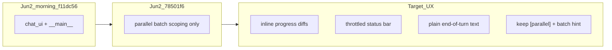

# Chat UI regression: git archaeology and restore plan

## Direct answer

**No — the earlier session did not do a proper old-diff review in git.**

What was done instead:

- `git log` on a few files
- Spot `git show` for `render_progress_file_diff`, `on_parent_status`, and `print_turn_output` before `ef7aee4`
- Code/spec reads and inference from your pasted “good” session

What was **not** done:

- `git diff <morning-ref>..HEAD` on [`src/vg_agent/chat_ui.py`](src/vg_agent/chat_ui.py) / [`src/vg_agent/__main__.py`](src/vg_agent/__main__.py)
- Commit-by-commit bisect on 2026-06-02
- Comparison of your screenshot/paste against a specific ref

---

## What git says about 2026-06-02 (morning → now)

Commits on Jun 2 touching chat UI:

| Time (CEST) | Commit | Chat UI impact |
|-------------|--------|----------------|
| ~10:10 | `6b73dcf` | No `chat_ui` / `__main__` changes |
| ~10:14–10:20 | `1198391`, `f11dc56` | No chat UI changes |
| ~13:44 | [`78501f6`](78501f6) | **Small**: parallel hint uses `latest_spawn_subagents_batch_summary`; progress `[parallel]` uses `parallel_subagent_summary_for_tool_result` (batch-scoped) |
| ~13:52 | `df974fe` | Dashboard web only — **no** `chat_ui` / `__main__` |

```bash
git diff f11dc56..78501f6 -- src/vg_agent/chat_ui.py src/vg_agent/__main__.py
# → 11 lines changed (parallel reporting only)
```

**Conclusion:** If the UI felt good this morning on committed `main`, the afternoon parallel commit did **not** introduce the big chrome changes (Response panels, status-bar spam, Rich diff boxes). Those come from **May 29** commits:

- [`30bb833`](30bb833) — `on_parent_status` → full status bar redraw on every parent `assistant_step` (spec said “throttled” but code never throttled)
- [`53dc4c1`](53dc4c1) — `print_turn_output` with dim Rules + **Response** `Panel`
- [`ef7aee4`](ef7aee4) — Rich `render_progress_file_diff` **panels** on stderr instead of inline `  --- a/...` lines

Morning ref `f11dc56` already had `render_progress_file_diff` + Response panels — so your pasted “good” session is either the same committed code (copy/paste flattens Rich output) or a local/uncommitted variant.

---

## Current working tree (uncommitted from last chat)

Uncommitted changes exist (not on `main`):

- [`src/vg_agent/chat_ui.py`](src/vg_agent/chat_ui.py) — throttle, inline `write_progress_diff_lines`, lighter end-of-turn output, `show_status=False` before runs
- [`scripts/generate_project.py`](scripts/generate_project.py) + regenerated [`__main__.py`](src/vg_agent/__main__.py)
- [`specs/16_chat_ui.md`](specs/16_chat_ui.md) updated to match
- Tests added/updated in [`tests/test_vg_agent.py`](tests/test_vg_agent.py) (6 targeted tests passed)

These align with your pasted flow (inline progress diffs, less status noise, plain summary text) but were **not** validated with a full `uv run pytest` or a live `--chat` rerun.

---

## Restore strategy (morning baseline + keep parallel wins)



1. **Confirm morning ref** — treat `f11dc56` (last Jun 2 commit before parallel UI tweaks) as “known good” baseline:
   ```bash
   git show f11dc56:src/vg_agent/chat_ui.py > /tmp/chat_ui_morning.py
   git diff f11dc56 -- src/vg_agent/chat_ui.py src/vg_agent/__main__.py
   ```

2. **Keep `78501f6` parallel behavior** — do not revert:
   - `parallel_subagent_summary_for_tool_result` in [`__main__.py`](src/vg_agent/__main__.py) `_make_progress_sink`
   - `_latest_turn_parallel_hint` in [`chat_ui.py`](src/vg_agent/chat_ui.py)

3. **Finish UX fixes** (already drafted uncommitted) — spec-first per repo rules:
   - Implement throttle in [`chat_ui.py`](src/vg_agent/chat_ui.py) (`VG_CHAT_STATUS_THROTTLE_S`, default `0.75`)
   - Inline progress diffs via `write_progress_diff_lines` (restore log-stream detail from your paste)
   - End-of-turn: plain bulletized answer; skip **Changes** for paths already shown in progress
   - Before run: bottom input rule only, then one `… running` status line
   - Mirror template in [`scripts/generate_project.py`](scripts/generate_project.py) → `python scripts/generate_project.py --clean`

4. **Verify**
   - `uv run pytest tests/test_vg_agent.py -k "chat_ui or progress_sink"`
   - Manual: same parallel calc prompt from your paste; confirm `── turn N ──`, `[llm]`/`[tool]`/`[parallel]`, inline diffs, no status-bar flood

5. **Optional bisect** if live UX still wrong after (4):
   ```bash
   git stash push -m chat-ui-wip
   git checkout f11dc56 -- src/vg_agent/chat_ui.py src/vg_agent/__main__.py
   # run --chat smoke; then git checkout main -- ...
   git stash pop
   ```
   Also check: `NO_COLOR` / non-TTY (disables Rich → different layout), Docker image age vs local `main`.

---

## Files to touch (after plan approval)

| File | Action |
|------|--------|
| [`specs/16_chat_ui.md`](specs/16_chat_ui.md) | Already updated — review wording vs implementation |
| [`src/vg_agent/chat_ui.py`](src/vg_agent/chat_ui.py) | Land/finish throttle, inline diffs, turn output |
| [`scripts/generate_project.py`](scripts/generate_project.py) | Keep `__main__` template in sync |
| [`tests/test_vg_agent.py`](tests/test_vg_agent.py) | Keep regression tests; run full suite |

No revert of parallel sub-agent logic from `78501f6`.
