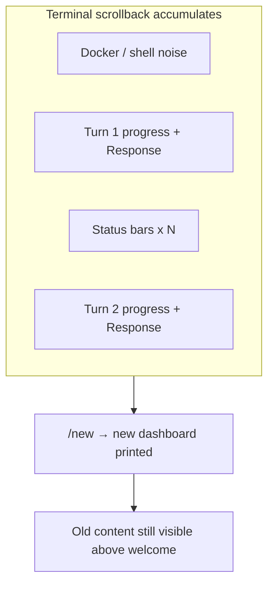

# Chat UI: screen clear and final polish

## Current behavior (why it feels cluttered)

The Rich chat UI ([`specs/16_chat_ui.md`](specs/16_chat_ui.md)) appends to the terminal scrollback:

- Welcome panel + status bar on start (then compact chrome after first turn)
- Per-prompt: top rule, `> ` input, bottom rule, **another** status bar + hint
- During runs: `── turn N ──`, `[llm]` / `[agent]` / `[tool]` lines, approval panels
- After turns: Response panel + another status refresh

Nothing clears the screen today. `/new` already resets trace, budget, and conversation and reprints the **full** welcome dashboard ([`__main__.py` `_chat_loop`](src/vg_agent/__main__.py) ~811–826), but old output stays visible above — exactly what your screenshot shows.



## Recommended: terminal clear at session boundaries

**Yes** — clear before the red welcome panel on startup, and on `/new`, `/reset`, and `/status` (per your choice).

| Event | Clear? | Then print |
|-------|--------|------------|
| `--chat` session start | Yes | Full dashboard (welcome + status + hint) |
| `/new` | Yes | Full dashboard + new trace |
| `/reset` | Yes | Full dashboard (same trace, `session_reset`) |
| `/status` | Yes | Full dashboard (refresh) |
| Idle prompt / agent turn | No | Existing append-only flow |
| `/budget`, `/help`, etc. | No | Plain slash output |

**Do not clear** during agent runs or after each turn — users need in-flight `[llm]` / approval context until the turn finishes.

### Implementation sketch

Add to [`src/vg_agent/chat_ui.py`](src/vg_agent/chat_ui.py) (this file is preserved across `generate_project.py --clean` via `EXTRA_SOURCE_GENERATED_FILES`):

```python
def clear_chat_screen(*, scrollback: bool = True) -> None:
    """TTY-only; no-op when VG_CHAT_NO_CLEAR is set or not a TTY."""
```

- **Gate**: `VG_CHAT_NO_CLEAR` env opt-out; require `use_rich_ui()` (stdin+stderr TTY, no `NO_COLOR`) so piped/CI chat ([`test_chat_slash_new_...`](tests/test_vg_agent.py)) is unchanged.
- **Mechanism**: Rich `Console(stderr=True).clear()` for visible screen, then optional `\033[3J` when `scrollback=True` (best-effort scrollback wipe on Windows Terminal, iTerm, etc.; harmless no-op elsewhere).
- **Call sites** in [`scripts/generate_project.py`](scripts/generate_project.py) `_chat_loop` template (regenerate after edit):
  - Before initial `print_chat_dashboard`
  - Before `print_chat_dashboard` in `/status`, `/reset`, `/new` handlers

Optional thin wrapper `print_chat_dashboard_cleared(...)` that calls `clear_chat_screen()` then `print_chat_dashboard()` to avoid forgetting clear at a fourth call site.

### Spec updates

- [`specs/16_chat_ui.md`](specs/16_chat_ui.md) — new **Screen clear** subsection under Refresh rules; document events above, `VG_CHAT_NO_CLEAR`, and scrollback best-effort note.
- [`specs/15_cli_contract.md`](specs/15_cli_contract.md) — one line on `/new` (and `/status`/`/reset`) clearing TTY scrollback when Rich UI is active.

### Tests

In [`tests/test_vg_agent.py`](tests/test_vg_agent.py):

- `clear_chat_screen` is no-op when `VG_CHAT_NO_CLEAR=1` or `use_rich_ui()` is false (monkeypatch).
- When TTY + Rich enabled, assert stderr receives `\033[2J` or Rich clear (mock `Console.clear`).
- Existing `test_chat_slash_new_starts_fresh_trace_and_live_history` stays valid (non-Rich path in test — no clear).

---

## Other final suggestions (no code required unless you want them)

These are optional follow-ups; the clear-screen work addresses your main pain.

1. **Run id hint after `/new`** — After welcome, one dim line `trace: …/traces/<id>.jsonl` so multi-session Docker users know which file to replay. Low cost, high debug value.

2. **`/help` one-liner** — Add to `SLASH_COMMAND_HELP`: “TTY: `/new`, `/reset`, `/status` clear the screen and refresh the dashboard.”

3. **Within-session status bar stacking** — Expected by spec (status bar below every prompt). Clearing on the four boundaries above is the right fix; **in-place HUD redraw** (cursor-up overwrite) would be a larger project and is listed as out of scope in the spec.

4. **Compact mode after first turn** — Already implemented (`mark_turn_completed` / `_compact_dashboard`). Works well with clear-on-`/new` so each new session gets the red welcome box once, then compact chrome.

5. **Approval + progress during a turn** — No change needed; clearing mid-run would hide the context the user is approving.

6. **Non-TTY / Docker without TTY** — No clear; plain `VG Agent chat mode…` line remains. Document in spec that `docker compose run -t` is needed for Rich + clear.

---

## Files to touch

| File | Change |
|------|--------|
| [`specs/16_chat_ui.md`](specs/16_chat_ui.md) | Screen-clear rules + env var |
| [`specs/15_cli_contract.md`](specs/15_cli_contract.md) | Slash-command note |
| [`src/vg_agent/chat_ui.py`](src/vg_agent/chat_ui.py) | `clear_chat_screen()` |
| [`scripts/generate_project.py`](scripts/generate_project.py) | `_chat_loop` call sites |
| [`tests/test_vg_agent.py`](tests/test_vg_agent.py) | Unit tests for clear |
| Regenerate | `python scripts/generate_project.py --clean` then `uv run pytest` |

No changes to trace schema or JSONL replay — clear is presentation-only.
