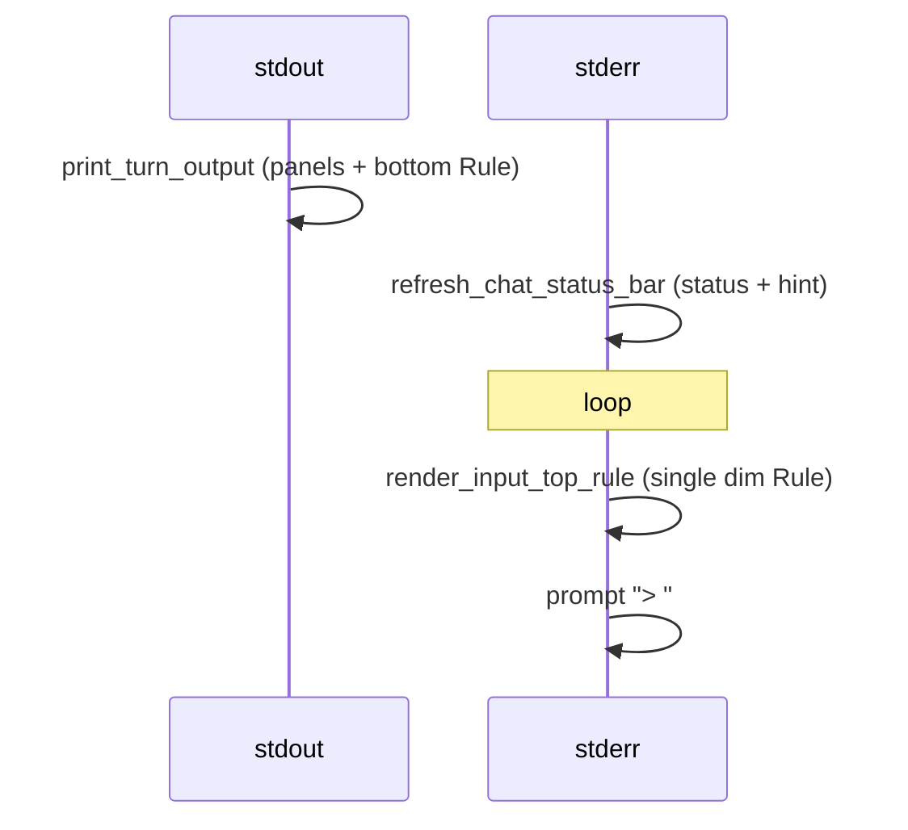

# Chat UI: input separation and response bullets

## Context

Rich TTY chat flow after each agent turn ([`__main__.py`](src/vg_agent/__main__.py) ~1014–1025):



Today [`render_input_top_rule()`](src/vg_agent/chat_ui.py) prints only one dim `Rule` with no leading blank lines, so the hint line sits flush against the next `>` row (as in your screenshot). Status-bar icons stay unchanged.

[`chat_ui.py`](src/vg_agent/chat_ui.py) is **preserved** across regeneration (`EXTRA_SOURCE_GENERATED_FILES` in [`scripts/generate_project.py`](scripts/generate_project.py)) — edit it directly, not the generator template.

## 1. Clearer separation before the input row

**Spec** — extend [`specs/16_chat_ui.md`](specs/16_chat_ui.md) §Layout item 3 (Input section) and §Refresh rules row “Before each prompt”:

- After turn completion, the **input block** is visually separated from turn output + session chrome by **two blank lines**, then a dim `Rule` titled **`input`** (Rich centered label).
- Status bar, emoji segments, and hint line behavior stay as today.

**Code** — update `render_input_top_rule()` in [`chat_ui.py`](src/vg_agent/chat_ui.py):

```python
def render_input_top_rule() -> None:
    if not use_rich_ui():
        return
    from rich.rule import Rule
    console = _console()
    console.print()
    console.print()
    console.print(Rule("input", style="dim"))
```

No change to `render_input_bottom_and_footer` (bottom rule + status after submit) or `print_turn_output` framing.

**Optional env** (document only if we add it): `VG_CHAT_INPUT_GAP=0` to disable extra blank lines — skip unless you want a kill-switch; default is fixed spacing.

## 2. Bullet points for Response panel (your choice: response only)

**Spec** — add under §Turn output in [`specs/16_chat_ui.md`](specs/16_chat_ui.md):

- When the parent **Response** body has **more than one non-empty line**, render each line as a bullet (`• ` prefix, dim bullet optional).
- **Unchanged:** Tool output (Tree / Syntax / preview), Changes diffs, compaction banners, single-line responses, non-TTY plain stdout.

**Code** — add a small helper in [`chat_ui.py`](src/vg_agent/chat_ui.py):

```python
def format_response_bullets(text: str) -> str:
    lines = [ln for ln in text.splitlines() if ln.strip()]
    if len(lines) <= 1:
        return text
    out: list[str] = []
    for raw in text.splitlines():
        stripped = raw.strip()
        if not stripped:
            out.append("")
            continue
        if stripped.startswith(("- ", "* ", "• ")) or re.match(r"^\d+\.\s", stripped):
            out.append(raw)  # model already listed
            continue
        out.append(f"• {stripped}")
    return "\n".join(out)
```

In `print_turn_output`, when `answer_text` is set:

```python
body = format_response_bullets(answer_text)
console.print(Panel(body, title="Response", border_style="dim"))
```

Plain-text fallback (`use_rich_ui()` false) can call the same helper for consistency.

**Out of scope per your choice:** bulletizing `find`/`ls` tool listings (they keep Tree or plain panels).

## 3. Tests

Add to [`tests/test_vg_agent.py`](tests/test_vg_agent.py):

| Test | Asserts |
|------|---------|
| `test_format_response_bullets_multiline` | Two+ lines → `•` prefixes; single line unchanged; existing `- item` preserved |
| `test_render_input_top_rule_spacing` | Fake stderr console: two `print()` calls (or captured output with `\n\n` before rule) and `Rule("input")` |
| Extend `test_chat_ui_turn_output_framed_on_tty` | Multi-line answer `"a\nb"` contains `•` in stdout |

Run: `uv run pytest tests/test_vg_agent.py -k "chat_ui or response_bullet or input_top"`

## Files touched

| File | Change |
|------|--------|
| [`specs/16_chat_ui.md`](specs/16_chat_ui.md) | Input separation + Response bullets |
| [`src/vg_agent/chat_ui.py`](src/vg_agent/chat_ui.py) | `format_response_bullets`, `render_input_top_rule`, `print_turn_output` |
| [`tests/test_vg_agent.py`](tests/test_vg_agent.py) | Unit tests above |

No `generate_project.py --clean` required (no generated-module contract change beyond spec doc).
