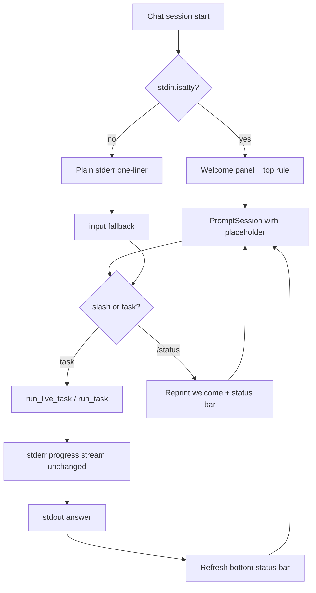

# Claude Code-style Chat UI (Python + Rich)

## Current state

All chat UI lives in the generated [`scripts/generate_project.py`](scripts/generate_project.py) template for [`src/vg_agent/__main__.py`](src/vg_agent/__main__.py):

- Startup: plain `"VG Agent chat mode. Type /help for commands."`
- Before **every** prompt: dense green one-liner from `_print_chat_statusline()` (`[live] model | ctx … | run ####------ …`)
- Prompt: `vg> ` via `prompt_toolkit.PromptSession` (TTY) or `input("vg> ")` (piped)
- Progress during runs: colored `[llm]` / `[tool]` lines on stderr (keep as-is)

## Target layout (TTY only)

Aligned with the Claude Code reference (welcome panel + framed input + **bottom status bar below the prompt**):

```text
vg-agent                                    (dim product label, top-left)

┌─────────────────────────────────────────┐
│ * Welcome to VG Agent!                  │  (accent border + bold title)
│   /help for commands · /status for setup│  (italic dim)
│   cwd: ~/vscode/vg_assignment/workspace │
└─────────────────────────────────────────┘

────────────────────────────────────────────
> Try "read data/sample.log and summarise auth/"   (placeholder when empty)
────────────────────────────────────────────

📁 workspace · 🤖 gemini-2.0-flash · live · ctx 1.2k in · 🪙 $0.00/$0.50 · 📊 1/15 steps · ✓ ready
/help for commands · /status to refresh session
```

**Behavior rules:**

- **Welcome panel** prints at session start, on `/status`, and after `/reset` / `/new`.
- **No** repeating green one-liner before every prompt (removed).
- **Input frame**: horizontal `Rule` above and below the `>` prompt.
- **Placeholder**: grey hint text in the prompt line when empty (prompt_toolkit `placeholder`); example task from demo fixture.
- **Status bar** sits **below** the bottom rule (not above the prompt) — pipe-separated segments with optional emoji prefixes; refreshed after each agent turn and on `/status`.
- **Secondary line** (optional): run-state hint when not `ready` (e.g. `!! model_error — see progress above`).
- **Accent**: warm coral/orange border on welcome panel (`#e07a5f` / Rich `rgb(224,122,95)`), matching Claude's welcome asterisk tone.
- **Non-TTY** (piped stdin, CI): plain `"VG Agent chat mode. Type /help for commands.\n"`, `> ` via `input()`, no Rich — unchanged for scripted demos.



## Spec-first: new `specs/16_chat_ui.md`

Create **[`specs/16_chat_ui.md`](specs/16_chat_ui.md)** as the **authoritative contract** for interactive chat presentation. Implementation in `chat_ui.py` must match this file; other specs only cross-reference it.

### Draft spec outline (to be written verbatim at implementation time)

```markdown
# 16 Chat UI

## Scope

Applies only to `--chat` when stdin and stderr are TTYs and `NO_COLOR` is unset.
All other modes (piped chat, `--task`, `--replay`) are unaffected.

## Layout (top to bottom)

1. **Product label** — `vg-agent` in dim text, left-aligned.
2. **Welcome panel** — Rich `Panel` with thin accent border:
   - Line 1: `* Welcome to VG Agent!` (accent asterisk, bold title).
   - Line 2: italic dim `/help for commands · /status for your current setup`.
   - Line 3: `cwd: {short_cwd}` where `short_cwd` tilde-expands `$HOME`.
3. **Input section** — `Rule` (dim), then prompt, then `Rule`:
   - Prompt character: `> ` (not `vg>`).
   - Placeholder (empty buffer): `Try "read data/sample.log and summarise auth/"`.
   - Slash-command autocomplete unchanged (prompt_toolkit completer).
4. **Status bar** — one line below the bottom rule, pipe-separated segments:
   - `📁 {workspace_dir_name}` — basename of workspace root.
   - `🤖 {short_model}` — from latest parent `llm_start` or config default.
   - `{mode}` — `live` or `deterministic`.
   - `ctx {compact} in` — latest parent context token estimate.
   - `🪙 ${running_usd:.4f}/${max_usd:.2f}` — session spend vs cap.
   - `📊 {steps}/{max_steps} steps`.
   - `{status_icon} {status}` — `✓ ready` | `⚠ warn` | `✗ error` from `_latest_run_state` + tool-error count.
5. **Hint line** — dim: `/help for commands · /status to refresh session`.
6. **Secondary status** (conditional) — only when `final_status ∉ {ok, ready}` or tool_errors > 0:
   - `!! {reason} — see progress above` in yellow/cyan accent.

## Refresh rules

| Event | What reprints |
|---|---|
| Session start | Full dashboard (welcome + rules + status bar + hint) |
| After each agent turn | Status bar + hint (+ secondary if needed) |
| `/status` | Full dashboard |
| `/reset`, `/new` | Full dashboard (new session_id on `/new`) |
| Before each prompt | Top rule only (avoids flicker); bottom rule + status bar after input |

## Colors (TTY, NO_COLOR unset)

| Element | Rich style |
|---|---|
| Welcome border | `rgb(224,122,95)` |
| Welcome title | bold white |
| Welcome hints | italic dim |
| Product label | dim |
| Rules | dim |
| Status segments | default white; status token green/yellow/red |
| Hint line | dim |
| Progress stream (`[llm]`, `[tool]`) | unchanged from specs/60 |

## Non-TTY fallback

- No Rich import side effects on stdout/stderr.
- Single line: `VG Agent chat mode. Type /help for commands.`
- Prompt: `> ` via `input()`; readline history when available.
- `/status` prints plain-text budget summary via existing `_print_budget` + compact status fields (no panel).

## Machine-readable statusline (unchanged)

The compact string from `_format_chat_statusline` remains the trace `statusline` event payload during agent runs. The TTY status bar is a **presentation layer** only; it must not change JSONL schema.

## Dependencies

- `rich>=13` for panels, rules, and styled stderr console.
- `prompt-toolkit>=3.0` for prompt, history, autocomplete, placeholder.

## Out of scope

- Git branch / version emoji in status bar (no git integration in v1).
- Plan-mode indicator (`!! plan mode on`).
- Streaming partial assistant text into the input area.
- Vegvisir-style full-width metadata box at startup.
```

### Cross-reference updates in existing specs

| Spec | Addition |
|---|---|
| [`specs/15_cli_contract.md`](specs/15_cli_contract.md) | New section **Interactive chat (TTY)** linking to `16_chat_ui.md`; document `/status` reprints dashboard; note prompt is `> ` not `vg>` |
| [`specs/60_observability.md`](specs/60_observability.md) | Clarify: idle chat does **not** repeat compact statusline before each prompt; trace `statusline` events during runs unchanged; TTY footer is observability for humans only |
| [`specs/10_main_agent.md`](specs/10_main_agent.md) | Replace one-line chat bullet with pointer to `16_chat_ui.md` |
| [`specs/00_overview.md`](specs/00_overview.md) | Add `16_chat_ui.md` to the spec index list if present |

`specs/16_chat_ui.md` is included automatically in `SPEC_DIGEST` via `specs/*.md`.

## Implementation

### 1. Add Rich dependency

Update [`pyproject.toml`](pyproject.toml):

```toml
dependencies = ["litellm>=1.0", "prompt-toolkit>=3.0", "rich>=13"]
```

### 2. New generated module: `chat_ui.py`

Add to `GENERATED_FILES` in [`scripts/generate_project.py`](scripts/generate_project.py).

| Function | Purpose |
|---|---|
| `_use_rich_ui()` | `stdin.isatty()` and stderr TTY and not `NO_COLOR` |
| `_short_cwd(path)` | Tilde-shorten home prefix |
| `render_welcome_panel(root, live_model)` | Rich `Panel` per spec §Welcome |
| `render_input_top_rule()` / `render_input_bottom_rule()` | Dim `Rule` full width |
| `render_status_bar(recorder, guard, root, live_model)` | Pipe-separated segments per spec §Status bar |
| `render_hint_line()` | Dim `/help · /status` line |
| `render_secondary_status(recorder)` | Conditional `!!` line |
| `print_chat_dashboard(...)` | Full layout (start, `/status`, `/reset`, `/new`) |
| `refresh_chat_status_bar(...)` | Status bar + hint + secondary after turn |

Import shared helpers from `__main__` or duplicate minimal formatters in `chat_ui.py` to avoid circular imports (prefer passing a `ChatUiContext` dataclass from `_chat_loop`).

**Keep `_format_chat_statusline`** unchanged for trace events and existing unit tests.

### 3. Wire into `_chat_loop` and `_make_chat_prompt`

- Remove `_print_chat_statusline()` before each prompt.
- Startup: `print_chat_dashboard(...)` when `_use_rich_ui()`.
- Before prompt: `render_input_top_rule()` only.
- After prompt returns: `render_input_bottom_rule()` + `refresh_chat_status_bar(...)`.
- `PromptSession` with `placeholder=DynamicPlaceholder(...)` or static string from spec.
- `/status` → `print_chat_dashboard(...)`.
- Non-TTY `/status` → print compact fields + `_print_budget` (spec fallback).

### 4. Tests

- Keep `test_live_chat_statusline_shows_context_and_budget`.
- Add `test_chat_ui_status_bar_segments` — assert segment text from `render_status_bar` with fake recorder/guard.
- Add `test_chat_ui_non_tty_skips_rich` — piped stdin, no panel markers in stderr.
- Subprocess chat tests unchanged (non-TTY).

### 5. Regenerate and verify

```powershell
python scripts/generate_project.py --clean
uv run pytest
./start.sh   # manual TTY smoke
```

## Files touched

| File | Change |
|---|---|
| [`specs/16_chat_ui.md`](specs/16_chat_ui.md) | **NEW** — full UI contract (source of truth) |
| [`specs/15_cli_contract.md`](specs/15_cli_contract.md) | TTY chat section + link to 16 |
| [`specs/60_observability.md`](specs/60_observability.md) | idle vs run statusline; TTY footer note |
| [`specs/10_main_agent.md`](specs/10_main_agent.md) | pointer to 16 |
| [`specs/00_overview.md`](specs/00_overview.md) | index 16 |
| [`pyproject.toml`](pyproject.toml) | `rich>=13` |
| [`scripts/generate_project.py`](scripts/generate_project.py) | `chat_ui.py` template + `_chat_loop` wiring |
| [`tests/test_vg_agent.py`](tests/test_vg_agent.py) | UI unit tests |

Generated: `src/vg_agent/chat_ui.py`, `src/vg_agent/__main__.py` — do not hand-edit.

## Out of scope

- Git branch / plan-mode footer segments
- Progress-stream format changes
- Approval prompt Rich styling
- Streaming assistant tokens inline
- Vegvisir full-width dashboard box
