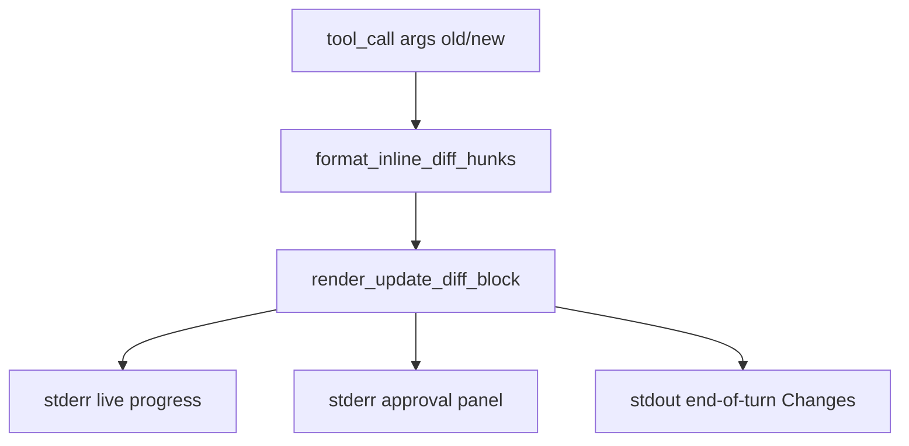

# Claude Code-style file edit diffs

## Current state vs target

The project **already renders diffs** for `edit_file` / `write_file` on all three surfaces ([`specs/16_chat_ui.md`](specs/16_chat_ui.md) §File-edit diffs):

| Surface | When | Stream |
|---------|------|--------|
| Live progress | successful `tool_result` | stderr |
| Approval | `--require-approval` write/edit | stderr |
| End-of-turn Changes | after agent answer | stdout |

Implementation lives in [`src/vg_agent/chat_ui.py`](src/vg_agent/chat_ui.py) (`format_unified_diff`, `_diff_syntax`, `_print_diff_panel`, `render_progress_file_diff`, `prompt_approval` diff branch, `_render_changes_to_console`).

**Today:** standard git hunks (`--- a/…`, `+++ b/…`, `@@ … @@`) inside a Rich `Panel` + `Syntax(lexer="diff")`.

**Target (your screenshot):**

```text
● Update(tests\test_vg_agent.py)
└ Removed 1 line
  22    from vg_agent.agent import (
  23        run_live_task,
  24  -   run_task,
  25        spawn_subagents,
```

- `Update({path})` header per **hunk** (same file can produce multiple blocks if edits are far apart)
- `└ Added N line(s), removed M line(s)` summary under the header
- Three columns: **line number** (dim) | **sign** (`-`/`+`/blank) | **content**
- Context lines: plain; removals: red background; additions: green background
- No `---`/`+++`/`@@` headers
- Keep existing truncation (~40 display rows per hunk) and `NO_COLOR` plain fallback



## Spec update (source of truth)

Edit [`specs/16_chat_ui.md`](specs/16_chat_ui.md) §**File-edit diffs** — replace the unified-diff bullet list with the Claude Code-style contract:

- Header: `Update({path})` (optionally prefixed with `●` when emoji allowed; ASCII `*` when `NO_EMOJI`)
- Summary line: `└ …` with human-readable add/remove counts
- Row layout: lineno | sign | content; context rows unsigned
- Colors: removals `red` on dark red bg; additions `green` on dark green bg; lineno `dim`
- One block per hunk; multiple hunks per file allowed
- Truncation footer unchanged
- Non-TTY / `NO_COLOR`: same structure, no Rich styles (prefix `-`/`+` only)

One-line cross-ref tweak in [`specs/60_observability.md`](specs/60_observability.md) if it still says "unified diff".

## Implementation in [`src/vg_agent/chat_ui.py`](src/vg_agent/chat_ui.py)

### 1. New diff model + hunk builder

Add dataclasses:

```python
@dataclass(frozen=True)
class DiffRow:
    line_no: int | None  # old-file lineno for context/delete; new-file for pure inserts
    sign: str            # "", "-", "+"
    text: str
    kind: str            # "context" | "remove" | "add"

@dataclass(frozen=True)
class DiffHunk:
    path: str
    rows: list[DiffRow]
    added: int
    removed: int
    truncated: bool
```

Add `format_inline_diff_hunks(old, new, *, path, context=DIFF_CONTEXT_LINES, max_rows=DIFF_MAX_LINES) -> list[DiffHunk]`:

- Split `old`/`new` into lines; run `difflib.SequenceMatcher.get_opcodes()`
- Merge change opcodes into hunks with `context` lines of surrounding `equal` opcodes (same grouping strategy as unified diff)
- For each hunk opcode:
  - `equal` → context rows with old-file line numbers
  - `delete` → `-` rows, count removals
  - `insert` → `+` rows with new-file line numbers, count additions
  - `replace` → emit deletes then inserts (matches screenshot block 2)
- Truncate **display rows** per hunk; set `truncated=True` and append dim footer row when clipped

Keep `format_unified_diff` as an internal fallback for `NO_COLOR` plain text **or** drop it and render plain from `DiffRow` list (simpler — one code path).

### 2. Rich renderer

Replace `_diff_syntax` + `_print_diff_panel` with:

```python
def _change_summary(added: int, removed: int) -> str: ...
def _render_diff_hunk(console, hunk: DiffHunk) -> None: ...
def _render_diff_hunks(console, hunks: list[DiffHunk]) -> None: ...
```

Use Rich `Table` (no box, minimal padding) or stacked `Text` segments:

| Column | Width | Style |
|--------|-------|-------|
| lineno | 5 | dim, right-aligned |
| sign | 1 | red/green/dim |
| content | flex | `white on rgb(80,30,30)` remove / `white on rgb(30,60,30)` add |

Header block (no outer Panel border — closer to screenshot):

```python
console.print(f"[bold]● Update({path})[/bold]")
console.print(f"[dim]└ {summary}[/dim]")
console.print(table)
```

When truncated, print dim `… N more lines (full edit in trace)`.

### 3. Rewire existing call sites (all surfaces)

| Function | Change |
|----------|--------|
| `render_diff_to_console` | build hunks → `_render_diff_hunks`; drop `title=f"{tool} {path}"` panel title |
| `_render_changes_to_console` | iterate hunks (not one panel per path); optional dim `Changes` section header when multiple files |
| `prompt_approval` | replace nested `Panel(_diff_syntax(...))` with `_render_diff_hunks` inside existing cyan approval `Panel` |
| `progress_diff_lines` | return flattened plain rows from hunks for non-Rich progress fallback |

No changes needed in [`scripts/generate_project.py`](scripts/generate_project.py) `__main__` template — it already calls `render_progress_file_diff` / `print_turn_output` which delegate to `chat_ui`.

### 4. Tests in [`tests/test_vg_agent.py`](tests/test_vg_agent.py)

Update existing diff tests and add hunk-specific coverage:

- **`test_format_inline_diff_hunks`** — `"foo\nbar"` → `"foo\nbaz"` yields one hunk, `removed=1`, `added=1`, rows include context + `-bar` + `+baz`
- **`test_format_inline_diff_hunks_splits_distant_edits`** — two separated edits → two hunks for same path
- **`test_change_summary_text`** — `(0,1)` → `"Removed 1 line"`; `(1,1)` → `"Added 1 line, removed 1 line"`
- Update **`test_format_unified_diff_*`** → rename/repoint to inline hunk tests (or keep unified as deprecated helper if retained)
- Update **`test_chat_ui_turn_output_includes_edit_diff`** — assert stdout contains `Update(app.py)` and `-foo` / `+bar` (via Rich capture or plain fallback path)
- Optional snapshot-style test: render hunks to `Console(file=StringIO())` and assert `Update(` + summary + line numbers present

### 5. Regenerate + verify

```powershell
python scripts/generate_project.py --clean
uv run pytest tests/test_vg_agent.py -k "diff or edit_diff or turn_output"
```

Manual TTY smoke: `uv run vg-agent --chat --seed-fixture` → task that triggers a Coder `edit_file`; confirm stderr progress block and stdout Changes block match the new layout.

## Out of scope (v1)

- Character/word-level highlights within a line (brighter sub-span on long-line replacements)
- Side-by-side columns
- Diff in `--task` non-chat mode (can reuse same helper later)
- Changing JSONL trace schema or tool semantics

## Files touched

| File | Role |
|------|------|
| [`specs/16_chat_ui.md`](specs/16_chat_ui.md) | New diff format contract |
| [`specs/60_observability.md`](specs/60_observability.md) | Wording cross-ref |
| [`src/vg_agent/chat_ui.py`](src/vg_agent/chat_ui.py) | Hunk builder + Claude-style renderer; rewire all surfaces |
| [`tests/test_vg_agent.py`](tests/test_vg_agent.py) | Updated + new unit tests |
