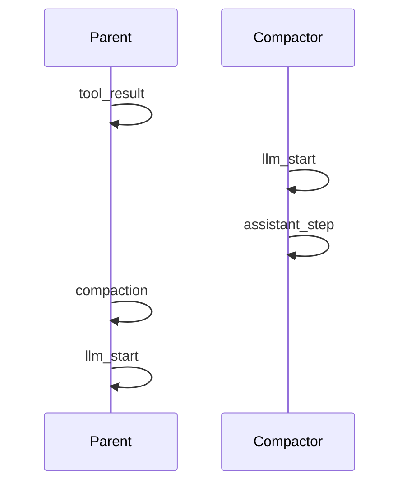
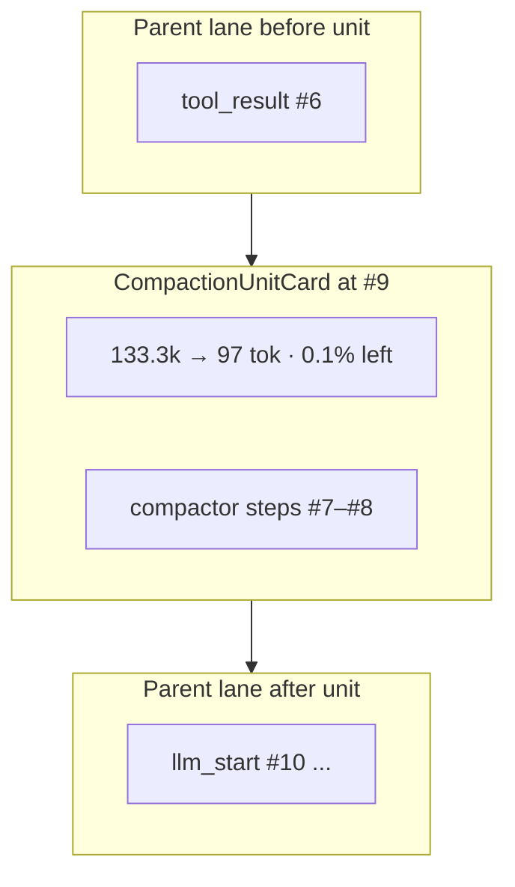

# Compaction + compactor visual grouping

## What you are seeing (and why it feels wrong)

You are correct on both counts.

**Runtime order (JSONL `event_idx`):**

**UI order today ("Turn + agents"):**

[`ParallelTurnLayout.tsx`](dashboard/web/src/components/ParallelTurnLayout.tsx) always renders:

1. **Entire parent lane** — all `agent_id === "parent"` events in order (#9 compaction, then #10–#15, …)
2. **All sub-agent lanes below** — including `compactor` (#7–#8), sorted by first `event_idx`

[`splitAgentLanes`](dashboard/web/src/lib/groupEvents.ts) routes `compactor` events to a subagent lane because they are not `parent`. That layout matches **parallel explorers** (overlap, side-by-side columns) but not **inline synchronous compaction**, where the compactor always finishes immediately before the parent `compaction` event ([`_compact_if_needed`](src/vg_agent/agent.py) emits `llm_start` / `assistant_step` with `agent_id="compactor"`, then `compaction` on the default parent `emit`).

So the summary metrics on #9 (`CompactionStatsBadge` on [`EventRow.tsx`](dashboard/web/src/components/EventRow.tsx)) and the compactor LLM work in the purple box are the same operation, split by layout — not by missing data in the trace.

**Flat / By turn modes** list events in true `event_idx` order and do not have this split; the confusion is specific to **Turn + agents**.

---

## Recommended UX: one "compaction unit" card

Treat each `kind: compaction` or `kind: context_compaction` as the anchor of a **CompactionUnit**:

| Section | Source | Content |
|--------|--------|---------|
| **Header** | `compaction` / `context_compaction` payload | `before_tokens → after_tokens`, % remaining / reduced ([`compactionStats.ts`](dashboard/web/src/lib/compactionStats.ts) — same strings as chat `/review`) |
| **Subheader** | compactor `assistant_step` + compaction payload | `compactor_model`, fallback flag, compactor cost/tokens rollup |
| **Body (collapsible)** | Preceding `agent_id=compactor` events | Nested `EventRow`s for #7–#8 (model, assistant summary) |
| **Footer link** | `original_event_idx` (tool compaction only) | Jump/highlight original `tool_result` row |

Render that card **once**, at the compaction event’s chronological position in the parent timeline. **Do not** also show:

- a standalone parent `compaction` row, or
- a separate bottom `compactor` lane for events already absorbed into a unit.

Explorers (`explorer`, `grilling`, …) keep the current parallel lane layout unchanged.

---

## Linking logic (dashboard-only, no trace schema change required)

Add [`dashboard/web/src/lib/compactionUnits.ts`](dashboard/web/src/lib/compactionUnits.ts):

For each `compaction` / `context_compaction` event (sorted by `event_idx`):

1. Walk **backward** over the same turn’s events while `agent_id === "compactor"` (or `agent_type === "compactor"`), collecting a contiguous block ending just before the compaction row.
2. Optionally attach `original_event_idx` → original `tool_result` for deep links.
3. Mark collected compactor `event_idx`s as **consumed** so they are not rendered again in a stray lane.

Heuristic is reliable for current runtime: compactor events are always emitted immediately before their compaction event ([`_summarize_for_compactor`](src/vg_agent/agent.py) → `recorder.emit("compaction", ...)`). Stub/fallback compactions with **no** compactor rows still render a header-only unit.

**Optional later (spec-first):** add `compactor_event_idxs: [7, 8]` on `compaction` in [`specs/30_runtime_governance.md`](specs/30_runtime_governance.md) + [`scripts/generate_project.py`](scripts/generate_project.py) for explicit linking across refactors — not required for v1 UI fix.

---

## Implementation touchpoints

| File | Change |
|------|--------|
| [`compactionUnits.ts`](dashboard/web/src/lib/compactionUnits.ts) | `buildCompactionUnits(turnEvents)`, types, consumed-index set |
| [`CompactionUnitCard.tsx`](dashboard/web/src/components/CompactionUnitCard.tsx) | Amber-bordered card: header stats, compactor footer, collapsible inner rows |
| [`ParallelTurnLayout.tsx`](dashboard/web/src/components/ParallelTurnLayout.tsx) or new [`TurnAgentLayout.tsx`](dashboard/web/src/components/TurnAgentLayout.tsx) | Build units from full turn events; render parent lane as interleaved `EventRow` \| `CompactionUnitCard`; pass **filtered** subagent map (exclude consumed compactor events; drop empty `compactor` lane) |
| [`AgentLane.tsx`](dashboard/web/src/components/AgentLane.tsx) | Optional: if a leftover compactor lane exists (orphan), show compaction stats in lane header from nearest compaction heuristic — edge case only |
| [`specs/70_dashboard.md`](specs/70_dashboard.md) | Document **Compaction unit** under Event stream: grouped compactor + compaction in Turn + agents view |
| Tests | Pure TS tests for `buildCompactionUnits` (Node/vitest if added, or small Python fixture test via API is unnecessary); extend [`tests/test_dashboard_api.py`](tests/test_dashboard_api.py) only if API changes (none planned) |

**Agent nav:** [`agentNav.ts`](dashboard/web/src/lib/agentNav.ts) `compactor` chip should still jump to compaction unit or first compactor `event_idx` inside it (use unit’s min `event_idx`).

**Highlight / deep link:** `eventIdx` query should expand the unit containing that index ([`TurnSection`](dashboard/web/src/components/TurnSection.tsx) already auto-expands turns with highlighted events).

---

## What we are not changing

- **Trace schema** — `compaction` stays a parent-scoped event; compactor stays `agent_id=compactor` for FinOps `per_agent_type_*` ([`specs/60_observability.md`](specs/60_observability.md)).
- **Safety tab / Context tab** — already show compaction lists and parent `show_context` markers; no change required.
- **Flat view** — optional: reuse `CompactionUnitCard` when consecutive compactor+compaction rows appear; lower priority than Turn + agents.

---

## Success criteria

After change, for the demo log-read run:

- One amber **compaction unit** appears after the large `tool_result`, containing **133.3k → 97** (or equivalent) at the top **and** compactor #7–#8 nested inside.
- No separate `compactor (compactor) 2 events` box below `run_end` / `statusline` for that same operation.
- Parent events #10+ still follow the unit in correct order.
