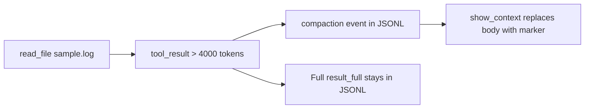
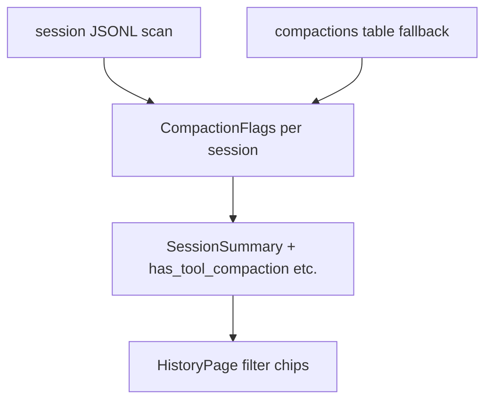

# Compaction examples, Context tab, and History filters

## What exists today (runtime)

| Kind | Trigger | Status | Trace event |
|------|---------|--------|-------------|
| **Tool-result compaction** (what specs call parent-scoped compaction) | Automatic when a parent `tool_result` exceeds `K_COMPACT` (4000 tokens) via [`_compact_if_needed`](src/vg_agent/agent.py) | **Implemented** | `kind: "compaction"` with `before_tokens`, `after_tokens`, `tool_use_id`, `original_event_idx`, `original_sha256` |
| **Conversation auto-compaction** | Threshold before each parent model call | **Not implemented** | Planned `kind: "context_compaction"` with `reason: "auto"` ([`plans/when-we-have-auto-compaction-partitioned-moler.md`](plans/when-we-have-auto-compaction-partitioned-moler.md)) |
| **Manual compaction** | `/compact` slash command | **Not implemented** | Same `context_compaction` with `reason: "manual"` |

There is **no** `/compact` in [`specs/15_cli_contract.md`](specs/15_cli_contract.md) today. [`format_compaction_banner`](src/vg_agent/chat_ui.py) already handles `context_compaction` in the UI layer, but nothing emits that event yet.

**Canonical example of auto (tool-result) compaction:**

- Run the VG demo task from [`demo_review.md`](demo_review.md): read `data/sample.log`, then parallel explorers.
- Unit test: [`test_parent_compaction_and_subagent_context`](tests/test_vg_agent.py) — asserts `compaction` event and that `show_context` contains `[COMPACTED tool_result…]` but not `req-00001` from the raw log.

---

## Is `/history/2af7403dd0db?tab=context` the right place?

**Partially yes** — for **parent model-visible** context at a chosen step:

- The Context tab calls [`GET /runs/{run_id}/context?step_idx=N`](dashboard/api/services/context.py), which uses [`show_context`](src/vg_agent/trace.py) on merged SQLite + JSONL events (same as CLI `--show-context N`).
- Messages with `compacted: true` get an amber border and a `compacted` label ([`SessionDetailPage.tsx`](dashboard/web/src/pages/SessionDetailPage.tsx) lines 256–289).
- Move the **parent step** slider to the step **after** the large `read_file` to see the `[COMPACTED tool_result…]` marker instead of the log body.

**Whether that session shows compaction** depends on the trace content, not the URL. For session `2af7403dd0db` (not in the repo’s checked-in traces), verify on your machine:

1. **Safety** tab → Compactions list (`before_tokens→after_tokens`).
2. **Events** tab → filter/scroll for `kind: compaction` (expandable row shows original idx/sha256 per [`specs/70_dashboard.md`](specs/70_dashboard.md)).
3. **Context** tab → step slider after the `read_file` step.

If none of those show `compaction`, that session never triggered tool-result compaction (e.g. no read above 4000 tokens).

**Better complementary views:**

| View | What you see |
|------|----------------|
| Context tab | What the **parent model** saw at step N (markers, not raw log) |
| Safety tab | All compaction rows for the run |
| Events tab | Full `compaction` event payload + link to original `tool_result` in trace |
| JSONL | **Full** `result_full` on the original `tool_result` event (audit source) |

---

## Is Context tab “the full context”?

**No.** It is intentionally **not** the full trace or full message bodies:

1. **Scope:** Parent-only (`agent_id == "parent"`). Explorer `tool_call` / `tool_result` intermediates are excluded (by design — VG.2 Explorer offloading).
2. **Step bound:** History stops at the selected parent `step_idx`; later turns are omitted.
3. **UI truncation:** Each message uses `max-h-48 overflow-y-auto` — long content is clipped in the browser even when the API returns more.
4. **Semantics:** Compacted tool results are **markers**, not summaries of the full file; the full payload remains in JSONL at `original_event_idx`.

So Context tab = **“parent LLM input at step N”** (CLI parity), not **“everything that happened”**.

Optional UX improvements (dashboard-only, no agent change):

- Label the tab: “Parent context (model view)” with a short note linking to Events/JSONL for full payloads.
- “Expand all” / remove `max-h-48` cap when inspecting compaction.
- Jump context slider to steps that have compaction (from Safety tab or compaction events).
- Side-by-side: marker in Context vs expandable full `tool_result` from Events.

---

## History filters: `auto-compaction` / `manual-compaction`

**Feasible** — same pattern as parallel/sequential sub-agent filters in [`sessionFilters.ts`](dashboard/web/src/lib/sessionFilters.ts) and [`session_tags.py`](dashboard/api/services/session_tags.py).

**Important naming alignment:**

| Filter label (suggested) | Matches today? | Detection |
|--------------------------|----------------|-----------|
| **Tool compaction** (or “Auto tool-result”) | Yes | Any parent `compaction` event in session JSONL (or `compactions` SQLite table) |
| **Context compaction (auto)** | No (until plan ships) | `context_compaction` with `reason == "auto"` |
| **Context compaction (manual)** | No (until `/compact` ships) | `context_compaction` with `reason == "manual"` |

Using exactly `auto-compaction` / `manual-compaction` on History is fine if we document that **today only the first category will match real sessions**; the second two are forward-compatible for [`when-we-have-auto-compaction-partitioned-moler.md`](plans/when-we-have-auto-compaction-partitioned-moler.md).

### Implementation sketch

1. **Spec** — extend [`specs/70_dashboard.md`](specs/70_dashboard.md) “History sub-agent badges” section with compaction flags and filter semantics (JSONL-first, like sub-agents).
2. **Backend** — new [`dashboard/api/services/session_compaction_tags.py`](dashboard/api/services/session_compaction_tags.py) (or extend `session_tags.py`):
   - `has_tool_compaction`: any `kind == "compaction"` in merged events / `compactions` row count.
   - `has_context_compaction_auto` / `has_context_compaction_manual`: `context_compaction` + `reason` (when present).
   - `bulk_compaction_flags(session_ids)` called from [`list_sessions`](dashboard/api/services/sessions.py) like `bulk_subagent_flags`.
3. **Schema** — add booleans to [`SessionSummary`](dashboard/api/schemas.py) and [`dashboard/web/src/api.ts`](dashboard/web/src/api.ts).
4. **Frontend** — extend [`SESSION_FILTER_OPTIONS`](dashboard/web/src/lib/sessionFilters.ts) and [`HistoryPage.tsx`](dashboard/web/src/pages/HistoryPage.tsx) with three chips; optional badges on session rows (amber “compacted” when `has_tool_compaction`).
5. **Tests** — API test with a fixture JSONL containing `compaction` (reuse test trace patterns from [`tests/test_vg_agent.py`](tests/test_vg_agent.py)).

No changes under `src/vg_agent/` unless you also want to **implement** conversation-level compaction; that remains a separate spec-first agent change per the existing plan.

---

## Recommended order

1. **Verify** session `2af7403dd0db` via Safety/Events tabs (no code).
2. **History filters** for existing tool compaction (dashboard-only, immediate value).
3. **Context tab copy + jump-to-compaction-step** (small UX, clarifies “not full context”).
4. **Agent work** (separate project): conversation auto + `/compact` from [`when-we-have-auto-compaction-partitioned-moler.md`](plans/when-we-have-auto-compaction-partitioned-moler.md); then enable the two `context_compaction` history filters and extend `show_context` if conversation summaries must appear in the Context tab.
