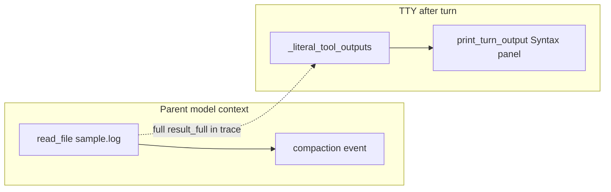

# Demo-friendly chat output and parallel visibility

## Diagnosis

You hit two separate UX gaps:



1. **Terminal flood** — [`_literal_tool_outputs`](src/vg_agent/__main__.py) runs when the user prompt contains `read` (your demo prompt does). It prints the **full** parent `tool_result.result_full` (~6200 lines for `data/sample.log`) via [`print_turn_output`](src/vg_agent/chat_ui.py), even though the parent model already received a [**compacted marker**](src/vg_agent/trace.py) (`K_COMPACT = 4000`). Compaction is visible in progress (`[context] compacted …`) and in `/show-context`, but the end-of-turn **Tool output** panel defeats the demo.

2. **Parallel proof buried** — Parallelism **does** happen ([`_spawn_many`](src/vg_agent/agent.py) + `threading.Barrier`; tested in [`test_parallel_explorers_run_concurrently_with_overlap`](tests/test_vg_agent.py)). Progress already emits indented `[agent] spawn` / `[agent] return` (magenta), but interleaved explorer tool lines and a huge file dump push that off-screen. `/finops` only aggregates `explorer` totals — it does not state **overlap** or list the two questions.

Your preference: **light `/finops` parallel line + new `/review`** for full recap.

---

## 1. Compaction-aware, tail-first file preview (fixes the flood)

**Spec** — extend [`specs/16_chat_ui.md`](specs/16_chat_ui.md) §Turn output and [`specs/15_cli_contract.md`](specs/15_cli_contract.md) literal-output bullets:

| Condition | TTY shows |
|-----------|-----------|
| Matching `compaction` event for that parent `tool_use_id` | Compaction banner text (same as progress), **not** raw file body |
| `read_file` / `read_file_range` body &gt; `VG_CHAT_FILE_PREVIEW_LINES` (default **30**) | **Last N lines** + header: line count, byte size, `event_idx`, trace path, hint `read_file_range path start end` |
| Small files / directory listings | Current behavior (Tree or full Syntax) |

**Implementation** (generated via [`scripts/generate_project.py`](scripts/generate_project.py)):

- Add `format_literal_tool_body(...)` in [`chat_ui.py`](src/vg_agent/chat_ui.py) (or `trace.py` if shared with `/review`).
- In [`_literal_tool_outputs`](src/vg_agent/__main__.py): build a `tool_use_id → compaction` map from events since `start_idx`; pass `recorder.path` / `event_idx` into the formatter.
- [`print_turn_output`](src/vg_agent/chat_ui.py): use the formatter before `Syntax`/`Panel` (truncation footer: `… {skipped} earlier lines (full payload in trace)`).

**Env knob** (document in spec §Environment): `VG_CHAT_FILE_PREVIEW_LINES=30`.

This matches your “show end of file, full file elsewhere” idea and aligns CLI with what the model actually saw when compacted.

---

## 2. Live progress: one clear parallel summary line

When `tool_result` for `spawn_subagents` is **ok**, append a single stderr line after existing `[tool]` output (in `_make_progress_sink` or `_format_progress_event`):

```text
[parallel] 2 explorers finished concurrently (overlap yes · 3.1s / 3.4s)
  · explorer-….0: summarise auth/…
  · explorer-….1: summarise utils.py…
```

**Overlap helper** — new `parallel_subagent_summary(events, *, since_event_idx=0)` in [`trace.py`](src/vg_agent/trace.py):

- Collect `subagent_return` rows with `agent_type`, `child_agent_id`, `started_at`, `ended_at`, optional question from nearest `subagent_spawn`.
- Pairwise interval overlap (same logic as the unit test).
- Truncate question snippets (~60 chars).

Spec cross-ref in [`specs/12_subagent_pipeline.md`](specs/12_subagent_pipeline.md) or [`specs/60_observability.md`](specs/60_observability.md) §FinOps — “CLI may surface overlap from `started_at`/`ended_at`”.

---

## 3. `/finops` — minimal parallel line (your choice)

After the existing per-agent table in [`_print_finops`](src/vg_agent/__main__.py), print:

```text
Parallel batches this session: 1
  turn 1: spawn_subagents · 2 explorers · overlapping wall-clock
```

Derive “turn” from last `user_prompt` before the spawn’s `parent_step_idx` (or batch by contiguous `subagent_spawn` groups). Keep it **3–5 lines max** — not a second dashboard.

---

## 4. New `/review` slash command (readable post-turn recap)

**Spec** — [`specs/15_cli_contract.md`](specs/15_cli_contract.md) + [`specs/16_chat_ui.md`](specs/16_chat_ui.md):

| Command | Behavior |
|---------|----------|
| `/review` | Last completed user turn in this chat session |
| `/review N` | Turn index counting `user_prompt` events (1 = first) |

Output (plain stdout; optional dim Rich sections when TTY):

1. **Prompt** — user text  
2. **Parent plan** — assistant step tool summaries (`spawn_subagents`, `read_file`, …)  
3. **Parallel** — table from `parallel_subagent_summary` (overlap yes/no, durations, truncated payloads from `spawn_subagents` JSON)  
4. **Context engineering** — compaction rows (`before_tokens → after_tokens`, trace pointer)  
5. **Answer** — final parent `assistant_text` (truncate if &gt; ~2 KB with “full in trace”)  
6. **Pointers** — `trace: traces/<run_id>.jsonl`, suggest `/show-context <step>` for parent context at a step

Wire in [`_chat_loop`](src/vg_agent/__main__.py): add to `SLASH_COMMANDS`, `SLASH_COMMAND_META`, help text.

**Not** a replacement for `/show-context` (machine JSON for graders) — complementary human recap.

---

## 5. `/status` — optional one-liner only

In [`_write_secondary`](src/vg_agent/chat_ui.py) or status bar hint: if the latest turn had overlapping explorers, append dim text:

`last turn: 2 parallel explorers (overlap confirmed)`

Avoid reprinting full `/review` on every `/status` clear — keeps `/status` fast for live demos.

---

## 6. Tests and regen

| Test | Asserts |
|------|---------|
| `test_literal_tool_output_compacted_read` | After compaction, literal output contains `[COMPACTED` / banner, not `request_id=req-` spam |
| `test_literal_tool_output_tail_preview_large_file` | 500-line fake read → last N lines + “earlier lines” + trace pointer |
| `test_parallel_subagent_summary_overlap` | Synthetic spawn/return timestamps → `overlap=True` |
| `test_review_command_formats_last_turn` | FakeClient pipeline → `/review` output contains both explorer snippets + overlap line |
| `test_finops_includes_parallel_batches` | Optional one-line assert |

```powershell
python scripts/generate_project.py --clean
uv run pytest tests/test_vg_agent.py -k "literal or parallel or review or finops"
```

Manual smoke (matches [`final_demo_live_chat_script.md`](final_demo_live_chat_script.md) Prompt 3):

```text
read data/sample.log, then summarise auth/ and utils.py in parallel; combine both sub-agent findings into one final recommendation
/finops
/review
/show-context 8
```

Expected: no 6200-line Syntax panel; stderr shows `[parallel] … overlap yes`; `/finops` mentions parallel batch; `/review` is presenter-friendly; `/show-context` still proves compaction for graders.

---

## Out of scope (v1)

- Web/React dashboard (deferred in [`specs/60_observability.md`](specs/60_observability.md))
- Changing JSONL schema or `read_file` tool semantics
- Collapsing interleaved explorer `[tool]` progress lines (can be v2 if still noisy)
- Claude Code diff plan ([`.cursor/plans/claude_code_diff_view_2eb74c3f.plan.md`](.cursor/plans/claude_code_diff_view_2eb74c3f.plan.md)) — orthogonal

---

## Files to change (spec-first)

| File | Change |
|------|--------|
| [`specs/16_chat_ui.md`](specs/16_chat_ui.md) | File preview, parallel progress line, `/review`, secondary status hint |
| [`specs/15_cli_contract.md`](specs/15_cli_contract.md) | `/review`, updated literal-output rules |
| [`specs/60_observability.md`](specs/60_observability.md) | FinOps CLI may expose overlap summary |
| [`scripts/generate_project.py`](scripts/generate_project.py) | Templates: `trace.py`, `chat_ui.py`, `__main__.py` |
| [`tests/test_vg_agent.py`](tests/test_vg_agent.py) | New/updated tests |

Do **not** hand-edit [`src/vg_agent/*`](src/vg_agent/) — regenerate after spec/template edits.
