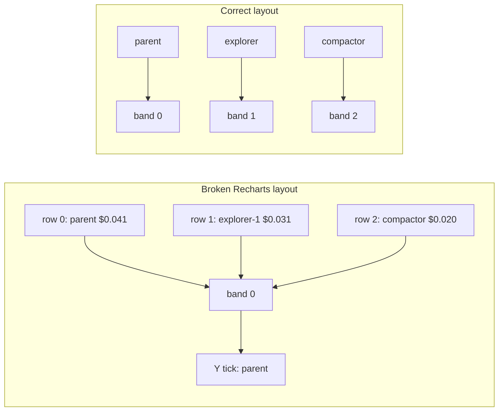

# Fix agent cost chart stacking

## What you are seeing

The screenshot is **not** multiple API rows for `parent`. Live data confirms one aggregated row per id:

| `agent_id` | `cost_usd` (7d) |
|------------|-----------------|
| `parent` | 0.041 |
| `explorer-1` | 0.031 |
| `compactor` | 0.020 |

The three long bars under the `parent` tick (~0.031, ~0.041, ~0.020) are those top costs **drawn on top of each other** at the first band position.



**Root cause:** Recharts `BarChart` with `layout="vertical"` defaults X/Y axis types as if horizontal. Without `XAxis type="number"` and `YAxis type="category"`, every bar uses the first category slot ([recharts#6034](https://github.com/recharts/recharts/issues/6034)).

Your screenshot title **"Cost by agent id"** matches an older UI path. Current source already prefers **role** rollup when the API provides it, but the instance fallback (and any build without explicit axis types) still shows the stacking bug.

## Backend (already correct for role view)

[`dashboard/api/services/stats.py`](dashboard/api/services/stats.py) already exposes:

- **`by_agent_role`** — rolls `coder-1`, `coder-1.0`, `explorer-3.1`, etc. into `coder` / `explorer` / `parent` / `compactor` via `_agent_role()` (lines 110–122, 259–267, 495).
- **`by_agent_type`** — per-instance ids (legacy / drill-down).

Live API today returns role rollup, e.g. `parent` ($0.041), `explorer` ($0.034), `compactor` ($0.020) — three clean categories.

No change needed to aggregation logic beyond optional sort consistency (role list is already sorted by `-cost_usd`).

## Frontend changes

**File:** [`dashboard/web/src/pages/StatsPage.tsx`](dashboard/web/src/pages/StatsPage.tsx)

1. **Extract a shared `CostBarChart` helper** used by "Cost by model", "Cost by agent role", and any instance fallback so axis config cannot drift again:

```tsx
function CostBarChart({ data, yWidth }: { data: { label: string; cost_usd: number }[]; yWidth: number }) {
  return (
    <BarChart data={data} layout="vertical" margin={{ left: 4, right: 8 }}>
      <CartesianGrid stroke="#334155" strokeDasharray="3 3" />
      <XAxis type="number" tick={{ fill: "#8b9cb3", fontSize: 11 }} tickFormatter={formatCostAxisTick} />
      <YAxis type="category" dataKey="label" width={yWidth} tick={{ fill: "#8b9cb3", fontSize: 10 }} />
      <Tooltip {...costChartTooltipProps} />
      <Bar dataKey="cost_usd" fill="#818cf8" radius={[0, 4, 4, 0]} />
    </BarChart>
  );
}
```

2. **Default chart = role only** (your choice): always render **"Cost by agent role"** from `stats.by_agent_role`, sorted by `cost_usd` desc, top 8–10. Remove the confusing instance-id chart from the main grid (or tuck it behind a small "Show instance ids" toggle if you still want drill-down later).

3. **Data prep:** `const byAgentRole = [...(stats.by_agent_role ?? [])].sort((a, b) => b.cost_usd - a.cost_usd).slice(0, 10)` — do not use `by_agent_type` sorted by tokens (that order put `explorer-1` first and made the stacking bug look like "extra parent bars").

4. **Empty state:** if `by_agent_role` is empty but `by_agent_type` has data (old API), show a short note: "Restart API to load role rollups" rather than the broken instance chart.

5. **Verify in browser:** hard-refresh `http://127.0.0.1:5173` (Vite dev). You should see **three separate bars** labeled `parent`, `explorer`, `compactor` — not `coder-1.0` fragments.

## Tests

**File:** [`tests/test_dashboard_api.py`](tests/test_dashboard_api.py) (extend existing `test_stats_extended_aggregations` / model-stats test)

- Insert model_calls for `explorer-1` and `explorer-1.0` with known costs; assert `by_agent_role` has a single `explorer` entry whose `cost_usd` is the sum.
- Assert all `label` values in `by_agent_role` are unique.

## Spec touch (one line)

[`specs/70_dashboard.md`](specs/70_dashboard.md) — note stats UI charts **agent role** rollup by default; `by_agent_type` remains API-only for debugging.

## Out of scope

- Changing runtime spawn ids (`coder-1.0` from parallel slots in [`src/vg_agent/agent.py`](src/vg_agent/agent.py) line 1190) — role rollup already hides this in the dashboard.
- Regenerating `src/vg_agent/` (no agent runtime change).
