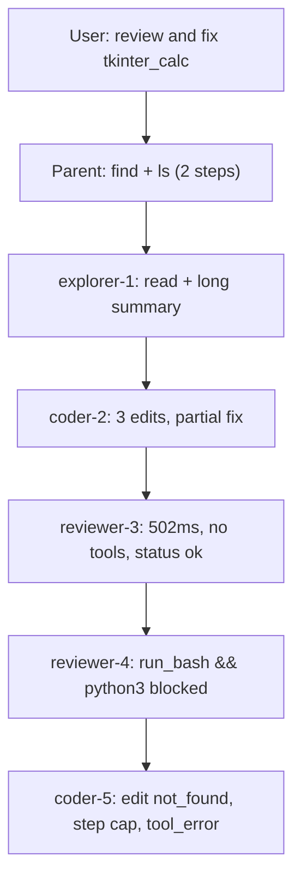

# Fix calculator-session failure chain

Covers **session 1** (“make calculator” → “pytest?”) and **session 2** (“review and fix calculator”).

---

## Session 2 diagnosis (new)

**Yes — Reviewer was spawned** (`reviewer-3`, `reviewer-4`), but both were effectively useless:



| # | Symptom | Root cause |
|---|---------|------------|
| R1 | reviewer-3 returned instantly (30 tokens, no tools) | **`review_slice` is never passed** — spawn path calls `_spawn_one(...)` without building JSONL slice ([`generate_project.py`](scripts/generate_project.py) ~3154); Reviewer prompt promises slice it never receives |
| R2 | reviewer-4 tried `grep ... && ...` and `python3 -c` | Reviewer prompt lacks explicit `run_bash` constraints; flash-lite model improvises blocked commands |
| R3 | Parent spawned Reviewer **twice** with same question | No dedup; first Reviewer `ok` was accepted despite doing nothing |
| R4 | Explorer used for initial “review” | **Correct per pipeline** — Explorer = pre-fix inspection; Reviewer = post-Coder verification only ([`specs/12`](specs/12_subagent_pipeline.md)). User expectation (“review” → Reviewer) differs from spec |
| R5 | Explorer summary drove wrong Coder plan | Referenced `total_calculation`, `self.display` before Coder read file; Coder’s first `edit_file` → `not_found` |
| R6 | coder-2 partial fix | Fixed `all_clear`→`clear_all` but left `clear_entry()` call while CE button uses `clear_last_entry` ([`calculator.py`](workspace/tkinter_calc/calculator.py) line 71) |
| R7 | coder-5 `tool_error` | Hit `MAX_SUBAGENT_STEPS` (8) mid-edit chain; parent step cap (20) hit simultaneously |
| R8 | 2 parent steps on `find`/`ls` | User named folder explicitly; parent should spawn Explorer on `tkinter_calc/calculator.py` directly |

### Critical bug: Reviewer JSONL slice unwired

Infrastructure exists but is dead code:

```3151:3154:scripts/generate_project.py
    if tool_name == "spawn_subagent":
        child_type = _normalise_agent_type(args.get("type"))
        question = str(args.get("question") or "")
        outcome = _spawn_one(root, child_type, question, recorder, client, guard, started, policy)
```

`_run_live_subagent` accepts `review_slice` and injects it into the user message (~3187), but **no caller ever sets it**. Spec table says Reviewer gets “JSONL slice of the Coder run” ([`specs/12`](specs/12_subagent_pipeline.md) line 13) — this is unimplemented.

---

## Session 1 diagnosis (unchanged)

| # | Symptom | Root cause |
|---|---------|------------|
| 1 | coder-2 stopped after `read_file` | No Coder must-mutate guard |
| 2 | Partial rename fix | No reference sweep after renames |
| 3 | Tests use fictional API | No read-before-test rule |
| 4 | `run_bash pytest` blocked | No `run_tests` tool; parent still tries |
| 5 | 4 Coder spawns, step cap | No combined delegation; empty Coder return accepted |
| 6–7 | Approval / budget UX | `--require-approval writes`; back-to-back cap prompts |

---

## Model tier recommendation

Your [`.env`](.env) already splits models — the pairing is part of the problem:

| Role | Current | Issue | Recommended |
|------|---------|-------|-------------|
| **Parent** (plan/orchestrate) | `gemini-2.5-flash` | OK for cost; sometimes spawns redundant steps | Keep flash, or try `claude-haiku-4.5` for stricter tool discipline |
| **Coder** (mutate) | `gemini-2.5-flash` | Hallucinates APIs, weak `edit_file` anchoring | **`qwen3-coder-30b`** or **`deepseek-v4-flash`** ([`MODEL_CONFIG.md`](MODEL_CONFIG.md) optional examples) |
| **Explorer** (read) | `gemini-2.5-flash-lite` | Fine for read-only | Keep lite |
| **Reviewer** (verify) | `gemini-2.5-flash-lite` | **Too weak** — instant no-op PASS, illegal run_bash | **Match parent or Coder** (flash minimum); never lite |
| **Grilling / Compactor** | lite | Fine | Keep lite |

**Action:** document tiers in [`MODEL_CONFIG.md`](MODEL_CONFIG.md) + [`.env.example`](.env.example); update your `.env` to set `VG_REVIEWER_MODEL=google/gemini-2.5-flash` (or same as Coder). No code change required — config only.

Separate “plan vs code” models is supported today via `VG_PARENT_MODEL` vs `VG_CODER_MODEL`. The shell does not need a new “Planner” sub-agent type; the parent already plans.

---

## Proposed changes

### 1. Wire Reviewer properly (runtime — highest impact for session 2)

**In [`scripts/generate_project.py`](scripts/generate_project.py):**

- Add `_build_review_slice(recorder, coder_agent_id: str) -> str` — serialize trace events where `agent_id == coder_agent_id` (spawn through return), capped at ~8 KB.
- On `spawn_subagent` when `type == "reviewer"`:
  - Resolve coder id from optional new schema field `review_agent_id`, else **most recent `coder-*` child** in current run trace.
  - Pass slice to `_spawn_one(..., review_slice=slice)`.
- **Reviewer guard:** if `completed=True` and no successful `read_file`/`read_file_range`/`run_bash` → `status = "tool_error"`, summary `"Reviewer returned without reading workspace."`
- Require final message to start with `PASS:` or `FAIL:`; otherwise treat as incomplete (one retry instruction in-loop, then `tool_error`).

**Schema extension** ([`specs/12`](specs/12_subagent_pipeline.md)) — optional on spawn request:

```yaml
review_agent_id: str  # e.g. "coder-2"; default = latest coder in trace
```

**Test:** FakeClient Reviewer with slice present → must call `read_file`; Reviewer text-only exit → `tool_error`.

---

### 2. New `run_tests` tool (session 1 — unchanged)

**Edit [`specs/20_tools.md`](specs/20_tools.md):**

- `run_tests(path)` — fixed `python -m pytest <path> -q --tb=short`, no shell, workspace-scoped, parent + coder only.
- Not available to Reviewer (Reviewer uses read-only tools + `run_tests` result from parent if needed).

---

### 3. Prompt hardening ([`PROMPTS.md`](PROMPTS.md))

**Parent** — add explicit **review-and-fix pipeline**:

1. If user names a folder/file, skip discovery (`find`/`ls`); spawn Explorer on that path directly.
2. Explorer → **one Coder** with concrete fix list from Explorer (include “update all references after renames”).
3. **Mandatory Reviewer** after every successful Coder on fix/review tasks (not optional).
4. If Reviewer returns `FAIL:` or `writes_ok == 0`, re-spawn Coder in same turn — do not re-spawn Reviewer with identical question.
5. After Reviewer `PASS:` and tests exist, call `run_tests` — never `run_bash pytest`.
6. Do not spawn Reviewer before Coder (Reviewer verifies Coder output, not pre-fix exploration).

**Coder** — must-mutate, read-before-test, reference sweep (session 1 plan).

**Reviewer** — expand constraints:

- You receive a JSONL slice of the Coder run; **always** `read_file` the changed file on disk before verdict.
- `run_bash` only: single allowlisted commands (`rg`, `grep`, `cat`, `head`) — **no** `&&`, `python`, `pytest`, or `-c`.
- Return exactly `PASS:` or `FAIL:` with one-line reason.
- FAIL if renamed symbols still referenced elsewhere, if Coder summary claims changes not on disk, or if `safe_eval`/tests are mentioned but not present.

**Update [`specs/12_subagent_pipeline.md`](specs/12_subagent_pipeline.md):** Reviewer required after Coder on fix/review tasks; document `review_slice` auto-wiring.

---

### 4. Coder runtime guard (session 1 — unchanged)

Track `writes_ok` / `reads_ok` on `subagent_return`. Coder text-only exit with `writes_ok == 0` → `tool_error`.

---

### 5. Model config docs

Add **Recommended tiers** section to [`MODEL_CONFIG.md`](MODEL_CONFIG.md):

```yaml
# Orchestration (parent): gemini-2.5-flash or claude-haiku-4.5
# Coding (coder): qwen3-coder-30b or deepseek-v4-flash
# Read-only (explorer/grilling): gemini-2.5-flash-lite
# Verification (reviewer): same tier as parent or coder — not lite
```

Mirror in `.env.example` with commented blocks.

---

## Expected behavior after changes

**“review and fix calculator in tkinter_calc”:**

1. Parent → Explorer reads `tkinter_calc/calculator.py` (no find/ls).
2. Parent → Coder fixes all references + adds/updates tests.
3. Runtime auto-attaches coder JSONL slice → Reviewer reads file → `FAIL: clear_entry called but method is clear_last_entry` (or `PASS:`).
4. Parent re-spawns Coder once with Reviewer reason (not duplicate Reviewer).
5. Parent → `run_tests("tkinter_calc/...")` → reports pass/fail honestly.

---

## Out of scope (optional follow-ups)

- Budget UX: coalesce `step_extend` + `step_cap`; raise chat default steps.
- Spawn scoped approval: derive scope from path in question.
- Fix workspace artifacts manually or re-run agent after shell fixes.

---

## Files to touch

| File | Change |
|------|--------|
| [`specs/20_tools.md`](specs/20_tools.md) | `run_tests` contract |
| [`specs/12_subagent_pipeline.md`](specs/12_subagent_pipeline.md) | Reviewer required after Coder; `review_slice` wiring; optional `review_agent_id` |
| [`PROMPTS.md`](PROMPTS.md) | Parent pipeline, Coder guards, Reviewer run_bash limits |
| [`MODEL_CONFIG.md`](MODEL_CONFIG.md) | Recommended model tiers |
| [`.env.example`](.env.example) | Commented tier examples |
| [`scripts/generate_project.py`](scripts/generate_project.py) | `run_tests`, `_build_review_slice`, Reviewer/Coder guards, spawn wiring |
| [`tests/test_vg_agent.py`](tests/test_vg_agent.py) | All new guards + `run_tests` safety |
| [`docs/dev/dangerous_cli.md`](docs/dev/dangerous_cli.md) | pytest via `run_tests` only |

No hand-edits under [`src/vg_agent/`](src/vg_agent/) — regenerate only.
