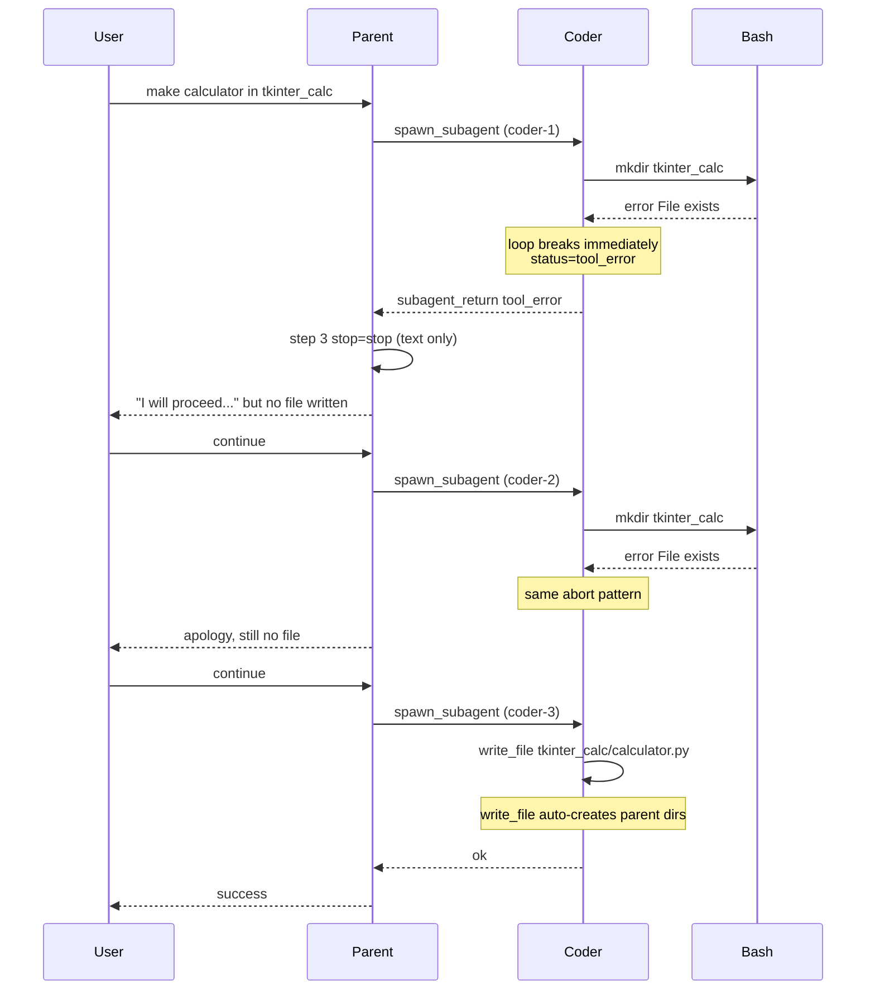

# Fix tkinter_calc mkdir failure chain

## What happened (3-turn timeline)



| Symptom | Root cause | Where |
|---|---|---|
| `mkdir: File exists` | `tkinter_calc/` already in workspace from a prior run; Coder used plain `mkdir` (not `mkdir -p`) | Model behavior + [`run_bash`](src/vg_agent/tools.py) passes through bash exit code |
| Sub-agent dies in 1 step | On any tool error, `_run_live_subagent` sets `status=tool_error` and **breaks** before the next LLM turn | [`scripts/generate_project.py`](scripts/generate_project.py) ~3283–3290 |
| Parent stops without retry | After failed spawn, parent step 3/6 had `stop=stop` (no `spawn_subagent`); model promised to continue but ended the turn | Parent prompt has no explicit retry rule; Gemini chose to yield |
| `✗ ok` + `!! 1 tool error(s)` | `run_end{final_status:"ok"}` but `_tool_error_count` includes **sub-agent** `tool_result` errors in the turn | [`chat_ui.py`](src/vg_agent/chat_ui.py) `_status_token` + `_tool_error_count` |
| 3 manual "continue" prompts | Each failed turn ended with `ok` run_end; user had to nudge the parent to try again | UX consequence of above |

**Important detail:** `write_file` already creates parent directories (`path.parent.mkdir(parents=True, exist_ok=True)` at line 310 of [`tools.py`](src/vg_agent/tools.py)). The `mkdir` step was unnecessary — Coder should have gone straight to `write_file`, as it finally did in turn 3.

---

## Proposed fixes (spec-first, ordered by impact)

### 1. Let sub-agents recover from tool errors (runtime — highest impact)

**Problem:** Parent loop already feeds tool errors back to the model and continues; sub-agent loop does not.

**Change** in the `agent.py` template inside [`scripts/generate_project.py`](scripts/generate_project.py):

- Remove the `break` on `had_error` after tool execution (~3289–3290).
- Do **not** set final `status="tool_error"` on the first failed tool; only set it when the sub-agent exhausts steps or exits without a successful final assistant message.
- Track `had_tool_error` separately; if the sub-agent later completes with a normal summary, return `status="ok"`.

Update [`specs/12_subagent_pipeline.md`](specs/12_subagent_pipeline.md) failure-modes row for `tool_error`:

> Sub-agent may retry within `MAX_SUBAGENT_STEPS` after a tool error; `tool_error` is returned only if the sub-agent ends without completing the task.

**Test:** FakeClient Coder turn 1 → `run_bash mkdir existing_dir` (error), turn 2 → `write_file` (ok); assert `subagent_return.status == "ok"`.

---

### 2. Make `mkdir` idempotent when target is an existing directory (tools)

**Problem:** Plain `mkdir dir` fails when `dir/` exists; `mkdir -p dir` succeeds. Models often omit `-p`.

**Change** in the `tools.py` template in [`scripts/generate_project.py`](scripts/generate_project.py), in `run_bash` after validation:

- For `mkdir` commands (via existing `mkdir_create_targets`), if every target path already exists as a directory under the workspace, return `status="ok"` with message like `mkdir: directory already exists: tkinter_calc` **without** shelling out.
- Alternatively (or additionally): if bash returns "File exists" and all targets are existing dirs, normalize to ok.

Update [`specs/20_tools.md`](specs/20_tools.md) mkdir bullet to note idempotent behavior when the directory already exists.

**Test:** extend [`tests/test_vg_agent.py`](tests/test_vg_agent.py) `test_run_bash_allowlist` — create `tkinter_calc/`, assert both `mkdir tkinter_calc` and `mkdir -p tkinter_calc` return ok.

---

### 3. Coder prompt: skip redundant mkdir (prompt)

**Change** [`PROMPTS.md`](PROMPTS.md) Coder section — add 2 lines:

- `write_file` and `edit_file` create parent directories automatically; do **not** run `mkdir` first for new files.
- If you must create a directory explicitly, use `mkdir -p <dir>` only.

Regenerate via `python scripts/generate_project.py --clean`.

---

### 4. Parent prompt: retry failed Coder spawns in the same turn (prompt)

**Problem:** [`specs/12_subagent_pipeline.md`](specs/12_subagent_pipeline.md) says parent should "decide retry vs. yield" on `tool_error`, but [`PROMPTS.md`](PROMPTS.md) parent prompt never mentions this. Gemini yielded with empty promises.

**Change** [`PROMPTS.md`](PROMPTS.md) parent section — add bullet:

- When `spawn_subagent` / `spawn_subagents` returns `status:"tool_error"`, read the payload, adjust the instruction (e.g. skip mkdir, name the exact file path), and **re-spawn in the same turn** before yielding to the user. Do not tell the user you will continue later without spawning again.

Optional test (FakeClient): parent turn after failed spawn must include another `spawn_subagent` within 2 parent steps (matches spec consumption assertion in [`specs/12_subagent_pipeline.md`](specs/12_subagent_pipeline.md) line 90–92 — currently untested).

---

### 5. Fix misleading `✗ ok` status bar (UI)

**Problem:** [`chat_ui.py`](src/vg_agent/chat_ui.py) `_status_token` (~178–187) shows red ✗ when `turn_errors > 0`, but keeps `status_label` from `run_end` (`ok`).

**Change** in the `chat_ui.py` template in [`scripts/generate_project.py`](scripts/generate_project.py):

- When `final_status == "ok"` but the turn has sub-agent failures (`subagent_return` with `status != "ok"`) or parent-visible tool errors, display label **`partial`** (or **`errors`**) instead of `ok`.
- Optionally count only **parent-scoped** `tool_result` errors for the status icon (sub-agent errors are already surfaced via `_turn_subagent_failure_notices`).

Update [`specs/16_chat_ui.md`](specs/16_chat_ui.md) status segment: document `✗ partial` when sub-agent failed but parent ended cleanly.

---

## What NOT to change

- **Approval gates** — working as designed; scoped approvals (`2`) correctly auto-approved subsequent spawns but still prompted for first `mkdir`/`write_file`.
- **Parent `spawn_subagent` tool status** — returning `ok` with embedded JSON `{status:"tool_error"}` is intentional; the parent model reads the payload.
- **Hand-editing `src/vg_agent/*`** — all runtime changes go through specs/prompts/templates + regenerate.

---

## Verification

After implementing fixes 1–5:

```powershell
python scripts/generate_project.py --clean
uv run pytest tests/test_vg_agent.py -k "mkdir or subagent or tool_error" -v
```

Manual smoke: in chat, re-run `make a calculator in tkinter in subfolder tkinter_calc` with `tkinter_calc/` pre-existing — should complete in **one turn** without manual "continue".

---

## Immediate workaround (no code)

Until fixes land: delete the stale directory first (`rm tkinter_calc/calculator.py` then remove dir if needed), or prompt explicitly: *"write tkinter_calc/calculator.py directly, directory already exists, do not mkdir"*.
