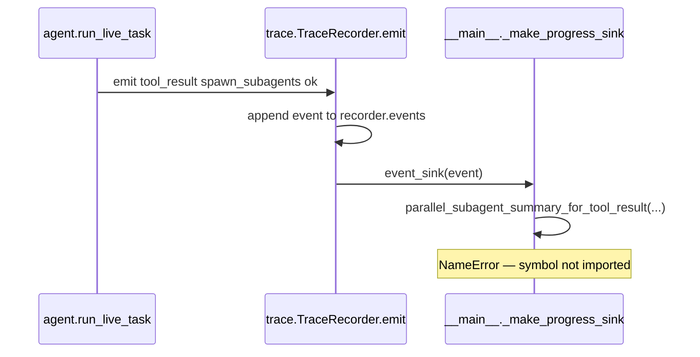

# Fix `parallel_subagent_summary_for_tool_result` NameError

## Root cause

After parallel Explorers return, the chat progress sink in [`src/vg_agent/__main__.py`](src/vg_agent/__main__.py) handles the parent `spawn_subagents` `tool_result` and calls `parallel_subagent_summary_for_tool_result`:

```769:781:src/vg_agent/__main__.py
        if kind == "tool_result":
            ...
            if (
                tool == "spawn_subagents"
                and event.get("status") == "ok"
                ...
            ):
                tool_result_idx = len(recorder.events) - 1
                summary = parallel_subagent_summary_for_tool_result(
                    recorder.events, tool_result_idx
                )
```

The function **exists** in [`src/vg_agent/trace.py`](src/vg_agent/trace.py) (line 502) and is covered by `test_parallel_subagent_summary_for_tool_result_scopes_batch`, but [`__main__.py`](src/vg_agent/__main__.py) only imports the sibling `parallel_subagent_summary`:

```77:86:src/vg_agent/__main__.py
from .trace import (
    TraceRecorder,
    format_parallel_progress_lines,
    ...
    parallel_subagent_summary,
    render_tree,
    show_context,
)
```

The same omission is in the generator template at [`scripts/generate_project.py`](scripts/generate_project.py) (~4501–4510), so a blind regen would not fix it unless the template is patched first.



## Fix (spec-first)

1. **Edit the generator template** in [`scripts/generate_project.py`](scripts/generate_project.py): add `parallel_subagent_summary_for_tool_result` to the `from .trace import (...)` block used for generated `__main__.py` (next to `parallel_subagent_summary`).

2. **Regenerate** (required by repo rules; do not hand-edit `src/vg_agent/__main__.py`):

   ```powershell
   python scripts/generate_project.py --clean
   ```

3. **Regression test** in [`tests/test_vg_agent.py`](tests/test_vg_agent.py): mirror `test_progress_sink_prints_edit_diff` — build a `TraceRecorder` with `event_sink=_make_progress_sink(..., recorder=recorder)`, emit two `subagent_return` events plus a parent `spawn_subagents` `tool_result` with `result_full` listing both child IDs (reuse payload shape from `test_parallel_subagent_summary_for_tool_result_scopes_batch`). Assert the sink runs without error and stderr contains parallel progress output (e.g. from `format_parallel_progress_lines`). This catches missing imports on the hot path the live CLI uses.

4. **Verify**:

   ```powershell
   uv run pytest tests/test_vg_agent.py::test_parallel_subagent_summary_for_tool_result_scopes_batch tests/test_vg_agent.py::test_progress_sink_spawn_subagents_parallel_summary -q
   uv run pytest
   ```

## After deploy

Re-run your interrupted task in Docker (the run died after Explorers finished, before the parent could spawn the Coder):

```powershell
docker compose run --rm vg-agent --task "Use one spawn_subagents call with two Explorer requests ..."
```

No spec/PROMPTS change is required — this is a generator import bug only.
