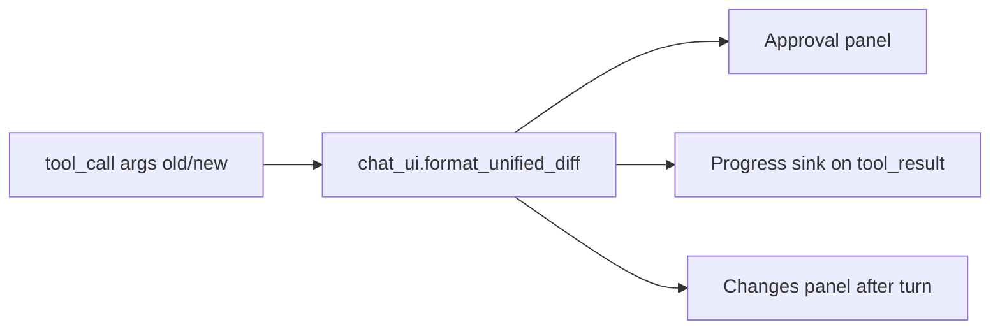

# Git-style diff for file edits

## Problem

Today, [`chat_ui.py`](src/vg_agent/chat_ui.py) frames **reads** as a `Syntax` panel (your screenshot), but **writes** only surface as:

- Approval: truncated one-liner from [`_args_summary`](src/vg_agent/agent.py) (`path  - 'old'[:40]' -> + 'new'[:40]'`)
- Progress: `[tool] coder edit_file ok tokens=…` with no visual change
- Turn end: parent prose only; Coder edits are not in `_literal_tool_outputs` (parent-only tools)

The trace already stores full `old`/`new` on every `tool_call` (`args` field in [`_emit_tool_call`](src/vg_agent/agent.py)), so we can render diffs in the **presentation layer** without a new tool API.



## Spec updates (source of truth)

Edit [`specs/16_chat_ui.md`](specs/16_chat_ui.md):

- **Diff rendering** — unified diff hunks; `-` lines `red`, `+` lines `green`, `@@` / `---` / `+++` headers `dim`; respect `NO_COLOR` (prefix only, no styles).
- **Truncation** — default max ~40 diff lines per hunk block; append dim `… N more lines (full edit in trace)` when truncated.
- **Surfaces**:
  1. **Approval** (`--require-approval writes|all`, Rich TTY): below `request.summary`, show diff for `edit_file` (`old`→`new`) and `write_file` (read prior file from workspace if it exists, else treat as new file / all-green).
  2. **Live progress** (`--chat`, Rich TTY): on successful `tool_result` for `edit_file` / `write_file` (any `agent_id`), print a dim-bordered diff panel on **stderr** immediately after the existing `[tool]` line.
  3. **End-of-turn Changes** — after the Response panel, if the turn contains any successful write/edit, print a `Changes` panel listing each file once (path header + diff).
- **Non-TTY** — plain `+`/`-` prefixed lines in stderr/stdout; no Rich styling.

Cross-link one sentence in [`specs/60_observability.md`](specs/60_observability.md) progress section: write/edit diffs are an optional Rich chat enhancement, not new JSONL kinds.

No change to [`specs/20_tools.md`](specs/20_tools.md) tool semantics; `result_full` stays the short status string to avoid context bloat.

## Implementation

### 1. Core diff helpers — [`src/vg_agent/chat_ui.py`](src/vg_agent/chat_ui.py)

Add (stdlib only):

- `format_unified_diff(old: str, new: str, *, path: str, context: int = 3, max_lines: int = 40) -> list[str]` using `difflib.unified_diff`.
- `render_diff_to_console(console, *, path: str, old: str, new: str, title: str, border_style: str = "dim")` — build `rich.text.Text` per line; `Panel` on stderr for progress/approval, stdout for turn-end Changes.
- `collect_file_changes(events, start_idx: int, *, workspace_root: Path) -> list[Change]` — scan `events[start_idx:]`:
  - Index `tool_call` by `tool_use_id`.
  - On matching `tool_result` with `status == "ok"` and `tool in {edit_file, write_file}`:
    - **edit_file**: `old`/`new` from call `args`.
    - **write_file**: `new` from `args.content`; `old` from `read_text(workspace/path)` if file existed before call timestamp (read at render time is wrong for replay—use args only at render time after turn completes, file already written; for **approval** and **progress before write**, read disk for `old`).
  - Dedupe by `(tool, path)` keeping last successful change per path per turn.

Export `print_turn_changes(events, start_idx, workspace_root)` for the Changes panel.

**write_file nuance:** At approval time, read current file from `workspace_root` for `old`. At progress/turn-end after success, reconstruct `old` by reversing the write from trace is hard—simpler approach: on `tool_call` for `write_file`, stash `prior_content` in the progress sink’s pending-call cache (read disk when `tool_call` is emitted, before execution). Pass that into diff render on `tool_result`.

### 2. Wire approval — [`chat_ui.prompt_approval`](src/vg_agent/chat_ui.py)

When `request.tool in {"edit_file", "write_file"}` and `use_rich_ui()`:

- Build diff from `request.args` (+ disk read for `write_file` prior content).
- `Panel` body = diff + existing options line.

### 3. Wire live progress — [`scripts/generate_project.py`](scripts/generate_project.py) `__main__` template

Extend `_make_progress_sink`:

- Maintain `pending: dict[str, dict]` — on `tool_call` for write/edit, store event; for `write_file`, also `pending[id]["prior"] = path.read_text()` if exists.
- On `tool_result` ok for write/edit, pop pending, call `chat_ui.render_diff_to_console(_console(), …)` when `use_rich_ui()`.
- Plain TTY: emit compact `+`/`-` block without Rich.

### 4. Wire end-of-turn — same template, `_chat_loop`

After `print_turn_output(...)`:

```python
print_turn_changes(recorder.events, start_idx, root)
```

Only when Rich UI and at least one change in the turn.

### 5. Regenerate + tests

- `python scripts/generate_project.py --clean`
- `uv run pytest`

New tests in [`tests/test_vg_agent.py`](tests/test_vg_agent.py):

- `test_format_unified_diff_styles` — `-`/`+` lines present; truncation footer when input huge.
- `test_collect_file_changes_edit_and_write` — synthetic trace events → one `Change` each.
- `test_chat_ui_turn_changes_panel` — monkeypatch `use_rich_ui`, feed events, assert stdout contains `-foo` / `+bar` and `Changes`.
- `test_progress_sink_prints_edit_diff` — optional: capture stderr FakeConsole on synthetic `tool_call` + `tool_result`.

Existing chat/approval tests should remain green (`--yes` skips approval UI).

## Files touched

| File | Role |
|------|------|
| [`specs/16_chat_ui.md`](specs/16_chat_ui.md) | Contract for diff UX |
| [`specs/60_observability.md`](specs/60_observability.md) | One-line cross-ref |
| [`src/vg_agent/chat_ui.py`](src/vg_agent/chat_ui.py) | Diff format/render + turn collector |
| [`scripts/generate_project.py`](scripts/generate_project.py) | `__main__` progress sink + chat loop |
| [`tests/test_vg_agent.py`](tests/test_vg_agent.py) | Unit tests |

## Out of scope

- Changing `edit_file` replacement rules (spec says unique match; runtime still replaces all occurrences).
- Side-by-side or inline word-level diff.
- Diff in `--replay` / `--task` non-chat modes (can follow same helper later).
- Storing diff text in JSONL `result_full`.
