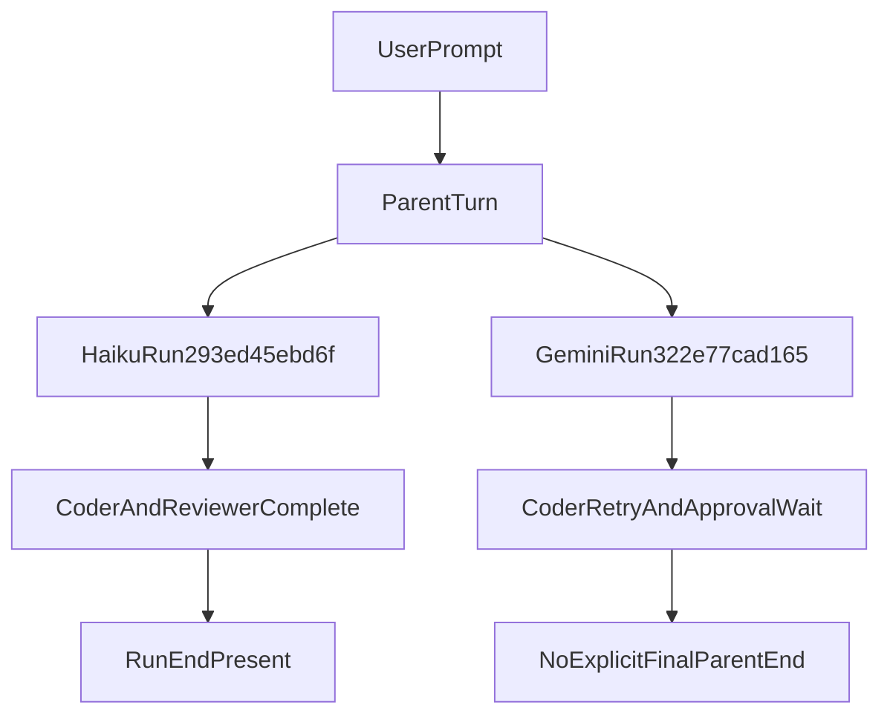

# Neutral Haiku vs Gemini Flow Comparison

## Goal

Add a repo-specific, evidence-based comparison of the two tested runs (`293ed45ebd6f` and `322e77cad165`) to [specs/model_experience.md](specs/model_experience.md), covering latency, cost, tool-call behavior, and completion quality.

## Evidence Baseline

Use trace artifacts as primary sources:

- [traces/293ed45ebd6f.jsonl](traces/293ed45ebd6f.jsonl)
- [traces/322e77cad165.jsonl](traces/322e77cad165.jsonl)

Key observed differences to encode neutrally:

- `293ed45ebd6f`: clear `run_end`, ~51s run duration, 5 tool calls, ~30,286 tokens, ~$0.069976.
- `322e77cad165`: no explicit final parent completion event in trace tail, ~172s trace window, 3 tool calls, ~13,601 tokens (from assistant-step sums), ~$0.0450845 (summed step costs), with large approval/subagent wait dominating latency.

## Planned Documentation Changes

Update [specs/model_experience.md](specs/model_experience.md) with:

- A new section, `Comparative note: Haiku vs Gemini (observed runs)`.
- A short scope/fairness disclaimer: this is run-specific in this repo/tooling setup, not a universal model ranking.
- A compact side-by-side bullets or mini-table for:
  - completion quality (clear end vs incomplete tail)
  - latency profile (end-to-end and dominant waits)
  - tool-call pattern (counts/types and retries)
  - cost and token footprint (with explicit derivation caveat where needed)
- A neutral conclusion stating: Haiku run appears operationally smoother in this sample, while Gemini run is cheaper in this sample; avoid over-generalization and recommend re-testing with repeated tasks.

## Caveats to Include

- Distinguish `run_end.duration_s` vs trace-tail duration when late events exist.
- Mark Gemini totals as derived from per-step fields because the trace lacks explicit terminal run summary.
- Note that approval wait time can dominate perceived model speed and should be separated from model inference behavior.

## Validation

After writing, verify the section:

- preserves existing spec tone (operational, evidence-focused),
- references exact run IDs,
- keeps claims bounded to observed data,
- avoids asserting model superiority beyond this sample.

## Flow Comparison Sketch

