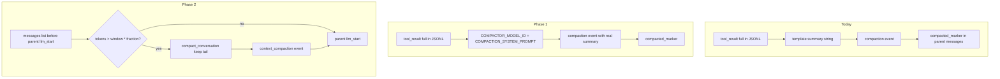

# LLM compaction (tool-result + conversation)

## Grading and spec alignment

| Requirement | Source | How this plan satisfies it |
|-------------|--------|----------------------------|
| **VG.2** — concrete context control, demonstrable trigger | [`background/vg_assignment_grading_requirements.md`](background/vg_assignment_grading_requirements.md) §2 | Tool-result: `tokens > K_COMPACT` → compactor call → marker in parent context. Conversation: `expected_in > window × fraction` → fold head → `context_compaction` event. Demo + `--show-context` + dashboard Parent context / Safety tabs. |
| **VG.3** | Same rubric §2 | Compactor calls go through existing `BudgetGuard.before_model_call` / `record_model_call` with `agent_type="compactor"` (visible in `/finops`). |
| Eval contract | [`specs/40_demo_and_eval.md`](specs/40_demo_and_eval.md) | Keep: `compaction` event, sha256, marker in `show_context`, no raw `sample.log` in parent view. **Add**: `summary` must be model-produced (tests use deterministic compactor stub, not the template string). |
| Design intent | [`plans/how-would-you-design-sparkling-aho.md`](plans/how-would-you-design-sparkling-aho.md) | Haiku/Flash compactor + `PROMPTS.md` ≤300-token summary — currently stubbed in [`_compact_if_needed`](scripts/generate_project.py) (~L2034). |

**Out of scope:** Changing `K_COMPACT = 4000` (stays in [`specs/30_runtime_governance.md`](specs/30_runtime_governance.md)); Docker/packaging beyond documenting `VG_COMPACTOR_MODEL` already in [`specs/50_packaging.md`](specs/50_packaging.md).

**Rule:** Edit specs / `PROMPTS.md` / `MODEL_CONFIG.md` / new `CONTEXT_WINDOWS.md` / [`scripts/generate_project.py`](scripts/generate_project.py) templates only — then `python scripts/generate_project.py --clean` and `uv run pytest`. Never hand-edit [`src/vg_agent/`](src/vg_agent/).

---

## Current vs target



| Layer | Event kind | Trigger | Model |
|-------|------------|---------|-------|
| Tool-result (Phase 1) | `compaction` | Parent `tool_result` tokens > `K_COMPACT` | `COMPACTOR_MODEL_ID` |
| Conversation (Phase 2) | `context_compaction` | In-memory context > per-model threshold **or** `/compact` | Same compactor + new conversation prompt |

---

## Phase 1 — Tool-result LLM compaction

### 1.1 Spec updates

- [`specs/10_main_agent.md`](specs/10_main_agent.md): Replace “compacted” prose with: after parent `tool_result`, if `tokens > K_COMPACT`, call **compactor** with [`PROMPTS.md`](PROMPTS.md) tool compaction prompt; emit `compaction` with `summary`, `compactor_model`; full body stays in JSONL; on compactor failure, fall back to deterministic one-line stub (trace notes `compactor_fallback=true`).
- [`specs/30_runtime_governance.md`](specs/30_runtime_governance.md): Document optional `compactor_model` on `compaction`; add `COMPACTOR_MAX_OUTPUT_TOKENS` (~400), `COMPACTOR_MAX_INPUT_CHARS` (cap payload sent to compactor, e.g. 120k chars with “[truncated for compaction input]” + trace pointer).
- [`PROMPTS.md`](PROMPTS.md): Split into **Tool-result compaction** (existing text) and **Conversation compaction** (Phase 2 prompt: summarise folded turns, preserve decisions/paths, ≤300 tokens).

### 1.2 Generator / runtime ([`scripts/generate_project.py`](scripts/generate_project.py))

Embed prompts in `agent.py` template (today only sub-agent prompts are literals; **add**):

```python
COMPACTION_SYSTEM_PROMPT = __COMPACTION_SYSTEM_PROMPT_LITERAL__
CONVERSATION_COMPACTION_SYSTEM_PROMPT = __CONVERSATION_COMPACTION_SYSTEM_PROMPT_LITERAL__
```

Replace `_compact_if_needed(recorder, event)` with:

- `_compact_if_needed(recorder, event, *, client, guard, tool=..., deterministic=False)`
- `_summarize_for_compaction(system_prompt, body, *, client, guard, model_id, deterministic)` — single user message, `tools=[]`, `max_tokens=COMPACTOR_MAX_OUTPUT_TOKENS`
- Budget: `guard.before_model_call(COMPACTOR_MODEL_ID, ...)`; `record_model_call(..., agent_type="compactor")`
- Optional `llm_start` / `assistant_step` with `agent_type="compactor"` for trace/finops (mirror sub-agent pattern ~L2406)
- `after_tokens = estimate_tokens(summary)`; clamp summary length post-hoc if over ~300 tokens
- Wire call site in parent loop: `_compact_if_needed(recorder, event, client=client, guard=guard, tool=call.name)`

Pass `client` and `guard` from `run_live_task` (already available at tool loop ~L2697).

### 1.3 Tests ([`tests/test_vg_agent.py`](tests/test_vg_agent.py))

- Extend `PipelineClient._classify_agent`: if system prompt contains tool compaction header → `"compactor"`.
- `_log_then_explorer_client`: add `by_type["compactor"]` with one `ModelTurn` whose text is a **distinct** fake summary (e.g. mentions `SAMPLE_LOG_SUMMARY_SENTINEL`), not `"Large read_file"`.
- Update [`test_parent_compaction_and_subagent_context`](tests/test_vg_agent.py): assert `compaction["summary"]` contains sentinel; assert `PipelineClient` received `model=COMPACTOR_MODEL_ID`.
- New `test_compactor_budget_recorded`: compactor call increments guard / emits budget-neutral compactor cost.
- New `test_compactor_fallback_on_error`: failing compactor → still emits `compaction` with stub summary + `compactor_fallback` flag (if spec’d).
- Keep [`test_literal_tool_output_compacted_read`](tests/test_vg_agent.py) compatible (uses pre-emitted compaction events).

### 1.4 Observability / dashboard

- [`format_compaction_banner`](scripts/generate_project.py `__main__.py` template): tool `compaction` line already shows before→after; no change required.
- Dashboard compaction % UI ([`dashboard/web/src/lib/compactionStats.ts`](dashboard/web/src/lib/compactionStats.ts)) continues to use `before_tokens`/`after_tokens` from events.

### 1.5 Live demo ([`demo_review.md`](demo_review.md), [`final_demo_live_chat_script.md`](final_demo_live_chat_script.md))

Update talking point: *“Over 4000 tokens we call Gemini Flash compactor; parent sees a ≤300-token summary; full read stays in JSONL event N.”*

---

## Phase 2 — Conversation compaction + `/compact`

Follow [`plans/when-we-have-auto-compaction-partitioned-moler.md`](plans/when-we-have-auto-compaction-partitioned-moler.md) with these integrations.

### 2.1 New source files

- **[`CONTEXT_WINDOWS.md`](CONTEXT_WINDOWS.md)** (repo root): per-model `CONTEXT_WINDOW` + `COMPACT_FRACTION` for parent model IDs (2.0-flash, 2.5-flash, Haiku, Sonnet).
- Append to `SOURCE_INPUTS` in [`scripts/generate_project.py`](scripts/generate_project.py) for `SPEC_DIGEST` / provenance test.
- [`MODEL_CONFIG.md`](MODEL_CONFIG.md): add `gemini-2.5-flash` pricing if not present (optional `--parent-model` only; default parent unchanged).

### 2.2 Generated config

In `config.py` template:

- `CONTEXT_WINDOW_TOKENS`, `AUTO_COMPACT_FRACTION`, `DEFAULT_CONTEXT_WINDOW`, `DEFAULT_COMPACT_FRACTION`, `COMPACT_KEEP_RECENT_TURNS = 4`

### 2.3 `compact_conversation` in agent template

```python
def compact_conversation(
    recorder, messages, parent_model_id, guard, *,
    client, reason: Literal["auto", "manual"], deterministic=False,
) -> dict | None:
```

Behaviour:

1. `before = _estimate_message_tokens(PARENT_SYSTEM_PROMPT, messages)`
2. Split **head** / **tail**: keep last `COMPACT_KEEP_RECENT_TURNS` user turns verbatim; tail starts on `role=="user"` boundary (never split assistant tool_call from tool_result).
3. Summarize head via compactor + `CONVERSATION_COMPACTION_SYSTEM_PROMPT` (deterministic fixed string in tests).
4. Replace `messages` with `[{role:user, content: folded summary}], ...tail`
5. `after = _estimate_message_tokens(...)`; `percent_reduced = 100 - after/before*100`
6. `recorder.emit("context_compaction", before_tokens=..., after_tokens=..., percent_reduced=..., model=parent_model_id, window=..., threshold=..., reason=..., summary=..., trace_pointer=recorder.run_id)`
7. At most **once per parent loop iteration** for `reason="auto"`.

Hook in `run_live_task` **after** `expected_in = _estimate_message_tokens(...)` and **before** `guard.before_model_call(PARENT_MODEL_ID, ...)` (~L2627).

### 2.4 Chat CLI ([`__main__.py`](scripts/generate_project.py) template)

- `/compact` in `SLASH_COMMANDS` / help ([`specs/15_cli_contract.md`](specs/15_cli_contract.md))
- Handler: run `compact_conversation(..., reason="manual")` on persisted `conversation` messages; print `_format_compaction_summary(event)` (reuse chat_ui `format_compaction_banner` for `context_compaction`)
- Progress sink: `[context] auto-compact …` / `[context] /compact …` ([`specs/16_chat_ui.md`](specs/16_chat_ui.md))
- Statusline: optional `ctx 19.6k/1.0m (2%)` using window map ([`specs/60_observability.md`](specs/60_observability.md))

### 2.5 Trace / `show_context`

- [`specs/30_runtime_governance.md`](specs/30_runtime_governance.md): register `context_compaction` fields.
- [`trace.py`](scripts/generate_project.py) template: in `show_context`, when scanning parent events, append a **meta** context item for each `context_compaction` (summary + before/after + trace pointer) so CLI/dashboard Parent context reflects conversation folds without losing JSONL audit events.
- SQLite mirror: ensure `context_compaction` rows ingest (dashboard [`session_compaction_tags.py`](dashboard/api/services/session_compaction_tags.py) already flags auto/manual).

### 2.6 Tests

- Provenance: digest includes `CONTEXT_WINDOWS.md`.
- `test_compact_conversation_deterministic`: synthetic long `messages`, `deterministic=True`, tail preserved, `context_compaction` emitted, `after < before`.
- `test_auto_context_compaction_before_parent_llm`: monkeypatch small `CONTEXT_WINDOW_TOKENS[PARENT_MODEL_ID]` or inject fat `history`; assert `context_compaction` with `reason=auto` before next `llm_start`; trace still contains original `assistant_step` events.
- `test_slash_compact_emits_manual_event`: chat loop unit test with `/compact` (pattern from existing slash-command tests).

### 2.7 Dashboard (light touch)

- Parent context tab: show `context_compaction` meta rows if present in `show_context` output (may only need API passthrough once trace.py updated).
- History filters **Auto/Manual context compaction** ([`specs/70_dashboard.md`](specs/70_dashboard.md)) will start matching real sessions after Phase 2.

---

## Verification checklist

```powershell
python scripts/generate_project.py --clean
uv run pytest
uv run pytest tests/test_vg_agent.py -k "compact" -q
uv run pytest tests/test_dashboard_api.py -q
```

**Live (OPENROUTER_API_KEY):**

```powershell
uv run python -m vg_agent --seed-fixture
uv run python -m vg_agent --task "read data/sample.log, then summarise auth/ and utils.py in parallel" --trace --show-context 8
uv run python -m vg_agent --chat   # many turns or /compact; watch [context] lines
```

**VG.2 oral script:** (1) trigger `K_COMPACT` on large read, (2) compactor model + summary in marker, (3) JSONL retains full `tool_result`, (4) optional conversation fold at 80% window with tail kept.

---

## Implementation order

1. Specs + `PROMPTS.md` split (tool vs conversation prompts).
2. Phase 1 generator + tests + regenerate.
3. `CONTEXT_WINDOWS.md` + Phase 2 generator + tests + regenerate.
4. Dashboard/`show_context` polish if meta rows missing after trace update.
5. Update demo scripts and [`specs/40_demo_and_eval.md`](specs/40_demo_and_eval.md) eval line for LLM summary.
