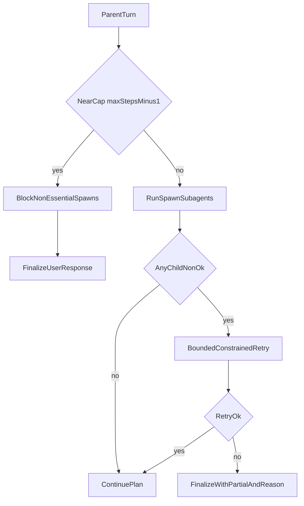

# Prevent End-of-Run Stops After Parallel Spawns

## What Happened
- This was not a dead stall. The transcript pattern indicates a near-cap run (`14/15`) where a parallel child returned `tool_error` (`coder stopped before producing a final summary`), then parent progress consumed the last step without a robust finalize path.
- Root causes are in orchestration and guardrails, not model availability.

## Targeted Changes
- **Add final-step reservation in parent loop** in [`src/vg_agent/agent.py`](src/vg_agent/agent.py): when at `max_steps-1`, block non-essential `spawn_subagent`/`spawn_subagents` unless user-approved as critical; otherwise force synth/finalize.
- **Add parallel child failure recovery** in [`src/vg_agent/agent.py`](src/vg_agent/agent.py): for `spawn_subagents`, if any child returns non-`ok`, run bounded same-turn constrained retry only for failed coders; if retry still fails, finalize with explicit partial status instead of launching new work.
- **Implement spec-aligned parallel budget slicing/cancel** by updating spec + generator source in [`specs/12_subagent_pipeline.md`](specs/12_subagent_pipeline.md), [`specs/30_runtime_governance.md`](specs/30_runtime_governance.md), and [`scripts/generate_project.py`](scripts/generate_project.py): each parallel child gets a budget slice, first overrun triggers `parallel_aborted` cancellation of remaining in-flight peers.
- **Improve terminal subagent error semantics** in generated runtime via [`scripts/generate_project.py`](scripts/generate_project.py): replace generic “stopped before producing a final summary” with structured reason codes to drive deterministic parent fallback.
- **Strengthen anti-loop protections** in [`specs/30_runtime_governance.md`](specs/30_runtime_governance.md) and runtime template in [`scripts/generate_project.py`](scripts/generate_project.py): add repetition signature tracking for spawn payloads (not only `run_bash`).

## Implementation Flow (Spec-First)
- Update specs first: parallel budget semantics, near-cap finalization rule, and failure-retry bounds.
- Update generator templates in [`scripts/generate_project.py`](scripts/generate_project.py) (do not hand-edit generated runtime/fixtures).
- Regenerate artifacts with `python scripts/generate_project.py --clean`.
- Validate behavior with `uv run pytest`, plus targeted tests in [`tests/test_vg_agent.py`](tests/test_vg_agent.py).

## Test Coverage to Add
- Parallel batch with one failing coder at `max_steps-1` ends with successful finalize (no silent stop).
- Parallel overrun emits `parallel_aborted` and cancels peers deterministically.
- Repeated identical spawn payloads trip repetition guard and return explicit abort reason.
- Subagent failure reason surfaces as structured status and triggers expected parent fallback path.

## Runtime Decision Flow

## Why This Fixes Your Symptom
- Prevents launching new heavy parallel work when only a finalize step remains.
- Converts parallel child failures from “late-run drift” into bounded recovery + deterministic completion.
- Aligns runtime with spec for parallel budgeting/cancellation so it does not appear stalled at the end.