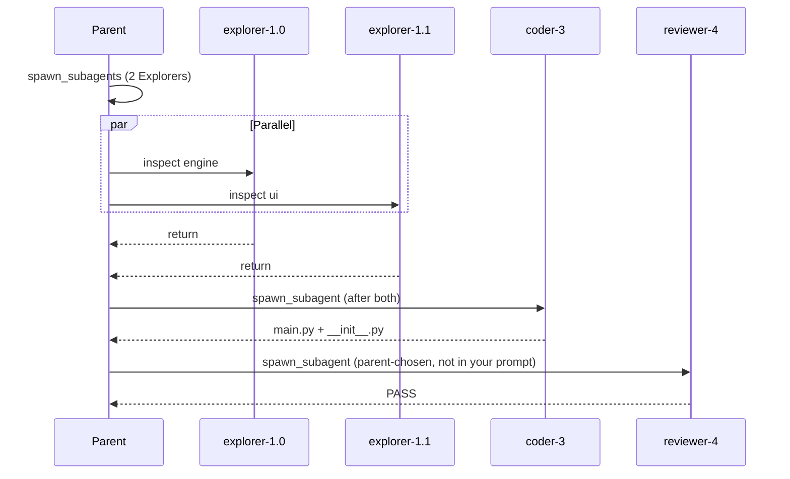

# Parallel Explorer Verification (session review)

## Verdict: **Yes — true parallel sub-agents for the Explorer batch**

The two Explorers (`explorer-1.0` on `calculator_engine.py`, `explorer-1.1` on `calculator_ui.py`) ran **concurrently** inside a **single** `spawn_subagents` call. That matches [VG.1](specs/40_demo_and_eval.md) and your stated intent (“then one Coder … **after both return**”).

---

## Evidence from your transcript

### 1. One batched call, not two serial spawns

- Parent turn 1: `tools=spawn_subagents 2 requests`
- Approval: `spawn_subagents` with 2 sub-agent requests
- Both children spawned back-to-back: `explorer-1.0` and `explorer-1.1`

If the parent had cheated with two `spawn_subagent` calls, you would see two separate parent tool rounds with no `[parallel] … 2 explorer` line. You did not.

### 2. Interleaved LLM/tool work (strongest live signal)

While both were in flight:

- `explorer-1.1 step 1` and `explorer-1.0 step 1` both **start** before either step 1 **finishes**
- `explorer-1.1` enters **step 2** while `explorer-1.0` is still finishing **step 1** (`explorer-1.0 step 1 done` appears after `explorer-1.1 step 2 ->`)

That pattern is only possible with concurrent threads, not sequential “run A to completion, then B.”

### 3. Runtime overlap summary (authoritative for that batch)

Immediately after the batch:

```text
[parallel] 2 explorer finished (concurrently) (overlap yes · 3.6s / 4.0s)
```

- **2 explorer** — only the parallel batch (not Coder/Reviewer)
- **overlap yes** — wall-clock intervals intersect (same rule as the unit test)
- **3.6s / 4.0s** — per-child durations; total parent wait ~32s includes approvals + network; the ~0.4s gap between children is normal skew, not serial sum (~7.6s)

Status bar right after that batch: `last turn: 2 parallel explorers (overlap confirmed)` — correct.

### 4. Pipeline order matches your prompt



- Coder started only on **parent step 2**, after `spawn_subagents ok` — **after both Explorers returned**
- Coder and Reviewer used **`spawn_subagent`** (singular), so they did **not** run in parallel with each other or with the Explorers

---

## How the runtime proves overlap (for graders)

Implementation in generated [`scripts/generate_project.py`](scripts/generate_project.py) (mirrored in [`src/vg_agent/agent.py`](src/vg_agent/agent.py)):

- [`_spawn_many`](scripts/generate_project.py) uses `ThreadPoolExecutor(max_workers=len(runnable))` and optional `threading.Barrier` when `len(runnable) > 1`
- [`parallel_subagent_summary`](scripts/generate_project.py) sets `overlap=True` when any pair of `subagent_return` intervals satisfies `a_start <= b_end and b_start <= a_end` (same as [`test_parallel_explorers_run_concurrently_with_overlap`](tests/test_vg_agent.py))

Your log’s `overlap yes` is computed from trace `started_at` / `ended_at`, not from log line ordering alone.

---

## Misleading UI at end of run (not a parallelism failure)

Later status lines say:

```text
last turn: 4 parallel explorers (overlap confirmed)
```

That is a **status-bar bug**, not proof of four parallel Explorers.

[`_latest_turn_parallel_hint`](src/vg_agent/chat_ui.py) calls `parallel_subagent_summary(events, since_event_idx=last_user_prompt)` with **no** `before_event_idx`, so it counts **every** `subagent_return` in the turn (2 Explorers + Coder + Reviewer) and always labels them “explorers”:

```267:277:src/vg_agent/chat_ui.py
def _latest_turn_parallel_hint(events: list[dict[str, object]]) -> str | None:
    ...
    summary = parallel_subagent_summary(events, since_event_idx=start)
    ...
    return f"last turn: {len(summary.returns)} parallel explorers (overlap confirmed)"
```

`overlap` can stay `yes` because the **Explorer pair** still overlaps pairwise, even after Coder/Reviewer returns are included. The **`[parallel] 2 explorer … overlap yes`** line at `spawn_subagents` completion remains the trustworthy count.

Optional follow-up (separate task): scope the hint to the latest `spawn_subagents` slice (like [`_event_slice_through_parent_step`](scripts/generate_project.py) does for `/show-context`) and filter `agent_type == "explorer"`.

---

## Out-of-scope notes (not VG.1)

- Parent spawned a **Reviewer** you did not ask for; that does not affect parallel-Explorer proof.
- Coder edits (`from calculator_ui import …`, dropped `CalculatorEngine` in `main.py`) are a **correctness** question, not parallelism.

---

## Optional hard confirmation from trace

If you have the run’s JSONL under `traces/` or Docker `/workspace/traces/`:

1. Find one `tool_result` with `"tool":"spawn_subagents"` and `"status":"ok"`.
2. Find the two preceding `subagent_return` rows with `"agent_type":"explorer"`.
3. Check ISO timestamps: intervals must overlap.

Or run `/finops` / `/review` in the same chat session — they slice per parent step and should still show **2 explorers · overlap yes** for turn 1.

---

## Parent tokens: sub-agents *do* report back summaries only (your question)

**Yes — that is already the design.** Explorers do not stream `read_file` bodies into the parent. The parent only receives:

- One `tool_result` per `spawn_subagents` / `spawn_subagent`, whose body is JSON of return records (each `payload` capped at **≤2 KB** per [specs/12_subagent_pipeline.md](specs/12_subagent_pipeline.md) § Sub-agent context isolation).
- Explorer `tool_call` / `tool_result` / intermediate `assistant_step` events stay in JSONL under `explorer-*` and are **filtered out** of `show_context` ([specs/11_subagent_explorer.md](specs/11_subagent_explorer.md)).

Your session proves isolation worked:

| agent_type | total_tok | What it paid for |
|------------|-----------|------------------|
| explorer   | ~4,024    | 2× read_file + 2× Gemini turns (file bytes billed here, not parent) |
| parent     | ~19,035   | 4× Sonnet turns + orchestration JSON, **not** raw `.py` file reads |

So parent ~19k is **not** “parent read the calculator files.” It is mostly **orchestration tax**:

1. **Four parent model calls** — each call re-sends **full turn history** (system prompt, parent tool schemas, user message, prior assistant messages, prior tool results). That is standard chat-completions accounting, not a VG bug.
2. **Fixed overhead every step** — parent system prompt + large tool schema block (~1–2k+ tokens) × 4 steps.
3. **Bounded but cumulative sub-agent returns** — `spawn_subagents` tool result was ~1,192 tokens (two Explorer summaries). Coder + Reviewer returns added more on steps 3–4.
4. **Model duplication (common)** — parent step 2’s `spawn_subagent` question often **re-pastes** Explorer findings into the Coder brief (“confirmed module contents: …”), so summaries can appear **twice** in parent context (once in `spawn_subagents` tool_result, again in the next `tool_call` args). That saves Coder context but **costs parent tokens**; prompt tuning can reduce it.
5. **Extra spawns you didn’t request** — Reviewer added another parent step + return payload.
6. **Sonnet pricing** — parent is ~76% of session USD despite doing less “work” than sub-agents in token terms.

**What would *not* help:** expecting zero parent tokens after parallel Explorers — the parent must still plan, merge two summaries, spawn Coder, and synthesize.

**What *does* help (already in repo or config):**

- `VG_PARENT_MODEL=openrouter/google/gemini-2.5-flash` for cheaper parent turns ([MODEL_CONFIG.md](MODEL_CONFIG.md)).
- Compaction (`K_COMPACT`) for huge **parent** `read_file` results (demo `sample.log` scene — not your calc task).
- Fewer parent steps (skip unsolicited Reviewer; tighter user prompt).
- Optional hardening: scope `/finops` + status hint; optional PROMPTS nudge against duplicating Explorer text in Coder spawn args.

**FinOps “4 sub-agents” line:** same scoping bug as status bar — counts Coder/Reviewer returns in the user turn, not “4 parallel Explorers.” Trust `[parallel] 2 explorer … overlap yes` for VG.1.
