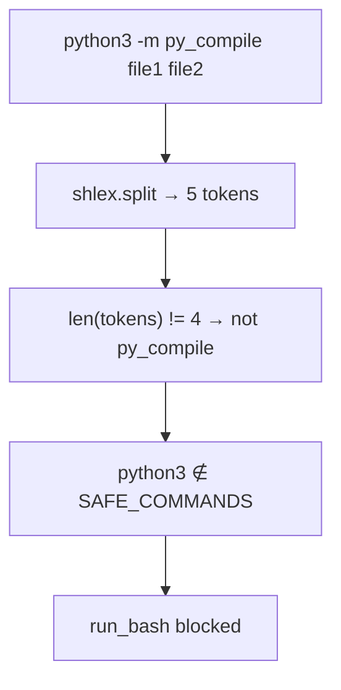

# Fix multi-file `py_compile` in `run_bash`

## Root cause

`py_compile` is already a documented exception in [`specs/20_tools.md`](specs/20_tools.md), but the implementation only recognizes **exactly one** target file:

```161:171:src/vg_agent/tools.py
def _py_compile_target_from_tokens(tokens: list[str]) -> str | None:
    if len(tokens) != 4:
        return None
    ...
    return tokens[3]
```

Coder ran:

```text
python3 -m py_compile calc_haiku_4/__init__.py calc_haiku_4/main.py
```

That is **5** tokens, so `_py_compile_target_from_tokens` returns `None`, validation skips the `py_compile` branch, and falls through to:

```257:258:src/vg_agent/tools.py
    if normalized[0] not in SAFE_COMMANDS:
        return f"command {normalized[0]!r} is not in the read-only allowlist"
```

The error message is misleading (it looks like `python3` is banned entirely, not “only one file allowed”).



## Fix (user choice: multi-file)

### 1. Spec update — [`specs/20_tools.md`](specs/20_tools.md)

Change the narrow Python exception from a **single** target to **one or more** workspace-relative `.py` paths:

- Allowed form: `python3 -m py_compile <path> [<path> ...]`
- Keep existing constraints: no flags beyond `-m py_compile`, no absolute paths, no `..`, no globs, no shell chaining, no `python`/`python -c`/`-m pytest`
- Add a reasonable cap (e.g. **8 files per command**) to avoid abuse
- Update the destructive-token bullet that says “no multiple targets”

### 2. Validator — edit template in [`scripts/generate_project.py`](scripts/generate_project.py) (not hand-edit `src/vg_agent/tools.py`)

Refactor helpers (same names or renamed for clarity):

| Function | Change |
|----------|--------|
| `_py_compile_target_from_tokens` | → `_py_compile_targets_from_tokens(tokens) -> list[str] \| None` — match when head is `python3`, args are `-m py_compile`, and `len(tokens) >= 4`; return `tokens[3:]` |
| `_validate_py_compile_tokens` | Loop each target; reuse per-path checks (sensitive path, traversal, `.py` suffix, no leading `-`); enforce max file count |
| `validate_shell_command` | Branch on non-empty target list instead of single string |
| `validate_shell_command_for_workspace` | For each target: `resolve_workspace_path`, must exist, must be regular file |

Optional small UX improvement (low cost): if `normalized[0] == "python3"` but pattern does not match, return a specific message (e.g. “only `python3 -m py_compile <relative .py> [...]` is allowed”) **before** the generic allowlist error.

### 3. Prompts — [`PROMPTS.md`](PROMPTS.md)

Align Coder and Reviewer text with the new rule:

- Coder (line ~138): `python3 -m py_compile <one or more relative .py paths>` in a **single** `run_bash` call
- Reviewer (lines ~164–168): remove “multiple file arguments” prohibition; keep prohibition on `&&`, pipes, `python -c`, pytest, etc.

Regeneration will propagate prompts into generated [`src/vg_agent/agent.py`](src/vg_agent/agent.py).

### 4. Tests — [`tests/test_vg_agent.py`](tests/test_vg_agent.py)

In `test_run_bash_py_compile_strict_allowlist`:

- **Allow**: `python3 -m py_compile module_ok.py another.py` (create `another.py` in `tmp_path`)
- **Allow**: two-file command via `run_bash` returns `status == "ok"`
- **Block**: 9+ files (over cap), non-`.py` arg mixed in, existing negatives unchanged (`python3 -c`, pytest, chains, traversal, sensitive paths)
- Consider one case matching the user trace: `python3 -m py_compile pkg/__init__.py pkg/main.py`

### 5. Regenerate and verify

```powershell
python scripts/generate_project.py --clean
uv run pytest tests/test_vg_agent.py::test_run_bash_py_compile_strict_allowlist -q
uv run pytest
```

## Safety notes (unchanged guarantees)

- Still syntax-only: `py_compile` does not execute user code
- Still no shell: one parsed command, no `&&`/pipes
- Still workspace-scoped path resolution per file
- `python` without `3`, `-c`, `-m pytest`, etc. remain blocked

## Out of scope

- Adding `python3` to `SAFE_COMMANDS` (would weaken the deny-by-default model)
- Loosening pipes or multi-command chains
- Hand-editing generated `src/vg_agent/tools.py`
