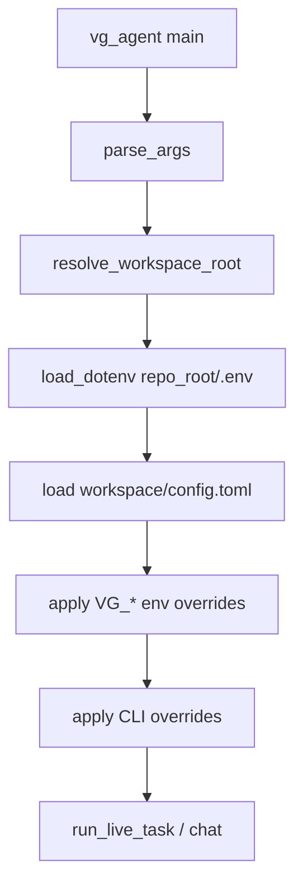

# Runtime config loader + model migration

## Problem

- [`specs/50_packaging.md`](specs/50_packaging.md) documents loader precedence (CLI > env > `workspace/config.toml` > generated defaults) but **no code reads `VG_*_MODEL` or TOML**.
- Generated [`src/vg_agent/config.py`](src/vg_agent/config.py) still hard-codes `openrouter/google/gemini-2.0-flash-001` from [`MODEL_CONFIG.md`](MODEL_CONFIG.md).
- Your [`.env`](.env) uses short IDs (`google/gemini-2.5-flash-lite`) which would fail [`live_model_client.py`](src/vg_agent/live_model_client.py) (`model` must start with `openrouter/`) even if env were loaded.
- [`BudgetGuard`](src/vg_agent/budget.py) dataclass defaults capture `config.MAX_*` at **class definition time**; mutating `config` after import does not change `BudgetGuard()` defaults — budget env overrides must be passed explicitly via [`_guard_overrides`](src/vg_agent/__main__.py).

## Architecture



**Precedence (last writer wins):** generated `config.py` constants → TOML → environment → CLI.

## Spec-first changes

1. **[`specs/50_packaging.md`](specs/50_packaging.md)** — add operational detail:
   - On startup, load `repo_root/.env` via `python-dotenv` with `override=False` (never clobber env already set by Docker/shell).
   - `repo_root` = parent of workspace when `pyproject.toml` exists there, else `Path.cwd()`.
   - Model IDs: if value lacks `openrouter/` prefix, prepend `openrouter/` (so `google/gemini-2.5-flash-lite` → `openrouter/google/gemini-2.5-flash-lite`).
   - Reject TOML keys matching `*_KEY|*_TOKEN|*_SECRET|*_PASSWORD`.
   - List optional `VG_K_COMPACT` (int) — your `.env` already sets this; wire it since it is documented in your local comments and harmless.

2. **[`MODEL_CONFIG.md`](MODEL_CONFIG.md)** — change default profile from `gemini-2.0-flash-001` to **`openrouter/google/gemini-2.5-flash`** for all six `*_MODEL_ID` keys (keep 2.0 pricing entries for backward-compatible traces/tests).

3. **[`CONTEXT_WINDOWS.md`](CONTEXT_WINDOWS.md)** — add entries for:
   - `openrouter/google/gemini-2.5-flash-lite` (same window/fraction as 2.5-flash)
   - Optionally keep 2.0 entries for historical traces

4. Sync tracked templates: [`.env.example`](.env.example), [`config.example.toml`](config.example.toml).

## Generated runtime module

Add **`runtime_settings.py`** to [`scripts/generate_project.py`](scripts/generate_project.py) `GENERATED_FILES` (not hand-edited under `src/`):

| Function | Responsibility |
|----------|----------------|
| `find_repo_root(workspace: Path) -> Path` | Locate compose/project root |
| `load_dotenv_file(repo_root: Path) -> None` | `dotenv.load_dotenv(repo_root / ".env", override=False)` |
| `normalize_model_id(raw: str) -> str` | Strip; prepend `openrouter/` if missing |
| `load_workspace_toml(workspace: Path) -> dict` | Parse `[models]`, `[budget]`, `[approval]`; reject secret-like keys |
| `apply_runtime_settings(*, workspace_root, cli: Namespace \| None)` | Mutate `config` module attrs |
| `KNOWN_ENV_VARS` | Frozen list for packaging tests |

**Env → config mapping:**

| Variable | Config attribute |
|----------|------------------|
| `VG_PARENT_MODEL` | `PARENT_MODEL_ID` |
| `VG_GRILLING_MODEL` | `GRILLING_MODEL_ID` |
| `VG_EXPLORER_MODEL` | `EXPLORER_MODEL_ID` |
| `VG_CODER_MODEL` | `CODER_MODEL_ID` |
| `VG_REVIEWER_MODEL` | `REVIEWER_MODEL_ID` |
| `VG_COMPACTOR_MODEL` | `COMPACTOR_MODEL_ID` |
| `VG_MAX_USD_PER_RUN` | `MAX_USD_PER_RUN` |
| `VG_MAX_USD_PER_DAY` | `MAX_USD_PER_DAY` |
| `VG_MAX_TOKENS_PER_RUN` | `MAX_TOKENS_PER_RUN` |
| `VG_APPROVAL_MODE` | `REQUIRE_APPROVAL_DEFAULT` |
| `VG_K_COMPACT` | `K_COMPACT` |

After model overrides, refresh `config.SUBAGENT_MODEL_IDS` dict in-place.

**TOML:** use `tomllib` (3.11+) with `tomli` fallback; add `tomli` to [`pyproject.toml`](pyproject.toml) for `requires-python >=3.10`.

**Dependencies:** add `python-dotenv` to main `dependencies` (already transitive; make explicit).

## CLI wiring ([`__main__.py` template](scripts/generate_project.py))

In `main()`:

```python
args = parser.parse_args(argv)
root = resolve_workspace_root()
apply_runtime_settings(workspace_root=root, cli=args)
if args.require_approval is None:
    args.require_approval = config.REQUIRE_APPROVAL_DEFAULT
_apply_model_overrides(args)  # expand below
```

Changes:

- `--require-approval` default `None` (not `config.REQUIRE_APPROVAL_DEFAULT` at import time).
- Expand `_apply_model_overrides`: set each `*_MODEL_ID` from CLI when present; keep `--subagent-model` setting explorer **and** compactor only when those CLI flags are unset.
- Expand `_guard_overrides`: always pass `max_usd` / `max_tokens` from CLI if set, else current `config.MAX_*` (post-loader).

Call order in `_chat_loop` is already after `main()` entry — no extra work.

## Pricing / context tables

In generator [`config.py`](scripts/generate_project.py) template, add to `PRICING_USD_PER_MTOK` and `CONTEXT_WINDOW_TOKENS` / `AUTO_COMPACT_FRACTION`:

- `openrouter/google/gemini-2.5-flash-lite` → same constants as `gemini-2.5-flash`

Unknown models still fail closed on budget preflight unless OpenRouter returns explicit cost (existing behavior).

## Tests ([`tests/test_runtime_settings.py`](tests/test_runtime_settings.py) new)

- Env override changes `config.COMPACTOR_MODEL_ID` after `apply_runtime_settings`.
- CLI `--parent-model` beats env.
- TOML loads under `tmp_path/workspace/config.toml`; env beats TOML.
- `normalize_model_id("google/gemini-2.5-flash-lite")` → `openrouter/google/...`
- TOML with `api_key = "x"` raises parse error.
- [`tests/test_packaging.py`](tests/test_packaging.py) (new, lightweight): `.env.example` keys ⊆ `KNOWN_ENV_VARS`; `config.example.toml` keys accepted by loader.

After edits: `python scripts/generate_project.py --clean` then `uv run pytest`.

## User-facing outcome

- Your existing [`.env`](.env) models (`google/gemini-2.5-flash-lite`, `qwen/...`) apply on next `vg-agent` / Docker run without hand-editing generated `config.py`.
- Fresh clones get **2.5-flash** defaults in regenerated code and examples; 2.0 remains in pricing tables for old traces.
- Restart `./start-web.sh` only affects dashboard display; **restart the agent process** (chat/task) to pick up model changes.

## Out of scope (deliberate)

- `VG_AUTO_COMPACT` toggle (no runtime flag exists today).
- Per-agent CLI flags (`--grilling-model`, etc.) — env/TOML cover your use case.
- `start-web.sh` sourcing `.env` (dashboard does not run the agent; optional follow-up).
