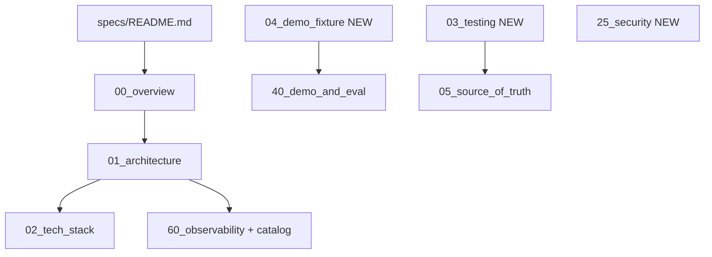

# Specs folder gaps — implementation plan

## Scope

Documentation-only changes under [`specs/`](specs/) plus small cross-links in [`specs/01_architecture.md`](specs/01_architecture.md), [`specs/00_overview.md`](specs/00_overview.md), [`DEVELOPER_README.md`](DEVELOPER_README.md), [`README.md`](README.md), [`docs/README.md`](docs/README.md). **No** `generate_project.py`, **no** `SOURCE_INPUTS` / `SPEC_DIGEST` changes, **no** new pytest unless you ask later.

## New files

### 1. [`specs/README.md`](specs/README.md) (navigation hub)

- Table of **numbered behavioral specs** (`00`–`70`) with one-line purpose.
- Note **intentional numbering gaps** (`03`/`04` reserved → will be filled by this work as `03_testing`, `04_demo_fixture`).
- Call out **two `70_*` files**: [`70_dashboard.md`](specs/70_dashboard.md) (trace UI) vs [`70_demo_runbook.md`](specs/70_demo_runbook.md) (graded live scenes).
- **Auxiliary specs** (unnumbered): [`model_experience.md`](specs/model_experience.md), [`41_runtime_quality_eval.md`](specs/41_runtime_quality_eval.md), [`gabriel_tips.md`](specs/gabriel_tips.md) (meta/workflow notes, not runtime contract).
- **Repo-root inputs**: `PROMPTS.md`, `MODEL_CONFIG.md`, `CONTEXT_WINDOWS.md`.
- **Recommended reading order** (same as `01`, plus new `03`/`04`/`25`).

### 2. [`specs/03_testing.md`](specs/03_testing.md)

Extract and centralize what today lives only in [`DEVELOPER_README.md`](DEVELOPER_README.md) / [`CLAUDE.md`](CLAUDE.md):

- **No network** in unit tests; `FakeClient` / `PipelineClient` in [`tests/test_vg_agent.py`](tests/test_vg_agent.py).
- **Provenance**: `test_generated_source_reproducible`, `test_documented_generation_command` — byte-for-byte match after `python scripts/generate_project.py --clean`.
- **Spec-first edits**: Tier A → templates/specs + regenerate; Tier B/C direct.
- **When to run**: `uv run pytest` after spec/template changes; focused `-k` patterns for chat/trace.
- **Dashboard tests**: [`tests/test_dashboard_api.py`](tests/test_dashboard_api.py) (no network).
- Link [`specs/05_source_of_truth_and_generation.md`](specs/05_source_of_truth_and_generation.md).

### 3. [`specs/04_demo_fixture.md`](specs/04_demo_fixture.md)

Consolidate fixture contract from [`specs/40_demo_and_eval.md`](specs/40_demo_and_eval.md) § layout + [`src/vg_agent/demo_fixture.py`](src/vg_agent/demo_fixture.py) (generated, but behavior is stable):

- **Layout tree**: `app.py`, `auth/`, `utils.py`, `data/sample.log`, `README.md`.
- **`sample.log`**: ~4600 lines, >200 KB, reproducible generator — triggers parent `K_COMPACT` on full read.
- **Auth demo intent**: session/middleware/utils roles for Scene 2 / parallel summarise.
- **`--seed-fixture`**: copies generated `fixtures/demo_repo/` into `VG_WORKSPACE_ROOT`.
- **Scene pointers** → [`70_demo_runbook.md`](specs/70_demo_runbook.md), assertions → `40`.

### 4. [`specs/25_security.md`](specs/25_security.md) (concise threat model)

One-page rollup (link, don’t duplicate full tool prose):

- Trust boundary: local dev / Docker workspace mount.
- Layers table: path sandbox, sensitive reads, `run_bash`, egress pin, approval, budget, Docker caps.
- **Out of scope**: multi-user dashboard auth, secrets in traces (redaction flag).
- Pointers: [`20_tools.md`](specs/20_tools.md), [`30_runtime_governance.md`](specs/30_runtime_governance.md), [`50_packaging.md`](specs/50_packaging.md), [`01_architecture.md`](specs/01_architecture.md) § Safety.

## Updates to existing specs

### 5. Trace event catalog — [`specs/60_observability.md`](specs/60_observability.md)

Add **§ Trace event catalog** (authoritative list). Sync from runtime emit sites in [`scripts/templates/agent.py.tmpl`](scripts/templates/agent.py.tmpl), [`trace.py.tmpl`](scripts/templates/trace.py.tmpl), [`live_model_client.py.tmpl`](scripts/templates/live_model_client.py.tmpl), [`chat_ui.py`](src/vg_agent/chat_ui.py):

| `kind` | Missing from `30` today | Parent `show_context`? |
|--------|-------------------------|-------------------------|
| `user_prompt` | listed | yes |
| `llm_start` | **missing** | no (trace/UI only) |
| `assistant_step` | listed | yes (parent) |
| `tool_call` | **missing** | yes (parent) |
| `tool_result` | listed | yes (parent; compacted) |
| `compaction` | listed | marker only |
| `context_compaction` | listed | meta row |
| `subagent_spawn` / `subagent_return` | listed | summary only via return |
| `budget_event` | listed | no |
| `approval` | listed | no |
| `egress_blocked` | listed | no |
| `redaction` | listed | no |
| `session_reset` / `session_new` | `session_new` **missing** | no |
| `statusline` | listed | no |
| `run_end` | listed | no |
| `model_error` | **missing** | no |

Also document:

- **`agent_type`** includes `compactor` (tool-result and conversation compaction LLM calls).
- **`budget_event.budget_reason`** enum (extend [`30`](specs/30_runtime_governance.md)): add `step_extend`, `coder_constrained_retry`, `subagent_empty_turn_retry`, `subagent_empty_turn_abort`, `subagent_truncated_tool_call_retry`, `subagent_budget_cap` where emitted in `agent.py.tmpl`.

### 6. [`specs/30_runtime_governance.md`](specs/30_runtime_governance.md)

- Replace the incomplete **Event kinds** bullet list with: “see [`60_observability.md`](specs/60_observability.md) § Trace event catalog” plus a short inline list including `llm_start`, `tool_call`, `model_error`, `session_new`.
- Add `compactor` to `agent_type` enum in § Per-event attribution cross-ref.

### 7. [`specs/01_architecture.md`](specs/01_architecture.md)

- Expand **Context engineering** into three mechanisms:
  1. Tool-result compaction (`K_COMPACT`)
  2. Sub-agent offloading (≤2 KB return)
  3. **Conversation compaction** (`context_compaction`, auto before parent `llm_start`, manual `/compact`)
- Add short **Sub-agent documentation** note: only Explorer has `11_*`; Grilling/Coder/Reviewer are specified in `12` by design.
- Update **Spec reading order** to include `README`, `03`, `04`, `25`, aux docs.

### 8. [`specs/11_subagent_explorer.md`](specs/11_subagent_explorer.md)

- New opening paragraph: why this is the only per-type spec file; others → `12`.

### 9. Cross-links (small)

| File | Change |
|------|--------|
| [`specs/00_overview.md`](specs/00_overview.md) | Link [`specs/README.md`](specs/README.md) |
| [`specs/02_tech_stack.md`](specs/02_tech_stack.md) | Link `03`, `04`, `25`, `README` under Related |
| [`specs/05_source_of_truth_and_generation.md`](specs/05_source_of_truth_and_generation.md) | Mention `03_testing` |
| [`specs/40_demo_and_eval.md`](specs/40_demo_and_eval.md) | Point fixture layout detail → `04_demo_fixture` |
| [`DEVELOPER_README.md`](DEVELOPER_README.md) | Testing section → `specs/03_testing.md` |
| [`README.md`](README.md) | Docs table: `specs/README.md`, `03`, `04` |
| [`docs/README.md`](docs/README.md) | Link specs index |

## Verification

- `rg` for broken relative links under `specs/`.
- Compare catalog `kind` set against `recorder.emit(` / `"kind":` in templates + `chat_ui.py` + `live_model_client.py.tmpl`.
- Manual read-through: `01` three mechanisms align with `10`, `15`, `30`, `60`.

## Out of scope

- Renumbering `70_dashboard` vs `70_demo_runbook` (index note only).
- Moving `gabriel_tips.md` out of `specs/`.
- Automated link-rot or trace-kind drift tests.
