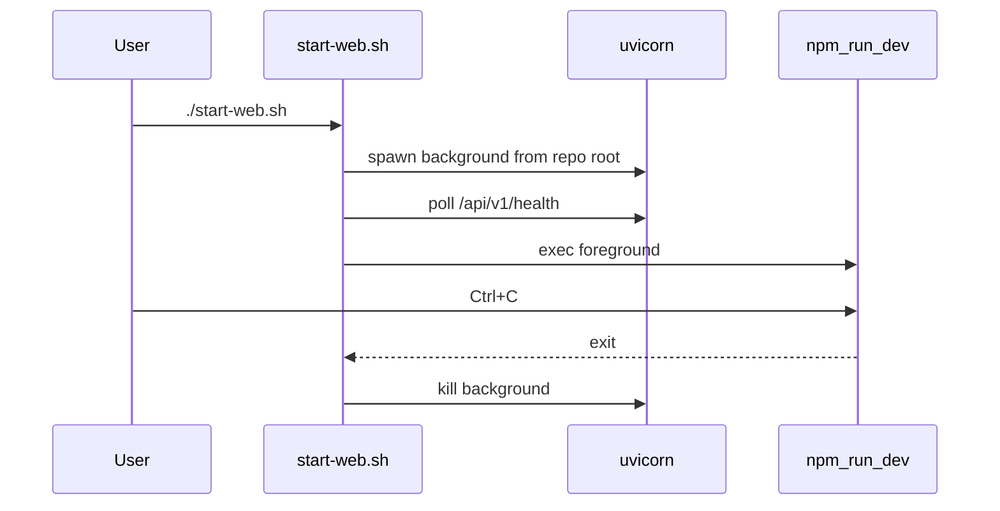

# Add `./start-web.sh` dashboard launcher

## Goal

One command from repo root starts **both**:

1. FastAPI on `127.0.0.1:8787` (always from **repo root** so `trace_dirs` is correct)
2. Vite on `http://127.0.0.1:5173` (foreground; Ctrl+C stops both)

Matches your workflow preference: **repo-root `start-web.sh` only** (no `.ps1` twin; keep existing [`scripts/run_dashboard.ps1`](scripts/run_dashboard.ps1) for native PowerShell users).

Note: [`start.sh`](start.sh) at repo root is **Docker live chat** — different purpose. New script name `start-web.sh` avoids confusion.

## Script behavior

File: [`start-web.sh`](start-web.sh) at repository root (executable `chmod +x`).

```bash
#!/usr/bin/env bash
set -euo pipefail
ROOT_DIR="$(cd "$(dirname "${BASH_SOURCE[0]}")" && pwd)"
cd "$ROOT_DIR"
```

| Step | Action |
|------|--------|
| Preflight | Require `uv` and `npm` on PATH; `exit 1` with clear message if missing |
| Env | `VG_WORKSPACE_ROOT=${VG_WORKSPACE_ROOT:-workspace}`, `VG_DASHBOARD_PORT=${VG_DASHBOARD_PORT:-8787}` |
| Frontend deps | If `dashboard/web/node_modules` missing → `npm install` in `dashboard/web` |
| API | Background: `uv run uvicorn dashboard.api.main:app --host 127.0.0.1 --port $PORT --reload` from `$ROOT_DIR` |
| Health wait | Loop up to ~15s on `GET /api/v1/health`; warn if `trace_dirs` empty (prints hint to check cwd) |
| UI | Foreground: `cd dashboard/web && exec npm run dev` |
| Cleanup | `trap` on EXIT/INT/TERM kills API child PID |



Optional flags (v1, keep minimal):

- `--no-install` — skip `npm install` check
- `--api-port 8787` — override port

## Documentation updates

[`README.md`](README.md) — dashboard section:

- Add **Recommended (Git Bash / WSL):** `./start-web.sh`
- Keep two-terminal manual steps as fallback
- Keep `.\scripts\run_dashboard.ps1` for PowerShell
- Reiterate: do **not** run uvicorn from `dashboard/web`

[`specs/70_dashboard.md`](specs/70_dashboard.md) — one line under Dependencies / local dev pointing to `start-web.sh`.

## Out of scope (per your choice)

- No code change to [`dashboard/api/paths.py`](dashboard/api/paths.py) cwd anchoring (README workaround remains sufficient)
- No `start-web.ps1` (existing PowerShell launcher already covers Windows)

## Verification

After implementation, from Git Bash at repo root:

```bash
./start-web.sh
```

Startup stderr should show non-empty `trace_dirs` and `schema_ready=True`. Browser: History shows sessions; http://127.0.0.1:8787/api/v1/sessions?limit=5 returns `total > 0`.
