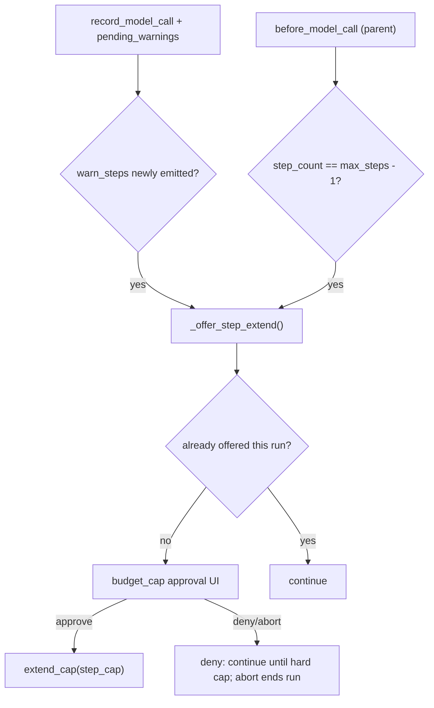

# Step budget prompt, approval copy, and SQLite threading

## Problem statement

From the live Docker chat run (`session_id` `a73dede4108c`):

1. **`warn_steps` is log-only** — at 15/15 the user saw `[budget] warn_steps` but no “extend steps?” prompt; the hard `step_cap` prompt only appears when a *16th* parent model call would start.
2. **Budget-cap UI is USD-shaped** — `format_budget_cap_approval_text` always shows `--max-usd` breakdown even for `step_cap` / `token_cap`.
3. **SQLite mirror dies under parallel explorers** — `warning: sqlite trace write failed: SQLite objects created in a thread…` after `spawn_subagents`; JSONL remains canonical but History/SQLite rollups miss sub-agent rows for that run.
4. **(Related, out of scope unless pulled into P2)** — traces written under `workspace/workspace/traces/` are invisible to the dashboard (`VG_WORKSPACE_ROOT=workspace` scans `workspace/traces` + repo `traces/` only).

## Goals

| ID | Goal |
|----|------|
| G1 | In interactive runs, offer **one optional** “extend step budget?” prompt before the hard `step_cap` blocks the run. |
| G2 | Budget-cap approval panels show **reason-specific** copy (`step_cap`, `token_cap`, `usd_cap`, …). |
| G3 | SQLite mirroring survives **parallel** `spawn_subagents` (no thread error; sub-agent rows present). |

## Non-goals

- Changing hard-cap semantics (VG.3 still requires a real abort at cap unless user approves).
- Auto-extending steps without a prompt (except existing `--yes` / `auto_yes`).
- Conversation-level `/compact` or `context_compaction` (separate plan).
- Fixing nested `workspace/workspace/traces` discovery unless P2 is explicitly scheduled.

---

## Design

### 1. Proactive step-budget prompt

**Triggers (first match wins, once per run):**



- **When `warn_steps` fires** (≥ `WARN_STEP_FRACTION * max_steps`, default 12/15) *or* **before a parent call that would be the last allowed step** (`step_count == max_steps - 1`, statusline `14/15`): call new helper `_offer_step_extend_if_needed(...)`.
- **At most once per run** — add `step_extend_prompted: bool` on `BudgetGuard` (or `warned` key `"step_extend_prompt"`).
- **Eligibility** — same gate as hard budget approval:
  - `ApprovalPolicy.prompt` is set (chat with approvals, or `--require-approval writes|all` without `--yes`).
  - Not `auto_yes`.
- **On approve** — reuse `extend_cap("step_cap", once=…)`:
  - `1/y` / `approved` → `once=True` → `max_steps = step_count + 1` (one more step).
  - `2` scoped / `3` always → `once=False` → existing bump `max_steps + max(5, max_steps // 4)`.
- **On deny** — emit `approval{decision:denied}`, **do not abort**; run continues until true `step_cap`.
- **On abort** — same as hard cap: `run_end{aborted}`.
- **Trace** — `approval` with `tool=budget_cap`, `budget_reason=warn_steps` (proactive) vs `step_cap` (hard). `budget_event` with `details.extended=true` on approve.

**Config (spec + `config.py` generated):**

| Constant | Default | Meaning |
|----------|---------|---------|
| `STEP_EXTEND_PROMPT_ON_WARN` | `true` | Offer at first `warn_steps` |
| `STEP_EXTEND_PROMPT_ON_LAST_STEP` | `true` | Offer when `step_count == max_steps - 1` before next parent LLM call |

If both true, still **only one** prompt per run (whichever condition is hit first). For `max_steps=15`, warn fires at 12 — user gets early offer unless we default `STEP_EXTEND_PROMPT_ON_WARN=false` and only prompt at 14/15.

**Recommendation:** default **`STEP_EXTEND_PROMPT_ON_WARN=false`**, **`STEP_EXTEND_PROMPT_ON_LAST_STEP=true`** so chat matches “14/15 on statusline” without noise at 12/15. Document both toggles in `specs/30_runtime_governance.md`; optional CLI `--step-extend-prompt {warn,last,both,off}` in `specs/15_cli_contract.md`.

**`_handle_budget_cap` change:** keep `if reason.startswith("warn_"): return False` for passive warnings. Proactive path is separate (`_offer_step_extend`), not routed through passive warn handling.

### 2. Reason-specific budget-cap approval text

Refactor generated `format_budget_cap_approval_text(reason: str, details: dict)`:

| `budget_reason` | Headline / body |
|-----------------|-----------------|
| `step_cap` | Steps used / max; “Approve to add N steps (this run)” |
| `warn_steps` (proactive) | “Approaching step limit (12/15)” + same extend copy |
| `token_cap` | Running tokens / max + bump summary |
| `usd_cap` | Existing cap / spent / step est. / projected (unchanged) |
| `daily_cap` | Daily remaining |
| `timeout` / `repetition_abort` | Short reason-specific line |

`prompt_approval` passes `request.path` (= reason) into formatter:

```python
body_text = format_budget_cap_approval_text(request.path, request.args)
```

Panel title remains `Budget cap — {reason}` (red border). Update `specs/16_chat_ui.md` table: budget body is **reason-dispatch**, not USD-only.

### 3. SQLite threading fix

**Root cause:** `SQLiteTraceStore.__init__` uses default `check_same_thread=True`; `TraceRecorder.emit` runs from `ThreadPoolExecutor` workers during `spawn_subagents`.

**Fix (generated `sqlite_store.py`):**

```python
self._write_lock = threading.Lock()
self.conn = sqlite3.connect(str(self.path), check_same_thread=False)
# PRAGMAs unchanged (WAL, foreign_keys)

def record_event(self, event: dict) -> None:
    with self._write_lock:
        ...  # existing body
```

- Do **not** rely on `TraceRecorder._lock` alone — store owns the connection.
- On failure, keep fail-open (stderr warning, disable mirror) — but threading fix should make failures rare.

**Spec addition (`specs/30_runtime_governance.md` § SQLite):**

> The observability connection must be usable from any thread that calls `TraceRecorder.emit` (parallel sub-agents). Implementation: `check_same_thread=False` and a store-level write lock.

**Test:** extend `test_parallel_explorers_run_concurrently_with_overlap` or add `test_sqlite_mirror_survives_parallel_subagents`:

- `TraceRecorder(tmp_path, sqlite_enabled=True)` + parallel pipeline client.
- Assert no disable of `sqlite_store` (or grep stderr capture).
- `SELECT COUNT(*) FROM subagents WHERE run_id=?` ≥ 2.

---

## Spec files to edit (source of truth)

| File | Changes |
|------|---------|
| [`specs/30_runtime_governance.md`](specs/30_runtime_governance.md) | Proactive step extend rules, constants, `approval.budget_reason` for `warn_steps`, SQLite thread requirement |
| [`specs/10_main_agent.md`](specs/10_main_agent.md) | Distinguish proactive extend vs hard `step_cap` pause |
| [`specs/16_chat_ui.md`](specs/16_chat_ui.md) | Reason-specific budget panel copy; optional `!` on steps segment at `max_steps-1` |
| [`specs/60_observability.md`](specs/60_observability.md) | Cross-link proactive prompt + warn vs hard cap |
| [`specs/15_cli_contract.md`](specs/15_cli_contract.md) | `--step-extend-prompt` (optional) |
| [`specs/40_demo_and_eval.md`](specs/40_demo_and_eval.md) | Optional demo note: at 14/15 chat offers extend (if approvals on) |

**P2 (dashboard visibility):** [`specs/70_dashboard.md`](specs/70_dashboard.md) — extend `all_traces_dirs()` to include `workspace_root.rglob("traces")` with depth cap, or canonicalize Docker cwd to `/workspace` so traces land in mounted `./traces`.

---

## Implementation path (generator only)

Edit templates in [`scripts/generate_project.py`](scripts/generate_project.py):

1. **`budget.py`** — `step_extend_prompted`, config flags, maybe `should_offer_step_extend(step_count) -> bool`.
2. **`agent.py`** — `_offer_step_extend_if_needed(...)`; call from parent loop after `pending_warnings()` and/or before `before_model_call`; wire `ApprovalPolicy.check_budget_cap` with `budget_reason=warn_steps` for proactive path.
3. **`chat_ui.py`** — `format_budget_cap_approval_text(reason, details)`; status bar yellow/`!` on steps when `steps == max_steps - 1` (optional, spec 16).
4. **`sqlite_store.py`** — lock + `check_same_thread=False`.
5. **`config.py` section** — new constants from spec.

Then:

```powershell
python scripts/generate_project.py --clean
uv run pytest
```

---

## Tests ([`tests/test_vg_agent.py`](tests/test_vg_agent.py))

| Test | Asserts |
|------|---------|
| `test_proactive_step_extend_prompt_at_last_step` | `max_steps=2`, fake client 3 turns, prompt callback once with `budget_cap` + `warn_steps` or `step_cap`; approve → run completes `ok` |
| `test_proactive_step_extend_deny_continues_until_hard_cap` | deny proactive → still hits hard `step_cap` on next boundary |
| `test_budget_cap_approval_step_copy` | `format_budget_cap_approval_text("step_cap", {...})` contains `steps` not `Cap (--max-usd)` |
| `test_sqlite_mirror_survives_parallel_subagents` | parallel explorers + sqlite; subagents table ≥ 2; store not nulled |
| Update `test_live_loop_budget_cap_approval_extends_steps` | body text still valid for hard `step_cap` |

Use `FakeClient` / `PipelineClient`; no network.

---

## Suggested implementation order

1. **SQLite fix** — small, unblocks dashboard fidelity immediately.
2. **Reason-specific approval text** — UX quick win; no loop semantics change.
3. **Proactive step extend** — spec + agent loop + tests.
4. **Regenerate + full pytest**.
5. **P2 dashboard trace dirs** — separate PR if desired.

---

## Risks and mitigations

| Risk | Mitigation |
|------|------------|
| Double prompt (warn at 12 + last at 14) | `step_extend_prompted` + default `ON_WARN=false` |
| Prompt during parallel sub-agent work | Only call `_offer_step_extend` on **parent** loop paths, not inside explorer workers |
| `--yes` bypass | Respect `auto_yes` (no proactive prompt) |
| VG.3 “hard cap must abort” | Proactive deny does not raise cap; hard `step_cap` still blocks without approval |
| WAL + multi-thread | Single writer lock per process matches dashboard `check_same_thread=False` pattern |

---

## Verification checklist

- [ ] Docker chat: parallel `spawn_subagents` → **no** sqlite thread warning; session appears in History after copy or P2 path fix.
- [ ] Chat at 14/15 with approvals → red “extend step budget?” panel; approve → steps show 15/20 (or similar).
- [ ] Hard `step_cap` still shows panel on 16th attempt if not extended.
- [ ] `uv run pytest` green; provenance test passes after regenerate.
