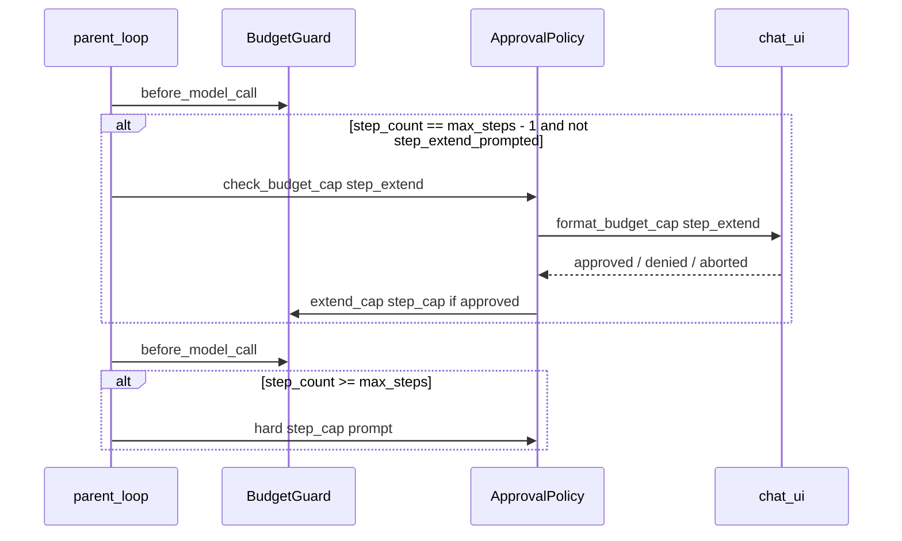

# Step budget at 14/15, SQLite threading, dashboard traces

## Confirmed behavior

- **Proactive prompt:** Once per run, **before the next parent LLM call** when `step_count == max_steps - 1` (e.g. **14/15**). No prompt at 80% (`warn_steps` at 12/15 remains log-only).
- **Hard cap unchanged:** 16th parent call still hits `step_cap` with existing `budget_cap` approval ([`specs/10_main_agent.md`](specs/10_main_agent.md)).
- **Deny proactive extend:** Run continues until hard cap; **abort** still ends with `run_end{aborted}`.
- **Include dashboard P2:** Discover nested `**/traces` under `VG_WORKSPACE_ROOT` (fixes `workspace/workspace/traces/a73dede4108c.jsonl`).

Workflow: edit specs + [`scripts/generate_project.py`](scripts/generate_project.py) templates only for agent code; edit [`dashboard/api/paths.py`](dashboard/api/paths.py) directly (not generated); then `python scripts/generate_project.py --clean` and `uv run pytest`.

---

## 1. Spec updates

| File | Changes |
|------|---------|
| [`specs/30_runtime_governance.md`](specs/30_runtime_governance.md) | `step_extend` proactive rule: trigger `step_count == max_steps - 1`, once per run; `approval.budget_reason` may be `step_extend`; SQLite must use `check_same_thread=False` + store write lock |
| [`specs/10_main_agent.md`](specs/10_main_agent.md) | Distinguish proactive `step_extend` vs hard `step_cap` |
| [`specs/16_chat_ui.md`](specs/16_chat_ui.md) | `format_budget_cap_approval_text(reason, details)` per cap type; optional yellow/`!` on steps segment when `steps == max_steps - 1` |
| [`specs/60_observability.md`](specs/60_observability.md) | Cross-link: `warn_steps` still non-blocking; extend prompt at last step |
| [`specs/15_cli_contract.md`](specs/15_cli_contract.md) | Optional `--no-step-extend-prompt` to disable proactive offer (chat + interactive approvals) |
| [`specs/70_dashboard.md`](specs/70_dashboard.md) | `all_traces_dirs()` also scans `workspace_root/**/traces` (depth-limited), deduped |

Generated constant (no `ON_WARN`): `STEP_EXTEND_PROMPT_ON_LAST_STEP = True` (internal; disable via CLI flag above).

---

## 2. Runtime (generator templates)

### BudgetGuard ([`scripts/generate_project.py`](scripts/generate_project.py) `budget.py` block)

- Add `step_extend_prompted: bool = False`.
- Add `should_offer_step_extend() -> bool`: `not step_extend_prompted and step_count == max_steps - 1 and max_steps > 0`.
- Add `mark_step_extend_prompted()` after offer.

### Agent loop ([`agent.py` template](scripts/generate_project.py))

- New `_offer_step_extend_if_needed(policy, recorder, guard, started) -> bool` (returns False only on user **abort**):
  - Skip if `not guard.should_offer_step_extend()` or `policy.auto_yes` or `policy.prompt is None`.
  - Build synthetic `BudgetDecision(allowed=False, budget_reason="step_extend", details={step_count, max_steps})`.
  - Call `policy.check_budget_cap("step_extend", details, summary)`; emit `approval` via existing `_emit_budget_approval`.
  - On approve: `guard.extend_cap("step_cap", once=…)` per decision; emit `budget_event` with `extended: true`; `mark_step_extend_prompted()`.
  - On deny: mark prompted, continue.
- Call from **parent** loop only, immediately **before** `guard.before_model_call` for the parent (after tool results are processed, when about to start next LLM turn)—same place [`before_model_call` is invoked ~line 2577](scripts/generate_project.py).
- Leave `_handle_budget_cap` `warn_*` early return unchanged.

### Chat UI ([`chat_ui.py` template](scripts/generate_project.py))

- Change signature to `format_budget_cap_approval_text(reason: str, details: dict)`.
- Branches: `step_extend` / `step_cap` (steps used/max + bump hint), `token_cap`, `usd_cap` (current body), `daily_cap`, default fallback.
- Update `prompt_approval` and [`__main__.py` template](scripts/generate_project.py) stderr path to pass `request.path` as `reason`.
- Optional: in `build_status_bar_text` / steps segment, prefix `!` when `steps == max_steps - 1` (spec 16).

### SQLite ([`sqlite_store.py` template](scripts/generate_project.py) — hand-maintained extra file per generator)

- `import threading`; `self._write_lock = threading.Lock()`.
- `sqlite3.connect(str(self.path), check_same_thread=False)`.
- Wrap `record_event` body in `with self._write_lock:`.

---

## 3. Dashboard trace discovery

[`dashboard/api/paths.py`](dashboard/api/paths.py) — extend `all_traces_dirs()`:

- After existing candidates, glob `workspace_root() / "**" / "traces"` with **max depth 4** (avoid runaway scans).
- Add each resolved dir to `dirs` if distinct and contains `*.jsonl` or exists as traces folder.
- `clear_path_cache()` unchanged; callers already invalidate on startup.

Test in [`tests/test_dashboard_paths.py`](tests/test_dashboard_paths.py):

- Create `workspace/workspace/traces/nested.jsonl`; assert `find_jsonl_path("nested")` resolves.

---

## 4. Tests ([`tests/test_vg_agent.py`](tests/test_vg_agent.py))

| Test | Purpose |
|------|---------|
| `test_proactive_step_extend_at_last_step` | `max_steps=2`, 3 parent turns, approve `step_extend` once → `ok` |
| `test_proactive_step_extend_deny_then_hard_cap` | Deny at 1/2, then hard `step_cap` on next attempt |
| `test_budget_cap_approval_step_copy` | Step body mentions steps, not USD cap |
| `test_sqlite_mirror_survives_parallel_subagents` | Reuse parallel pipeline client; assert `recorder.sqlite_store` stays live and `subagents` count ≥ 2 |

Regenerate: `python scripts/generate_project.py --clean`.

---

## 5. Verification

- `uv run pytest`
- Manual: Docker chat with approvals, run demo task to 14/15 → extend panel; parallel spawn → no SQLite thread warning; History shows `a73dede4108c` (or new run) without copying JSONL

---

## Out of scope

- Prompt at 80% (`warn_steps`) — explicitly excluded per your choice.
- Conversation `/compact` / `context_compaction`.
