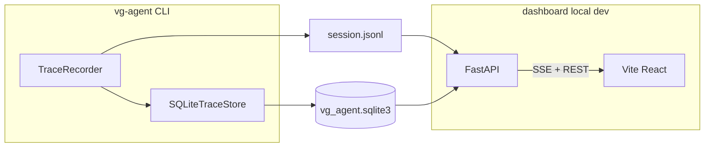
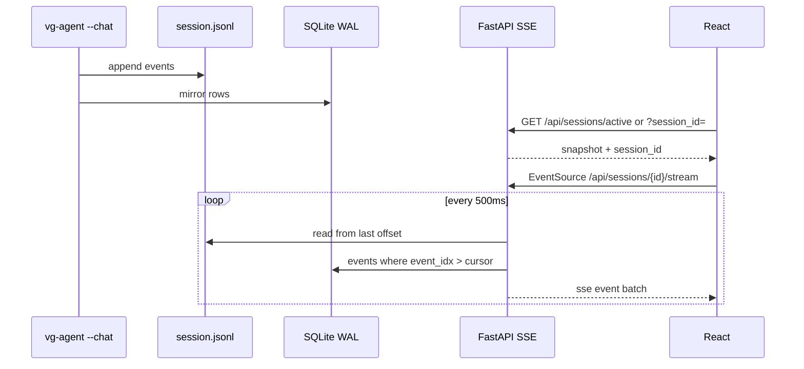

# VG Agent trace analysis dashboard

## What already exists (no reinventing)

The repo is **spec-ready for this UI** but has **zero frontend** today. You already persist everything the dashboard needs:

| Source | Role |
|--------|------|
| [`traces/vg_agent.sqlite3`](traces/vg_agent.sqlite3) | Query store: `sessions`, `runs`, `turns`, `events`, `model_calls`, `tool_calls`, `subagents`, `approvals`, `compactions`, `redactions` ([`src/vg_agent/sqlite_store.py`](src/vg_agent/sqlite_store.py)) |
| [`traces/<session_id>.jsonl`](traces/) | Canonical audit log (chat = one file per session, append-only) |
| [`workspace/.vg_daily_spend.json`](workspace/.vg_daily_spend.json) | UTC daily spend for cap context |
| [`src/vg_agent/trace.py`](src/vg_agent/trace.py) | `show_context()`, `parallel_subagent_summary()`, turn review helpers — reuse server-side |
| [`specs/60_observability.md`](specs/60_observability.md) | Declares deferred **FastAPI + Pydantic + React**; FinOps + attribution fields |



**Constraint:** Do not hand-edit generated [`src/vg_agent/*`](src/vg_agent/). Dashboard is a **new top-level package** (e.g. `dashboard/api/`, `dashboard/web/`). Agent behavior changes only via new spec + regenerate if you later want a `--serve-dashboard` flag.

---

## Your tabs + recommended additions

### Core tabs (your list)

| Tab | Purpose |
|-----|---------|
| **Current session** | Live run: SSE stream of new events, statusline, budget counters, in-progress turn |
| **History** | Paginated session list → drill into run/turn |
| **Statistics** | Aggregates: today / 7d / 30d tokens, USD, runs, error rate, top tools/models |

### Strong v1 additions (same app, sub-routes or secondary nav)

| Area | Why |
|------|-----|
| **Session detail → Timeline** | Waterfall: user prompt → LLM calls → tools → sub-agents (overlap band for parallel explorers) |
| **Context** | Step slider calling same logic as `--show-context N` ([`show_context`](src/vg_agent/trace.py)); highlight compaction substitutions vs full payload in JSONL |
| **Tools & errors** | Filterable table from `tool_calls` (latency, status, `error_type`) |
| **Safety / FinOps** | `approvals`, `redactions`, `budget_event`, per-`agent_type` token/USD (mirrors `/finops` + statusline) |

### Defer to v2

- Run **compare** (two sessions side-by-side)
- **Export** (download JSONL, printable report)
- Inline **file diffs** (reuse upcoming Claude-style diff from [`specs/16_chat_ui.md`](specs/16_chat_ui.md) — API can return hunk JSON later)
- Hosted multi-user / auth (you chose **local dev only**)

---

## Stack proposals (aligned with your ask)

| Layer | Choice | Notes |
|-------|--------|-------|
| API | **FastAPI** + **Pydantic v2** | Matches [`specs/60_observability.md`](specs/60_observability.md) |
| DB access | **SQLAlchemy 2.0** (read-only) | Map existing tables; **no Alembic migrations** — schema owner remains `sqlite_store.py`. Use `check_same_thread=False` / short-lived sessions; WAL mode is already enabled |
| Live updates | **SSE** (`EventSource`) | Poll JSONL tail + SQLite `MAX(event_idx)`; simpler than WebSocket for one-way agent→UI |
| Frontend | **React 18** + **Vite** + **Tailwind** | New `dashboard/web/` |
| Data fetching | **TanStack Query** | Cache session lists; invalidate on SSE |
| Routing | **React Router** | `/`, `/history`, `/history/:sessionId`, `/stats` |
| Charts | **Recharts** or **Tremor** | Statistics tab time series / breakdowns |
| Timeline / parallel | **vis-timeline** or lightweight custom Gantt | Overlap from `started_at`/`ended_at` on `subagents` + `parallel_subagent_summary` |
| Virtualization | **@tanstack/react-virtual** | Long event lists |

Optional later: **Zod** on the client mirroring Pydantic OpenAPI types (codegen from `/openapi.json`).

Add optional dependency group in [`pyproject.toml`](pyproject.toml), e.g. `dashboard = ["fastapi", "uvicorn[standard]", "sqlalchemy>=2", "pydantic>=2"]`; Node deps only under `dashboard/web/package.json`.

---

## Local dev deployment (your choice)

- **API:** `uv run uvicorn dashboard.api.main:app --reload --port 8787`
- **Web:** `npm run dev` in `dashboard/web` with Vite proxy `/api` → `8787`
- **Config:** env `VG_WORKSPACE_ROOT` (default repo `./workspace`) → resolves `traces/vg_agent.sqlite3` and `traces/*.jsonl`
- **CORS:** allow `localhost:5173` only
- **Security:** bind `127.0.0.1`; no auth for v1; document that traces may contain redacted-but-sensitive content

No Docker service in v1 (can add sidecar later without changing API contract).

---

## Live SSE design (Current session)



- **Active session detection:** latest `sessions.last_seen_at` where `status` not terminal, or env `VG_ACTIVE_SESSION_ID` set by future CLI hook; fallback: most recently modified `traces/*.jsonl`
- **SSE payload:** `{ type: "events", items: [...] }`, `{ type: "statusline", ... }`, `{ type: "heartbeat" }`
- **Idempotency:** client tracks `last_event_idx`; server sends only new rows
- **Reconnect:** `Last-Event-ID` header or `?from_event_idx=`

---

## API surface (v1)

Prefix `/api/v1`:

| Method | Path | Data |
|--------|------|------|
| GET | `/health` | DB reachable, workspace path |
| GET | `/sessions` | List from `sessions` (+ last prompt snippet from `turns`) |
| GET | `/sessions/{session_id}` | Session + runs + rollups |
| GET | `/sessions/{session_id}/events` | Paginated `events` or raw JSONL slice |
| GET | `/sessions/{session_id}/stream` | **SSE** live tail |
| GET | `/runs/{run_id}/timeline` | Turns, model_calls, tool_calls, subagents joined |
| GET | `/runs/{run_id}/context` | `?step_idx=N` → Pydantic model wrapping `show_context()` |
| GET | `/runs/{run_id}/parallel` | `parallel_subagent_summary` per turn |
| GET | `/stats` | `?range=today\|7d\|30d` aggregates from SQL |
| GET | `/finops/daily` | Read `.vg_daily_spend.json` + config caps from env/package |

Pydantic models in `dashboard/api/schemas/`; SQLAlchemy declarative models mirroring existing column names in [`sqlite_store.py`](src/vg_agent/sqlite_store.py) lines 145–323.

**Import rule:** `from vg_agent.trace import show_context, parallel_subagent_summary` inside API handlers (install package editable: existing `uv` workflow).

---

## Frontend information architecture

```
/                     → Current session (live SSE + summary cards)
/history              → Session table (sort by last_seen, status, cost)
/history/:sessionId   → Tabs: Timeline | Context | Tools | Safety | Raw JSONL
/stats                → Today / week / month charts + tables
```

**Current session UI:** connection badge, live statusline strip, event feed (grouped by turn), parallel explorer chip when overlap detected, budget progress bars.

**History session UI:** reuse same detail components without SSE (snapshot load).

**Statistics UI:** KPI cards (runs, tokens, USD, error %), line chart by day, breakdown bars by `agent_type` and `model_id`, tool failure leaderboard.

---

## Spec-first workflow

Add [`specs/70_dashboard.md`](specs/70_dashboard.md) defining:

- Tab scope, API routes, SSE contract, Pydantic response shapes
- Which tables/fields are authoritative vs derived
- Local-only security stance
- Live session detection rules

This spec is **not** fed through `generate_project.py` initially (dashboard is outside generated tree). Link from [`specs/60_observability.md`](specs/60_observability.md) “frontend deferred” section.

---

## Testing strategy

| Layer | Approach |
|-------|----------|
| API | `pytest` + `TestClient`; seed DB using existing `TraceRecorder` + fake client pattern from [`tests/test_vg_agent.py`](tests/test_vg_agent.py) (`test_sqlite_trace_mirror_and_dashboard_rollups`) |
| SSE | TestClient async generator; append events to temp JSONL |
| Frontend | Vitest for parsers/formatters; optional Playwright smoke later |
| No network | Same rule as agent tests |

---

## Implementation phases

### Phase 1 — Foundation
- `dashboard/api/` FastAPI app, SQLAlchemy models, session list + session detail REST
- `dashboard/web/` Vite scaffold, Tailwind, History list + static session detail

### Phase 2 — Live current session
- SSE endpoint + JSONL tail reader
- Current session page with EventSource + live event feed

### Phase 3 — Analytics
- `/stats` SQL rollups (today/7d/30d)
- Statistics tab charts

### Phase 4 — Deep inspection
- Context step slider (`show_context`)
- Parallel timeline visualization
- Tools/errors and Safety/FinOps panels

### Phase 5 — Polish
- OpenAPI → typed client; empty states; link to JSONL path; README section + `scripts/run_dashboard.ps1`

---

## Files to add (high level)

| Path | Role |
|------|------|
| [`specs/70_dashboard.md`](specs/70_dashboard.md) | Contract |
| `dashboard/api/main.py` | FastAPI app |
| `dashboard/api/db.py` | SQLAlchemy engine + session |
| `dashboard/api/models.py` | ORM table mappings |
| `dashboard/api/schemas.py` | Pydantic DTOs |
| `dashboard/api/routes/*.py` | REST + SSE |
| `dashboard/api/services/tail.py` | JSONL + SSE cursor |
| `dashboard/api/services/context.py` | Wrap `show_context` |
| `dashboard/web/*` | React app |
| [`pyproject.toml`](pyproject.toml) | Optional `[dashboard]` deps |
| `scripts/run_dashboard.ps1` | Start API + web |

---

## Risks and mitigations

| Risk | Mitigation |
|------|------------|
| SQLite write lock during agent run | Read-only connections; short queries; SSE reads JSONL for lowest latency |
| Large `payload_json` in UI | Paginate; lazy-load event detail drawer |
| Schema drift | ORM columns match `sqlite_store` tests; CI test loads mirror DB |
| Secrets in traces | Banner in UI; default redacted payloads; never log API responses |
