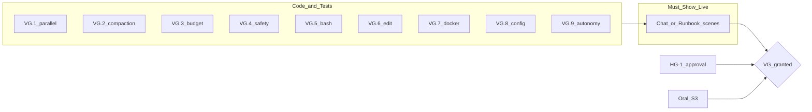

# VG Assignment Grading Assessment

## Executive verdict

| Lens | Verdict | Confidence |
|------|---------|------------|
| **Code + tests (no live demo)** | **Almost Pass** — implementation is there; rubric says undemonstrated features do not count | High |
| **Live demo per [final_demo_live_chat_script.md](docs/demo/final_demo_live_chat_script.md)** | **Pass** — script maps every VG.1–VG.9 item to a concrete moment | Medium (model/network risk) |
| **Full VG grade (incl. hard gates + oral + substance)** | **Conditional Pass** — blocked only by artefacts you must bring to the room | Medium |

The rubric is explicit: *"What you cannot demonstrate and prove live doesn't count."* ([vg_assignment_grading_requirements.md](docs/background/vg_assignment_grading_requirements.md) §B). Code quality is strong; **VG is decided at the demo**, not in pytest.

---

## §1 Hard gates (VG-HG-0 … HG-4)

| Gate | Repo evidence | Demo / oral needed | Assessment |
|------|---------------|-------------------|------------|
| **HG-0** artefacts loaded | Spec set in `specs/`, pitch in [emil_pitch.md](docs/background/emil_pitch.md), build in repo | Open all three at start of demo | **Ready** if you do it |
| **HG-1** approved own spec | Pitch exists; full spec lives in `specs/` (esp. [00_overview.md](specs/00_overview.md)) | Teacher approval status **not in repo** | **Unknown** — confirm approval with examiner |
| **HG-2** student-prompted, no hand code | [generate_project.py](scripts/generate_project.py) + [PROMPTS.md](PROMPTS.md); [CLAUDE.md](CLAUDE.md) forbids hand-editing `src/vg_agent/`; `test_generated_source_reproducible` | Must show chat sessions on request | **Likely Pass** if you can show sessions |
| **HG-3** architecture understanding | [ARCHITECTURE.md](docs/ARCHITECTURE.md), oral answers in demo script §Oral | 2–3 questions at demo | **Depends on you** |
| **HG-4** demonstrated live | Docker path in [README.md](README.md), [docker-compose.yml](docker-compose.yml), [70_demo_runbook.md](specs/70_demo_runbook.md) | Must run `--chat` or `--task` live | **Ready** if demo runs |

**Hard-gate blockers:** Only **HG-1 approval** is unverifiable from the repo. Everything else is procedural.

---

## §2 Feature set (VG.1 – VG.9)

### VG.1 — Parallel sub-agents — **MET (code); demo-dependent (live)**

**Evidence:**
- `ThreadPoolExecutor` in [`_spawn_many`](src/vg_agent/agent.py) (~1168–1218)
- Test proves overlap + parent integration:

```1046:1057:tests/test_vg_agent.py
    returns = [e for e in events if e["kind"] == "subagent_return" and e["agent_type"] == "explorer"]
    assert len(returns) == 2
    (a_start, a_end), (b_start, b_end) = [(r["started_at"], r["ended_at"]) for r in returns]
    assert a_start <= b_end and b_start <= a_end  # genuinely overlapping wall-clock
    ...
    assert "SENTINEL_APP" in final["assistant_text"] and "SENTINEL_UTILS" in final["assistant_text"]
```

**Demo anchor:** Prompt 3 in [final_demo_live_chat_script.md](docs/demo/final_demo_live_chat_script.md); `/finops` overlap line; [Scene 2](specs/70_demo_runbook.md).

**Risk:** Live model may call two serial `spawn_subagent` instead of one `spawn_subagents`. Mitigation: your script already checks `/finops` parallel-batch **overlap yes**.

---

### VG.2 — Advanced context engineering — **MET (code); demo-dependent (live)**

**Evidence:**
- `K_COMPACT = 4000`; `_compact_if_needed` emits `compaction` with `original_sha256`, `compactor_model`
- `show_context` substitutes marker; raw log absent from parent context:

```493:497:tests/test_vg_agent.py
    context_text = json.dumps(show_context(events, final_step))
    assert "[COMPACTED tool_result for tool_use_id=parent-read-sample-log]" in context_text
    assert "req-00001" not in context_text
```

- Explorer intermediates excluded from parent context (separate test)

**Demo anchor:** Prompts 3a/3b/4 — `/review`, `/show-context N`, JSONL `"kind": "compaction"`.

**Risk:** Prompt 3 may route `sample.log` through Explorer (parent compactor never fires). Script covers this with **Prompt 3b** (forced parent `read_file`). Run 3b if `/review` lacks compactor row after Prompt 3.

---

### VG.3 — Cost monitoring + warning + hard cap — **MET (code); warning is demo-fragile**

**Evidence:**
- Real-time: statusline + `/budget` ([chat_ui.py](src/vg_agent/chat_ui.py), demo Prompt 1)
- Hard cap: `BudgetGuard.before_model_call` returns `usd_cap`; CLI exit 3 on abort:

```149:152:tests/test_vg_agent.py
    guard = BudgetGuard(max_usd=0.000001)
    decision = guard.before_model_call(config.PARENT_MODEL_ID, 1000, 1000)
    assert not decision.allowed
    assert decision.budget_reason == "usd_cap"
```

```683:687:tests/test_vg_agent.py
    assert _exit_code_for_final_status("aborted") == 3
```

- Warning at 80%: implemented in [`budget.py`](src/vg_agent/budget.py) (`warn_usd`) but **no pytest asserts `warn_usd` events**

**Demo anchor:**
- Live cost: Prompt 1 `/status`, `/budget`
- Hard stop: Prompt 8 `--max-usd 0.0001 --require-approval off` → exit 3
- Warning: [Scene 4](specs/70_demo_runbook.md) with `--max-usd 0.02` OR chat script optional mid-range cap

**Gap:** If you only show Prompt 8 (instant pre-call abort), grader may ask where the **80% warning** was shown. **Show Scene 4 or `--max-usd 0.0008` once** before the tiny-cap abort.

---

### VG.4 — Harmful tool call protection — **MET**

**Evidence:**
- Bash: `validate_shell_command` blocks `rm -rf .`, shell control, destructive tokens ([tools.py](src/vg_agent/tools.py))
- Sensitive paths: `.env` blocked (`test_file_tools_reject_path_traversal`, sensitive-path tests)
- Approval gate: `test_approval_required_for_write_tools` — deny → file unchanged

**Demo anchor:** Prompts 5–6 in chat script; [Scene 5](specs/70_demo_runbook.md).

**Nuance:** `rm` is in `SAFE_COMMANDS` for **single regular files only** — not `rm -rf .`. Still defensible as gated deletion, but a picky grader may probe the “read-only allowlist” story.

---

### VG.5 — Bash execution — **MET**

**Evidence:** `run_bash` via `bash -c`; `pwd`/`find` allowed; tests in `test_run_bash_rejects_dangerous_commands`.

**Demo anchor:** Prompts 2, 5; Scene 1 + Scene 5.

---

### VG.6 — Partial file editing — **MET**

**Evidence:** `edit_file` does find-and-replace, reports occurrence count — not whole-file rewrite:

```248:260:src/vg_agent/tools.py
def edit_file(root: Path, rel_path: str, old: str, new: str, tool_use_id: str) -> dict[str, object]:
    ...
    occurrences = content.count(old)
    ...
    path.write_text(content.replace(old, new), ...)
```

**Demo anchor:** Prompt 2 (foo→bar via Coder); Scene 1.

---

### VG.7 — Deployable packaging — **MET**

**Evidence:** [README.md](README.md) Docker-first path; [Dockerfile](Dockerfile); [docker-compose.yml](docker-compose.yml) with `cap_drop: ALL`; `test_packaging.py`.

**Demo anchor:** Before-demo `docker compose build` + seed; Prompt 1 explains run path.

---

### VG.8 — Config file + env secrets — **MET**

**Evidence:** `config.example.toml` + `.env.example`; secrets only via env; `.env` gitignored (`test_env_gitignored`); no key in tracked files.

**Demo anchor:** Prompt 1 + Prompt 5 (`.env` read blocked).

---

### VG.9 — Agent autonomy (tool vs yield) — **MET (code); live model may deviate**

**Evidence:** Single live loop in `run_live_task`; model chooses tools; Grilling path tested:

```1665:1692:tests/test_vg_agent.py
def test_grilling_yields_clarifying_questions(tmp_path: Path) -> None:
    ...
    run_live_task(tmp_path, "make it better", recorder, client=client)
    ...
    assert spawns[0]["agent_type"] == "grilling"
```

**Demo anchor:** Prompt 7 `"make it better"`; Scene 3.

**Risk:** Live model might edit blindly instead of asking. Have Scene 3 (`--task "make it better"`) as fallback if chat misbehaves.

---

## §3 Scope & quality / §4b Substance gate

| Check | Assessment |
|-------|------------|
| **Product pitch** | [emil_pitch.md](docs/background/emil_pitch.md) — credible |
| **Beyond checkbox shell?** | Yes: JSONL trace, SQLite mirror, dashboard, `/finops`, approval scopes, egress pin — substantial |
| **S1 features actually work live** | Unknown until demo |
| **S2 genuinely integrated** | Code integrates (parallel returns → parent answer; cap before LLM call; safety before bash). Live proof required |
| **S3 oral** | Script provides good answers; depends on delivery |
| **S4 credible product** | Strong for a student VG build; **Reviewer** typed but never demo'd/tested ([next_steps.md](docs/notes/next_steps.md)) — minor pitch vs delivery gap |

**Reviewer gap does not fail VG.1–VG.9** (rubric requires parallel sub-agents, not all four types demonstrated). It could weaken S4 if examiner expected the full pitch pipeline.

---

## Feature checklist summary



| Item | Code | Demo script | Likely grade |
|------|------|-------------|--------------|
| VG.1 | Yes | Prompt 3 + `/finops` | MET if overlap shown |
| VG.2 | Yes | 3a/3b/4 + `/show-context` | MET if compactor shown |
| VG.3 | Yes (warn untested) | Prompt 1 + 8 + Scene 4 | MET if warn + cap both shown |
| VG.4 | Yes | Prompts 5–6 | MET |
| VG.5 | Yes | Prompts 2, 5 | MET |
| VG.6 | Yes | Prompt 2 | MET |
| VG.7 | Yes | Docker setup | MET |
| VG.8 | Yes | Prompt 1, 5 | MET |
| VG.9 | Yes | Prompts 2, 7 | MET if model clarifies |

---

## If Almost Pass: concrete fixes before demo

1. **Dry-run the full chat script once** with real API key; record step numbers for `/show-context N`.
2. **Always show `warn_usd`** — run Scene 4 (`--max-usd 0.02 --trace`) or equivalent; do not rely on Prompt 8 alone.
3. **Keep Prompt 3b ready** if Prompt 3 does not produce parent compaction in `/review`.
4. **Confirm HG-1** — get explicit “approved” on pitch + `specs/` bundle (or separate requirement doc if teacher required one).
5. **Prepare chat session exports** for HG-2 on request.
6. **Optional hardening:** add one pytest for `warn_usd` emission (not required for VG but closes the only untested VG.3 leg).

---

## Second review — challenging the optimistic claims

Read each “MET / Pass” claim skeptically:

| Claim | Why it may **not** hold |
|-------|-------------------------|
| **“You pass VG.1–VG.9 in code”** | Rubric §B: code without live demo = **NOT MET**. pytest uses injected `FakeClient`/`PipelineClient`, not proof the live model behaves correctly. |
| **“Parallel sub-agents are proven”** | Tests force `spawn_subagents` via scripted turns. Live parent might serialise or spawn one Explorer. `/finops` overlap is your real proof — if overlap is `no`, VG.1 fails live. |
| **“Context engineering is proven”** | Parallel demo may offload the large log to Explorer; that proves isolation, not parent compactor. Without Prompt 3b or `/review` compactor row, VG.2 is **NOT MET** live even though code works. |
| **“VG.3 is fully covered”** | `test_live_loop_budget_abort_before_client_call` uses `step_cap`, not `usd_cap`. `warn_usd` has **zero tests**. Prompt 8 aborts *before* spend — valid hard cap, but does not demonstrate “cost ticks upward then warns at 80%”. A strict grader could mark VG.3 **PARTIAL** if you skip Scene 4. |
| **“Safety is deny-by-default read-only bash”** | `rm` is allowlisted for single files; parent prompt even mentions deletion via `rm`. Contradicts strict “read-only” wording in [specs/20_tools.md](specs/20_tools.md). `rm -rf .` is blocked, but a grader asking “why is rm allowed at all?” needs your answer ready. |
| **“HG-1 passes via specs/ + pitch”** | Template requires **teacher-approved requirement specification**. A pitch + generated specs may not satisfy an examiner who expects a separate approved requirements doc. |
| **“HG-2 passes via generate_project.py”** | Provenance proves spec-first generation, not that *you* prompted it. If you cannot show sessions, gate fails regardless of code quality. |
| **“Substance gate S4 passes — real product”** | Reviewer is in pitch and config but unused in demo/tests. Dashboard/SQLite is impressive extra scope, but also signals effort spent outside minimum rubric — examiner may ask why core pitch item (Reviewer) is missing. |
| **“Approval denial proves VG.4”** | Denial stops **spawn**, not mid-flight `edit_file` in all paths. Demo still valid, but oral question “what if Coder already started?” — answer from [12_subagent_pipeline.md](specs/12_subagent_pipeline.md) failure modes (partially unimplemented: `oversize`, `parallel_aborted` statuses). |
| **“Docker + README = idiot-proof VG.7”** | Requires `.env` with real key, `workspace/` + `traces/` dirs, `--seed-fixture` first. README is good but not literally `docker compose up` one-liner. Acceptable per rubric (“equivalent well-packaged method”) but not zero-step. |
| **“Grilling on ‘make it better’ proves VG.9”** | Test uses scripted Grilling spawn. Live Haiku/Qwen may guess and edit. Scene 3 is deterministic `--task` fallback — if you skip it and live chat misbehaves, VG.9 fails live. |
| **“Trace JSONL satisfies HG-4 alone”** | Post-hoc trace helps §4b S2, but HG-4 requires showing the solution **working** during demo, not only reading logs afterward. |

**Revised honest verdict after second pass:**

- **Implementation:** Pass-level (reference-solution class).
- **Graded VG without live demo:** **Fail / not yet** on procedural grounds (§B).
- **Graded VG with a well-rehearsed live demo:** **Pass**, with residual risks on VG.2 routing, VG.3 warning visibility, VG.9 model behavior, and HG-1/HG-2 artefacts.
- **Most likely “almost pass” scenario:** Demo runs but skips `warn_usd`, or Prompt 3 does not show parent compaction, or live model does not parallelise — examiner marks 1–2 items PARTIAL → **not yet**.

---

## Recommended demo minimum (highest ROI)

1. Open pitch + specs + repo (HG-0/1)
2. `docker compose run --rm -it vg-agent --chat --require-approval writes`
3. Execute Prompts 1 → 2 → 3 → **3a** (if no compaction, **3b**) → 4 → 5 → 6 → 7 → 8
4. Add **Scene 4 once** for `warn_usd` if not seen in chat
5. Prompt 9 trace inspection
6. Oral answers from demo script

This sequence closes every documented grader objection from the second review.
