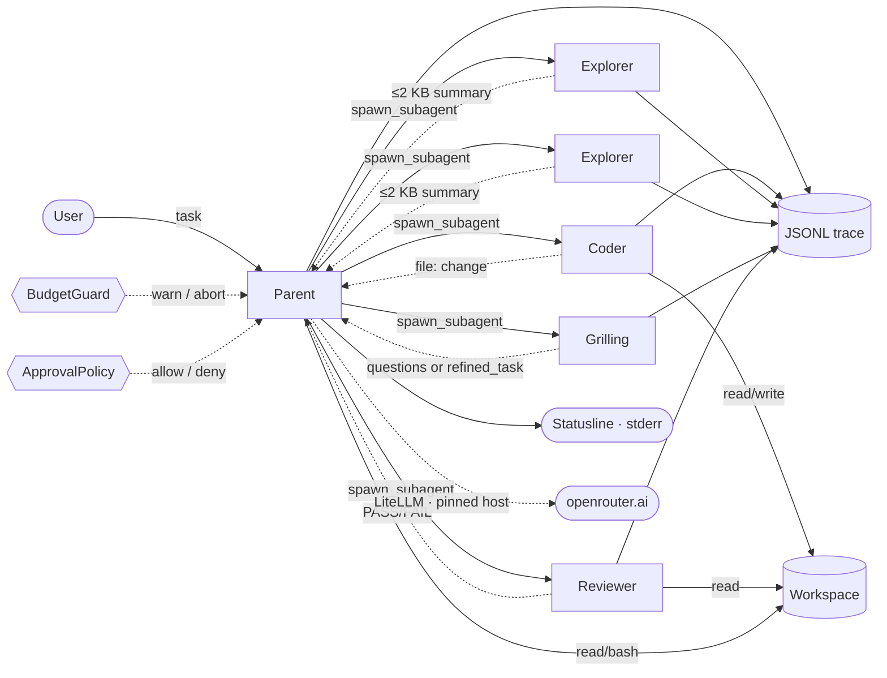

# Architecture

Reference for the §4 oral knowledge-check. Source of truth remains
`specs/`, `PROMPTS.md`, and `MODEL_CONFIG.md`.

## Diagram

## Pipeline (one paragraph)

The parent is the only agent with a conversational tool surface
(`read_file`, `read_file_range`, `run_bash`, `spawn_subagent`). It dispatches
typed sub-agents — Grilling for clarification, Explorer for read-only
inspection, Coder for mutations, Reviewer for verification — and the
**model itself** decides each transition. Two or more Explorers (or mixed
read-only types) can be spawned in parallel through one `spawn_subagents`
call; the parent waits for all returns and integrates them in the next
turn. Sub-agent depth is hard-capped at 1; no sub-agent may spawn another.
Coder is the only path that writes to disk, and it is always gated by the
approval policy in `writes` and `all` modes.

## Context engineering (one paragraph)

Two mechanisms keep parent context bounded under load. First,
**tool-result compaction**: any parent `tool_result` whose token estimate
exceeds `K_COMPACT` (4000) is replaced by a compaction marker in the
parent's next model turn; the full payload, its SHA-256, and a pointer
remain in the JSONL trace and are retrievable via `read_file_range` or
`--replay`. Second, **sub-agent context offloading**: a sub-agent's
intermediate `tool_call` and `tool_result` events live under its own
`agent_id` and are filtered out of the parent's view; the parent sees only
the ≤2 KB return summary. Combined, the parent stays small while
intermediate work is fully auditable in the trace.

## Weakest part (one paragraph)

The per-agent budget split on parallel fan-out is a simple even division:
each sub-agent in a `spawn_subagents` call receives
`remaining_budget / len(requests)`. An uneven task — for example, two
Explorers where one inspects a 1-line file and the other a 10k-line
directory — can starve the large one even when the small one returns with
budget to spare. The mitigation (re-slice on early return) is listed as
future work in `specs/12_subagent_pipeline.md`. Second weakness: the
heuristic that triggers Grilling is keyword-based and will over-fire on
short but unambiguous tasks; the `--no-grill` flag is the user-facing
escape hatch.

## Failure modes (quick reference)

| Failure | Detection | Trace signal |
|---|---|---|
| Sub-agent timeout | `TOOL_TIMEOUT` exceeded | `subagent_return{status:"timeout"}` |
| Sub-agent oversize return | >2 KB after one retry | `subagent_return{status:"oversize", truncated:true}` |
| Sub-agent tool error | tool inside sub-agent failed | `subagent_return{status:"tool_error"}` |
| Coder write conflict | two Coders, same path | `subagent_return{status:"conflict"}` |
| Parallel slice exceeded | per-agent budget breach | `budget_event{reason:"parallel_aborted"}` |
| Hard cap hit | total USD/tokens/steps exceeded | `budget_event{reason:"usd_cap"|...}` then `run_end{final_status:"aborted"}` |
| Egress pin violation | non-OpenRouter host in client | `egress_blocked` event, `EndpointPinViolation` raised |
| Sensitive-path read | `.env`, keys, credentials | `tool_result{status:"error", reason:"sensitive path"}` |
| Destructive bash | `rm`, `mv`, `find -exec`, etc. | `tool_result{status:"error"}` with refusal message |
