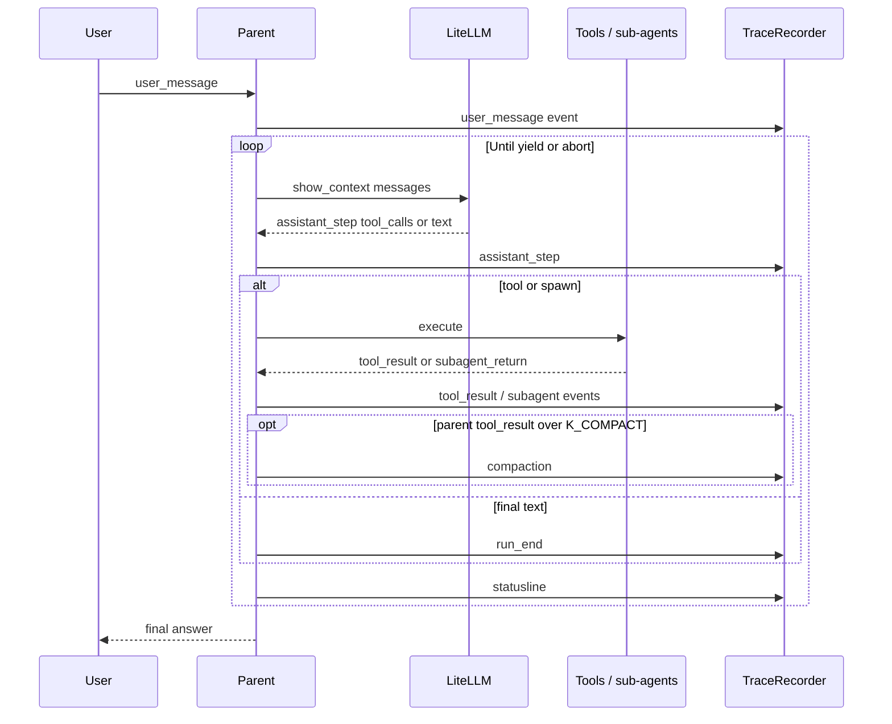

# 01 Architecture

Product-level architecture for the VG Agent: how components fit together,
how data flows, and where behavioral detail lives in the numbered specs.
For oral-exam talking points and a compact diagram, see
[`docs/ARCHITECTURE.md`](../docs/ARCHITECTURE.md). For libraries and
versions, see [`specs/02_tech_stack.md`](02_tech_stack.md).

## Purpose and VG claim

This repository implements a **coding-agent shell**, not a frontier-model
benchmark. The claim is about:

- Tool execution with workspace sandboxing and deny-by-default `run_bash`
- Context management (tool-result compaction, sub-agent offloading, conversation compaction)
- Typed sub-agent boundaries with parallel fan-out
- JSONL (+ SQLite mirror) observability and cost guards
- Safety layers (approval policy, egress pin, optional Docker boundary)

Model quality comes from OpenRouter-hosted models configured in
`MODEL_CONFIG.md`; the runtime architecture is what the assignment grades.

Non-goals are summarized in [`specs/00_overview.md`](00_overview.md): no
nested sub-agent trees, no hidden state outside traces and the spend file,
no hand-maintained generated runtime code.

## System context

```mermaid
flowchart TB
    User([User]) --> CLI[CLI __main__]
    CLI -->|task or chat| Parent[Parent agent]
    Parent -->|spawn_subagent(s)| Sub[Typed sub-agents]
    Sub --> Grilling[Grilling]
    Sub --> Explorer[Explorer x N]
    Sub --> Coder[Coder]
    Sub --> Reviewer[Reviewer]
    Grilling -.->|questions or refined_task| Parent
    Explorer -.->|summary max 2KB| Parent
    Coder -->|read/write| WS[(Workspace)]
    Coder -.->|change summary| Parent
    Reviewer -->|read| WS
    Reviewer -.->|PASS/FAIL| Parent
    Parent -->|read/bash/tests| WS
    Parent --> Status[Statusline / Rich HUD]
    Parent --> TraceJSONL[(JSONL trace)]
    Parent --> SQLite[(SQLite mirror)]
    Sub --> TraceJSONL
    Budget{{BudgetGuard}} -.-> Parent
    Approval{{ApprovalPolicy}} -.-> Parent
    Parent -->|LiteLLM pinned host| OR[openrouter.ai]
    Dash[Dashboard sidecar] -.->|read| TraceJSONL
    Dash -.->|read| SQLite
```

- **Parent** — single conversational loop; owns user turns, tool dispatch,
  compaction, trace recording, final answer. See
  [`specs/10_main_agent.md`](10_main_agent.md).
- **Sub-agents** — typed, depth-capped at 1; no sub-agent may spawn another.
  Pipeline contract: [`specs/12_subagent_pipeline.md`](12_subagent_pipeline.md).
- **Workspace** — mutable tree under `VG_WORKSPACE_ROOT` (default `./workspace`);
  demo fixture via `--seed-fixture`.
- **Traces** — append-only JSONL per run; SQLite mirrors events for dashboard
  queries. Contract: [`specs/60_observability.md`](60_observability.md).
- **Dashboard** — optional local FastAPI + React UI; read-only relative to the
  agent. [`specs/70_dashboard.md`](70_dashboard.md).

## Execution surfaces

| Surface | Entry | Typical use |
|---------|--------|-------------|
| One-shot task | `vg-agent --task "..."` | Demos, CI-style runs, `--show-context` proofs |
| Interactive chat | `vg-agent --chat` | Grading live chat, Rich TTY UI |
| Docker | `docker compose run --rm vg-agent ...` | Primary demo boundary ([`specs/50_packaging.md`](50_packaging.md)) |
| Local dev | `uv run -m vg_agent ...` | Fast iteration on Tier B UI files and tests |

Both `--task` and `--chat` use the **same live parent loop** (LiteLLM →
OpenRouter). There is no offline or deterministic runtime path; missing
`OPENROUTER_API_KEY` exits with code 2.

Chat-specific presentation (Rich panels, compact progress, slash commands) is
specified in [`specs/16_chat_ui.md`](16_chat_ui.md) and
[`specs/17_rich_tui_stack.md`](17_rich_tui_stack.md). `--task` and non-TTY
paths use plain stderr progress and no Rich chrome.

## Agent topology

The parent exposes: `read_file`, `read_file_range`, `run_bash`, `run_tests`,
`spawn_subagent`, `spawn_subagents`. It does **not** expose `write_file` or
`edit_file`.

| Type | Role | Writes workspace? | May spawn? |
|------|------|-------------------|------------|
| `grilling` | Clarify ambiguous tasks | No | No |
| `explorer` | Read-only inspection | No | No |
| `coder` | File mutations | Yes (only mutation path) | No |
| `reviewer` | Post-Coder verification | No | No |

- **Model-driven transitions** — the parent model chooses which type to spawn
  each step; there is no hardcoded state machine beyond caps and tool surfaces.
- **Parallel fan-out** — `spawn_subagents` runs multiple sub-agents with
  overlapping wall-clock; parent waits for all returns before the next turn.
- **Depth** — `MAX_SUBAGENT_DEPTH = 1` globally.
- **Approval** — sub-agent spawns always interact with approval policy;
  Coder `write_file` / `edit_file` gated in `writes` and `all` modes.

Full type table, Grilling heuristics, Reviewer scope, and parallel budget
slicing: [`specs/12_subagent_pipeline.md`](12_subagent_pipeline.md).

### Sub-agent documentation

Only **Explorer** has a dedicated per-type spec ([`11_subagent_explorer.md`](11_subagent_explorer.md))
because the parallel auth summarise demo is Explorer-heavy. **Grilling**, **Coder**,
and **Reviewer** contracts live entirely in [`12_subagent_pipeline.md`](12_subagent_pipeline.md)
by design — not an accidental gap.

## Parent loop lifecycle



Compaction runs on **parent-scoped** `tool_result` events before the next
model turn. Sub-agent intermediate `tool_call` / `tool_result` pairs are
recorded under the sub-agent `agent_id` but excluded from parent `show_context`.

## Context engineering

Three mechanisms keep the parent context bounded under heavy load.

### 1. Parent-scoped tool-result compaction

When a parent `tool_result` token estimate exceeds `K_COMPACT` (default 4000,
overridable via `VG_K_COMPACT`), the runtime:

1. Writes a `compaction` event with `original_event_idx` and `original_sha256`
2. Replaces the payload in the parent's next model turn with a compact marker
3. Retains the full body in JSONL for audit and `read_file_range` recovery

Uses `COMPACTOR_MODEL_ID` for the summary (`agent_type: compactor`). Invariant:
`show_context(events, step_idx)` at the final demo step must show the compaction
marker and **not** full `sample.log` content in parent context (see
[`specs/40_demo_and_eval.md`](40_demo_and_eval.md), [`04_demo_fixture.md`](04_demo_fixture.md)).

### 2. Sub-agent context offloading

Sub-agents run their own mini-loops. All their events are traced, but the
parent model sees only the `subagent_return` summary (≤2 KB; one retry then
truncate). Explorer/Coder `tool_call` / `tool_result` noise never enters
parent context.

### 3. Conversation compaction

Folds **older in-memory chat turns** (not individual tool results) when parent
context exceeds the model window × `AUTO_COMPACT_FRACTION` from
[`CONTEXT_WINDOWS.md`](../CONTEXT_WINDOWS.md):

- **Auto** — before parent `llm_start` when over threshold; emits
  `context_compaction{reason:"auto"}`.
- **Manual** — chat `/compact`; emits `context_compaction{reason:"manual"}`.
- **Tail preserved** — recent turns stay verbatim (`COMPACT_KEEP_RECENT_TURNS` in
  [`30_runtime_governance.md`](30_runtime_governance.md)).

Distinct from §1: tool-result compaction shrinks one oversized `tool_result`;
conversation compaction summarizes multi-turn dialogue history.

Together: small parent prompts, fully auditable JSONL, dashboard can render
full sub-agent lanes and compaction units ([`60_observability.md`](60_observability.md),
[`70_dashboard.md`](70_dashboard.md)).

## Observability architecture

| Layer | Purpose | Owner spec |
|-------|---------|------------|
| JSONL (`traces/<run_id>.jsonl`) | Source of truth, replay, `show_context` | [`60_observability.md`](60_observability.md) |
| SQLite (`vg_agent.sqlite3`) | Indexed queries, session list, FinOps | `sqlite_store.py`, [`70_dashboard.md`](70_dashboard.md) |
| stderr statusline | Live step HUD (`\r` or chat status bar) | [`60_observability.md`](60_observability.md), [`16_chat_ui.md`](16_chat_ui.md) |
| Progress stream | Human-readable run log (compact in Rich TTY chat) | [`60_observability.md`](60_observability.md) |
| Dashboard | History, live tail, stats UI | [`70_dashboard.md`](70_dashboard.md) |

**Write path:** agent appends JSONL and mirrors to SQLite during the run.
**Read path:** dashboard reads SQLite + JSONL; in Docker sidecar mode
`VG_DASHBOARD_NO_BACKFILL=1` avoids the dashboard writing into the agent DB.

Every event carries `kind`, `event_idx`, `agent_id`, and attribution fields
documented in `60_observability.md`.

## Safety in depth

Defense is layered; Docker is not the only gate.

| Layer | Mechanism | Spec |
|-------|-----------|------|
| Path sandbox | Workspace-root resolution; no `..` or absolute paths | [`20_tools.md`](20_tools.md) |
| Sensitive reads | Denylist for `.env`, keys, credentials | [`20_tools.md`](20_tools.md) |
| `run_bash` | Allowlist (`grep`, `rg`, `find`, `ls`, …); block redirection, substitution, destructive tokens | [`20_tools.md`](20_tools.md) |
| Egress pin | LiteLLM client refuses non-`openrouter.ai` hosts | [`30_runtime_governance.md`](30_runtime_governance.md) |
| Budget | Step/token/USD/daily caps; repetition guard; warn at 80% | [`30_runtime_governance.md`](30_runtime_governance.md) |
| Approval | `off` / `writes` / `all`; scoped cache; interactive menus in chat | [`10_main_agent.md`](10_main_agent.md) |
| Docker | Non-root user, `cap_drop`, pids limit, bridged network for API only | [`50_packaging.md`](50_packaging.md) |

Unit tests prove in-process gates without Docker (`FakeClient` injection, no
network).

## Code organization (three tiers)

| Tier | Paths | Edit directly? | Source of truth |
|------|-------|----------------|-----------------|
| A — Generated | Most of `src/vg_agent/*`, `fixtures/demo_repo/*` | No | `scripts/templates/*.tmpl` + markdown inputs; regenerate with `generate_project.py --clean` |
| B — Hand-written in generated dir | `chat_ui.py`, `sqlite_store.py`, `workspace_paths.py` | Yes | The files themselves (`EXTRA_SOURCE_GENERATED_FILES`) |
| C — Ordinary repo | `dashboard/`, `tests/`, `scripts/`, `specs/`, `docs/`, Docker files | Yes | Those paths |

Details: [`specs/05_source_of_truth_and_generation.md`](05_source_of_truth_and_generation.md),
[`DEVELOPER_README.md`](../DEVELOPER_README.md).

`SPEC_DIGEST` hashes only codegen inputs listed in `scripts/generate_project.py`
`SOURCE_INPUTS` — this document is **not** in the digest.

## Runtime module map

| Module | Responsibility | Origin |
|--------|----------------|--------|
| `agent.py` | Parent loop, sub-agent spawn/run, compaction, tool dispatch | Template |
| `__main__.py` | CLI, chat loop, slash commands, progress sink | Template |
| `tools.py` | File tools, `run_bash` validation, path sandbox | Template |
| `budget.py` | Caps, warnings, repetition guard, daily ledger | Template |
| `trace.py` | JSONL recorder, redaction, `show_context`, review builders | Template |
| `live_model_client.py` | LiteLLM OpenRouter adapter | Template |
| `config.py` | Model IDs, pricing, governance constants | Template |
| `runtime_settings.py` | Env/TOML overlay on generated config | Template |
| `demo_fixture.py` | Seeds `fixtures/demo_repo/` | Template |
| `chat_ui.py` | Rich TTY presentation | Tier B |
| `sqlite_store.py` | SQLite schema and mirror writes | Tier B |
| `workspace_paths.py` | Workspace/trace/SQLite path resolution | Tier B |
| `dashboard/api/` | FastAPI routes and services | Tier C |
| `dashboard/web/` | React trace UI | Tier C |

## Spec reading order

See [`README.md`](README.md) for the full index. Short path for a new contributor:

1. [`00_overview.md`](00_overview.md) — goals and success criteria
2. **This file** — system shape
3. [`02_tech_stack.md`](02_tech_stack.md) — dependencies and infrastructure
4. [`03_testing.md`](03_testing.md) — how CI verifies the spec
5. [`04_demo_fixture.md`](04_demo_fixture.md) — demo workspace layout
6. [`05_source_of_truth_and_generation.md`](05_source_of_truth_and_generation.md) — how to change code safely
7. [`12_subagent_pipeline.md`](12_subagent_pipeline.md) — typed agents and parallelism
8. [`10_main_agent.md`](10_main_agent.md) — parent tools, approval, conversation compaction
9. [`20_tools.md`](20_tools.md) — tool contracts and bash safety
10. [`30_runtime_governance.md`](30_runtime_governance.md) — caps and constants
11. [`25_security.md`](25_security.md) — safety rollup
12. [`16_chat_ui.md`](16_chat_ui.md) + [`17_rich_tui_stack.md`](17_rich_tui_stack.md) — interactive UI
13. [`60_observability.md`](60_observability.md) — traces, statusline, **event catalog**
14. [`50_packaging.md`](50_packaging.md) — Docker and distribution
15. [`70_dashboard.md`](70_dashboard.md) — trace dashboard
16. [`15_cli_contract.md`](15_cli_contract.md), [`40_demo_and_eval.md`](40_demo_and_eval.md), [`70_demo_runbook.md`](70_demo_runbook.md) — CLI and graded demos

Auxiliary: [`model_experience.md`](model_experience.md), [`41_runtime_quality_eval.md`](41_runtime_quality_eval.md).

Prompts and model IDs: [`PROMPTS.md`](../PROMPTS.md), [`MODEL_CONFIG.md`](../MODEL_CONFIG.md).

## Known limitations

1. **Parallel budget split** — `spawn_subagents` divides remaining budget evenly
   per child (`remaining / N`). Uneven workloads can starve a heavy Explorer
   while a light sibling finishes under budget. Re-slice on early return is
   future work (`12_subagent_pipeline.md`).

2. **Grilling is model-optional** — heuristics and `--no-grill` exist, but the
   parent may skip or over-use Grilling on borderline tasks (cost vs clarity
   tradeoff). See [`docs/ARCHITECTURE.md`](../docs/ARCHITECTURE.md) § Weakest part.

3. **Reviewer scope** — runs after every Coder that wrote a file
   (`writes_ok > 0`), greenfield creation included; guards both integration and
   new-code quality. Only skipped on the parent's last reserved step
   (`12_subagent_pipeline.md`).

4. **Docker stale UI** — `src/` is baked at image build; Rich/chat changes need
   `docker compose build vg-agent` (`50_packaging.md`).

## Failure modes (quick reference)

| Failure | Detection | Trace signal |
|---------|-----------|--------------|
| Sub-agent timeout | `TOOL_TIMEOUT` exceeded | `subagent_return` with `status:"timeout"` |
| Sub-agent oversize return | >2 KB after one retry | `subagent_return` with `status:"oversize"`, `truncated:true` |
| Sub-agent tool error | Tool failed inside sub-agent | `subagent_return` with `status:"tool_error"` |
| Coder write conflict | Two Coders, same path | `subagent_return` with `status:"conflict"` |
| Parallel slice exceeded | Per-agent budget breach | `budget_event` with `reason:"parallel_aborted"` |
| Hard cap hit | USD/tokens/steps/daily exceeded | `budget_event` then `run_end` with `final_status:"aborted"` |
| Egress pin violation | Non-OpenRouter host | `egress_blocked`, `EndpointPinViolation` |
| Sensitive-path read | Denylist path | `tool_result` error, sensitive path reason |
| Destructive bash | Blocklisted command | `tool_result` error with refusal message |

## Related documents

- Spec index: [`README.md`](README.md)
- Oral architecture Q&A: [`docs/ARCHITECTURE.md`](../docs/ARCHITECTURE.md)
- Technology inventory: [`specs/02_tech_stack.md`](02_tech_stack.md)
- Agent contributor guide: [`DEVELOPER_README.md`](../DEVELOPER_README.md)
- Repository quick reference: [`CLAUDE.md`](../CLAUDE.md)
